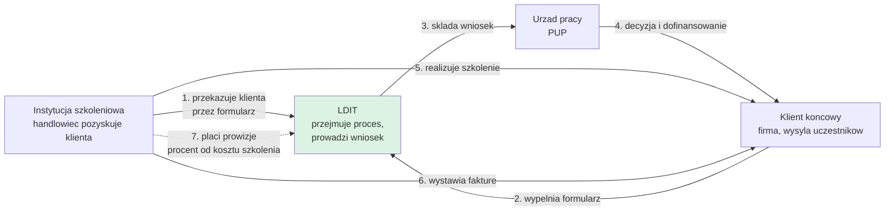

# 01. Kontekst i cel biznesowy

## Model biznesowy klienta

LDIT (firma Bartłomieja Olejnika) pozyskuje dla firm końcowych dofinansowania szkoleń z **Krajowego Funduszu Szkoleniowego (KFS)** i kieruje te firmy na szkolenia realizowane przez współpracujące **instytucje szkoleniowe (IS)**.

Strzałka przerywana to **jedyne źródło przychodu LDIT**. Wszystko, co robi silnik prowizji,
dotyczy tej jednej relacji.

**Źródło przychodu LDIT:** prowizja od instytucji szkoleniowej, liczona procentowo od kosztu całkowitego szkolenia. Standard 20%, ale realne umowy mają skale progowe i wyjątki (patrz [07. Silnik prowizji](07-silnik-prowizji.md)).

**Kto jest czyim klientem** (rozróżnienie krytyczne dla nazewnictwa):
- Klientami LDIT są **instytucje szkoleniowe**
- Klientami instytucji szkoleniowych są **firmy końcowe** (w rozmowach nazywane po prostu "klientami")
- Uczestnikami szkoleń są **pracownicy firm końcowych**

> **Bartek (1:01):** "Pojedynczej nie instytucji szkoleniowej tylko o k. Firmę, czyli w zasadzie i tak uczestnika."

---

## Problemy, które system ma rozwiązać

### 1. Excel przestał wystarczać
Cała operacja stoi na trzech plikach Excel (zakładki: `Zestawienie 2026 złożone`, `Niezłożone`, `Rozpis szkoleń`), mailach i telefonach. Dane rozjeżdżają się między plikami, pojawiają się błędy.

> **Bartek (1:32:18):** "za ciężko się skupić mi na czymś konkretnym, z bardzo dużo tych informacji jednocześnie wyskakuje (...) wolałbym, żeby to po prostu było mocno przejrzyste i wszystko miało swoje miejsce."

### 2. Każda instytucja ma inny system, brak wspólnego standardu
Jedna IS ma rozbudowany system z panelem logowania, inna sam kalendarz, część pracuje wyłącznie na mailach. Przy ~20 współpracujących firmach nauczenie się każdego systemu jest niewykonalne. Kierunek ma się odwrócić: jeden standard dla wszystkich.

Dwa realne, sprzeczne modele operacyjne ustalania terminu, oba muszą być obsłużone:

| Model | Przykład | Przebieg |
|---|---|---|
| **A** | Metal Maniak | LDIT ma kalendarz IS, sam ustala terminy z klientami i wpisuje do tabeli. IS tylko podgląda. |
| **B** | Dron Fortech | IS ustala termin telefonicznie z klientem, wpisuje do swojego systemu, LDIT dostaje maila. Potem LDIT składa w PUP pismo o zmianie terminu. |

> **Bartek (10:06):** "to zależy. Większość instytucji szkoleniowych to my się kontaktujemy (...) mam różne przykłady, więc tu naprawdę u nas nie ma jednego standardu."

### 3. Obieg formularzy trwa dni zamiast minut
Dziś: handlowiec IS wysyła klientowi Excel mailem, klient odsyła, handlowiec przekazuje do LDIT. Realne opóźnienie: **2 do 3 dni**. Cel: **pół godziny do godziny**. W sezonie to ok. 300 identycznych plików Excel w skrzynce.

Realny incydent: nabór kończył się 5 kwietnia, formularz od handlowca wpłynął tego samego dnia, wniosku nie udało się złożyć. LDIT dostało pretensje i musiało przeszukiwać maile, żeby udowodnić, kiedy dokumenty dotarły.

### 4. Historia kontaktu jest rozproszona
Ustalenia siedzą w skrzynkach pocztowych poszczególnych pracowników. Przypadek pracownicy Magdy: klient przesłał umowę mailem, umowa nie trafiła na dysk, fizycznie zaginęła.

> **Bartek (1:27:42):** "żeby była historia rozmowy między instytucją szkoleniową a nami i każdy ma do tego wgląd (...) mamy jednak wiadomość, że klient podesłał tą umowę, tylko zapomniała po prostu przerzucić do folderu."

### 5. Dane finansowe widzi każdy pracownik
W obecnym Excelu każdy pracownik widzi cały zysk firmy oraz stawki prowizyjne wszystkich instytucji. To ryzyko biznesowe: instytucje są wobec siebie konkurencyjne i mają różne stawki.

> **Bartek (57:52):** "Na ten moment każdy widzi cały zysk firmy, jakie prowizje ma jaka firma. Chciałbym po prostu już to ukrócić do tylko do administratora."

### 6. Ręczna robota przy certyfikatach i fakturach
Certyfikaty dla 50 uczestników z jednej firmy to dziś ręczna praca. Dane do faktury wysyłane mailem wg stałego wzoru, przepisywane z Excela.

---

## Skala

| Wymiar | Wartość | Źródło |
|---|---|---|
| Instytucje szkoleniowe w zeszłym roku | 2 | 4:46 |
| Instytucje szkoleniowe obecnie | **ok. 20** | 4:46 |
| Firmy w bazie (szacunek klienta) | "1000 parę" | 3:53 |
| Perspektywa modułu Zgłoszeń | ponad 1000 klientów | 3:05:01 |
| Faktury LDIT miesięcznie | 5 do 40, średnio ok. 30 | 1:02:40 |
| Faktury LDIT rocznie | ok. 300 | 1:05:10 |
| Wnioski jednego klienta rocznie | do 3, wyjątkowo 5-6 | 2:46:58, 1:46:06 |
| Numeracja klientów w roku | sekwencyjna, po pół roku ok. 170 | 1:45:00 |
| Szczyt operacyjny | ok. 130 wniosków w 2 tygodnie | dok. przedwarsztatowa |
| Urzędy pracy w bazie naborów | 340 | dok. przedwarsztatowa |
| Uczestników na jednym szkoleniu | do 50 | 2:57:48 |
| Skrzynka w sezonie | ok. 300 identycznych Exceli | 2:11:20 |
| Obciążenie klienta w szczycie | ok. 400 h pracy Bartka w lutym | 3:21:01 |

**Wzrost jest pewny.** Marketing i social media planowane od 2027. Ale klient warunkuje uruchomienie marketingu przepustowością operacyjną.

> **Bartek (3:21:31):** "marketing możemy uruchomić dopiero wtedy, jeżeli będę wiedział, że wyrobimy tą ilość wniosków, bo mam tutaj 2 opcje, albo ten bot (...) albo nowy pracownik. Bo inaczej to jest niemożliwe, żeby więcej osób obsłużyć."
>
> **Bartek (3:21:50):** "Przez co prawdopodobnie część współprac pójdzie do wiatru."

**Koszt utrzymania jest dla klienta kryterium decyzyjnym przy każdym rozszerzeniu zakresu.**

> **Bartek (6:10):** "jeżeli to nie będzie znaczące jakoś zwiększone no to to spoko, ale jeżeli będzie miało jakiś większy wpływ no to mi jest akurat to zbędne."

Wykonawca wskazał, że wąskim gardłem będzie wydajność serwera aplikacyjnego, nie baza danych (4:20). **Kalkulacja kosztów hostingu w wariantach skali jest zadaniem otwartym** (patrz [14. Pytania otwarte](14-pytania-otwarte.md)).

---

## Granice systemu

### Co system robi
- Prowadzi klienta przez cały proces: formularz, wniosek do PUP, decyzja, szkolenie, rozliczenie
- Rozdziela dane między konkurencyjnymi instytucjami szkoleniowymi
- Nalicza prowizje wg konfigurowalnych reguł progowych
- Generuje certyfikaty i dane do faktur
- Gromadzi historię korespondencji przy kliencie
- Pokazuje nabory aktualne i prognozowane
- Raportuje skuteczność i marżowość

### Czego system NIE robi

| Wykluczenie | Uzasadnienie | Źródło |
|---|---|---|
| Nie zastępuje wniosku w urzędzie | Wniosek składa się w praca.gov.pl / PUP, system prowadzi proces wokół niego | dok. przedwarsztatowa |
| Nie przechowuje folderów i plików klientów | Klient zostaje przy Eksploratorze Windows i OneDrive | [D-41](13-rejestr-decyzji.md) |
| Nie obsługuje zadań pracowników | Przeniesione do Projectly (druga aplikacja wykonawcy) | [D-118](13-rejestr-decyzji.md) |
| Nie integruje kalendarza Outlook | Wykluczone z zakresu | [D-118](13-rejestr-decyzji.md) |
| Nie wysyła SMS-ów | Odrzucone w etapie I | [D-04](13-rejestr-decyzji.md) |
| Nie integruje się z systemem księgowym przez API | Import CSV zamiast integracji, 1h vs 10-15h pracy | [D-39](13-rejestr-decyzji.md) |
| Nie pozwala instytucjom wysyłać powiadomień | Cała komunikacja wychodzi z domeny LDIT | [D-87](13-rejestr-decyzji.md) |
| Nie udostępnia publicznego API | W dokumentacji przedwarsztatowej przewidziano MCP, warsztat tego nie potwierdził | patrz [14](14-pytania-otwarte.md) |

### Napięcie do rozwiązania
Klient deklaruje "wszystko w jednym systemie", ale jednocześnie wyłącza z niego pliki, zadania i kalendarz.

> **Bartek (1:02:48):** "chciałbym, żeby ten system służył mi do wszystkiego, co robię w pracy, żebym nie musiał osobno wchodzić na driva (...) Chcę przenieść do systemu, żeby odejść już od Excela przede wszystkim."
>
> **Bartek (1:22:27):** "Przeglądarkowego nienawidzę, nie muszę mieć, muszę mieć po prostu ten eksplorator Windowsa i mi się wygodnie to robi."

To ryzyko rozczarowania po wdrożeniu, opisane w [15. Ryzyka](15-ryzyka.md).

---

## Filozofia realizacji

Klient chce najpierw działającego szkieletu, szczegóły dopracowywane w trakcie.

> **Bartek (2:59:50):** "Na razie chciałbym, żebyśmy szkielet postawili na nogi, a takie szczegóły dopracujemy sobie myślę już na bieżąco."
>
> **Bartek (1:33:36):** "robisz jeden moduł czy tam kilka modułów i na spotkaniach przedstawiasz. Akceptujemy, zmieniamy i wtedy wrzucamy w system. Może w ten sposób, niż wszystko."

Tryb pracy: **iteracyjny odbiór modułami**, z prezentacją i akceptacją przed wdrożeniem. Klient deklaruje pełną dostępność telefoniczną w trakcie realizacji, bo w styczniu jej nie będzie.
