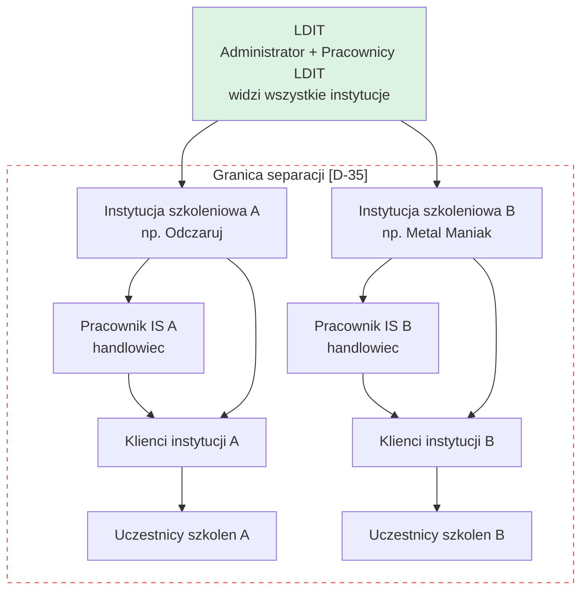
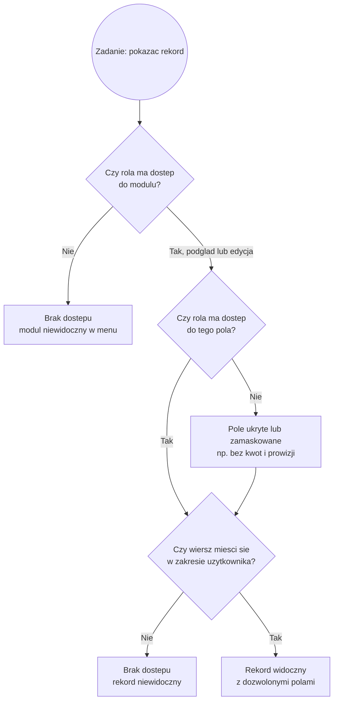

# 02. Aktorzy i uprawnienia

## Role w systemie

Warsztat rozszerzył model z 4 do **5 ról bazowych**, plus możliwość tworzenia własnych.

| Rola | Kto to | Zakres widoczności |
|---|---|---|
| **Administrator** | Bartek | Wszystko: wszystkie instytucje, wszyscy klienci, finanse, konfiguracja, prowizje |
| **Pracownik LDIT** | Łucja, Martyna, Asia | Klienci **przypisanych mu instytucji**. Bez zysków firmy i bez stawek prowizyjnych |
| **Instytucja szkoleniowa** (admin IS, rola `is`) | np. Odczaruj, Metal Maniak | Wyłącznie własna zakładka i **wszyscy** klienci swojej instytucji [D-210]. Nie widzi swojej stawki prowizji. Statystyki własnych klientów bez rozbicia per handlowiec [D-209] |
| **Pracownik IS** (handlowiec) | np. Mirka z Fortech | Wyłącznie klienci i wnioski **przypisani do siebie** (`handlowiec_id`) [D-210], dodatkowo może być przefiltrowany (np. tylko najnowszy nabór) [D-73] |
| **Klient końcowy** | firma / uczestnik | OTWARTE, patrz niżej |

### Hierarchia ról i zakres widzialności danych

Poniższy diagram pokazuje, jak zakres widoczności zawęża się w dół hierarchii oraz gdzie przebiega granica separacji między instytucjami szkoleniowymi (dwie odrębne gałęzie po prawej stronie nigdy się nie stykają, patrz [Separacja danych](#separacja-danych)).

Administrator (Bartek) i Pracownicy LDIT widzą obie gałęzie, bo działają ponad granicą separacji. Instytucja A i Instytucja B (wraz ze swoimi pracownikami, klientami i uczestnikami) nie mają wzajemnego dostępu, niezależnie od modułu czy widoku.

### Zasada: własne konto, działanie we własnym imieniu [D-121]

Każdy użytkownik loguje się na **własne, imienne konto** i wykonuje działania w swoim imieniu. Nie ma kont współdzielonych, spójnie z brakiem wspólnej skrzynki firmowej [D-45]. Konsekwencje:

- każda akcja (zmiana danych, wysyłka maila, wpis zgłoszenia) jest przypisana do konkretnej osoby i widoczna w [rejestrze aktywności](10-bezpieczenstwo-i-rodo.md);
- na karcie Zgłoszeń autor wpisu jest **domyślnie ustawiany na zalogowanego użytkownika**, z możliwością zmiany [D-121];
- administrator może dzięki temu odtworzyć, kto co zrobił i kiedy [D-122].

### Rola: pracownik instytucji szkoleniowej (handlowiec)

**Nowa rola dodana na warsztacie** [D-72]. Nadawana przez administratora IS swojemu handlowcowi.

> **Paweł (2:14:40):** "Dodałbym jeszcze jedną rolę w naszej apce. Że ja jako administrator instytucji szkoleniowej mam jeszcze swojego pracownika, któremu nadaję rolę. I chcę mu ograniczyć dostęp do pełnego systemu, czyli dać mu tylko dane klientów i to jeszcze przefiltrowane."
>
> **Bartek (2:15:13):** "Dobra. Spoko jest to."

**Zakres roli w procesie kończy się na wypełnieniu formularza przez klienta.** Dalej sprawę przejmuje w całości LDIT.

> **Paweł (2:18:12):** "Idąc po procesie, rola handlowca kończy się jak ktoś wypełnia ten formularz i wtedy ty go przejmujesz zupełnie."
> **Bartek (2:18:23):** "Tak."

Konsekwencja: handlowiec **nie dostaje** informacji o zbliżających się naborach u swoich klientów, bo kontakt z klientem po formularzu należy do LDIT [D-91].

### Rola: klient końcowy (panel uczestnika)

**STATUS: OTWARTA.** Klient ma wątpliwości, wykonawca (jako IS) bardzo chce.

> **Bartek (1:36):** "nie wiem czy w ogóle ktoś będzie z tego korzystał (...) oni często nie mają czasu czegoś podpisać, albo im się nie chce, a co dopiero sobie wejść i sprawdzić na jakim etapie jest ich wniosek. Ale pojawiają się tacy klienci."
>
> **Paweł (3:02):** "jeżeli chodzi o ten moduł dostępu dla klienta, to tutaj możemy podzielić się tym kosztem, bo ja chętnie będę z tego korzystał."

Oczekiwany zakres (gdyby wszedł): podgląd etapu wniosku, lista wysłanych dokumentów do ponownego pobrania, informacje przedszkoleniowe (co, gdzie, materiały), lista naborów. Wyłącznie odczyt.

Blokery: skokowy wzrost bazy użytkowników (z kilkunastu do kilkuset), koszt utrzymania, ryzyko bezpieczeństwa (wpuszczenie osób spoza obu organizacji).

---

## Konfigurator ról

**Decyzja TWARDA [D-36].** Administrator sam tworzy role i nadaje im uprawnienia, bez udziału wykonawcy.

### Model uprawnień

- **Płaski, nie hierarchiczny.** Menedżer nie musi widzieć więcej niż pracownik. Dowolna kombinacja.
- **Uprawnienia per rola, nie per pracownik** [D-35].
- **Jednostka uprawnienia = feature `modul.akcja`** [D-211]. Dla zakładki z lewej nawigacji są to dwa features: `modul.view` (podgląd) i `modul.manage` (edycja). Zachowuje to układ "zakładka x podgląd/edycja" z warsztatu.
- **Uprawnienia do pól** to też features (np. pole kwot lub prowizji jako osobny feature), nie osobna tabela [D-211, zastępuje `uprawnienia_pol` z D-149].
- **Wildcard:** `modul.*` daje wszystkie akcje modułu, `*` wszystko (wzór Open Mercato `acl.ts`).
- **Tabele w makiecie:** `funkcje` (słownik features) i `role_funkcje` (przypisanie do roli), zamiast `uprawnienia` i `uprawnienia_pol` [D-211].
- **Menu boczne renderowane dynamicznie** na podstawie roli zalogowanego użytkownika.

> **Bartek (58:19):** "docelowo mówię, żebyśmy te role mogli nadawać co kto widzi, cały konfigurator roli, żebyśmy mieli powiedzmy checkboxy, że ty masz dostęp do tego i tego, ale pracownik już inny ma dostęp tylko do spisu klientów i kontaktów."
>
> **Bartek (59:04):** "chciałbym mieć możliwość samodzielnej decyzji, co widzi ten menedżer, a co widzi to nie. Nawet absurdalny przykład: jeżeli będę chciał, żeby pracownik zwykły widział więcej niż menedżer, to żebym mógł sobie to ustawić."

> **Uwaga projektowa.** Reakcja wykonawcy "dobrze, że to mówisz teraz" (1:00:01) sygnalizuje, że dynamiczna macierz uprawnień nie była wcześniej wyceniona. To istotne rozszerzenie zakresu, patrz [15. Ryzyka](15-ryzyka.md).

### Drugi wymiar: przypisanie użytkownik do instytucji

**Decyzja TWARDA [D-113].** Niezależnie od macierzy rola x moduł, administrator przypisuje pracownikom konkretne instytucje szkoleniowe.

> **Bartek (3:12:21):** "pracownik Łucjan ma dostęp tylko do Metal Maniak, pracownik Martyna ma dostęp do Odczaruj Power BI [i] Dron Fortech."

Konsekwencja: zakładka **Dofinansowania** rozwija listę instytucji ograniczoną do przydziału zalogowanego użytkownika.

### Trzeci wymiar: filtrowanie wierszy

Uprawnienia muszą działać nie tylko na poziomie modułu, ale też na poziomie **wierszy**:
- po instytucji szkoleniowej
- po handlowcu instytucji [D-210]
- po etapie procesu (np. tylko klienci na etapie początkowym)
- po naborze (np. tylko najnowszy nabór) [D-73]

### Filtr handlowca [D-210, TWARDA, [W]]

| Konto | Kogo widzi |
|---|---|
| Administrator LDIT, Pracownik LDIT | Zgodnie z przydziałem instytucji [D-113]. Filtr handlowca ich nie dotyczy |
| Administrator instytucji (rola `is`) | Wszystkich klientów i wnioski swojej instytucji |
| Pracownik IS (handlowiec) | Wyłącznie klientów i wnioski przypisane do jego konta |

Przypisanie zapisują kolumny `klient_instytucja.handlowiec_id`, `wnioski.handlowiec_id` i `formularze_oczekujace.handlowiec_id`, wszystkie wskazują `uzytkownicy`. Filtr egzekwuje warstwa danych (`makieta/assets/zakres.js`), nie interfejs. W aplikacji docelowej dochodzi do polityk RLS [D-179].

**Statystyki:** instytucja nie dostaje rozbicia per handlowiec [D-209, koryguje D-193]. Filtr handlowca dotyczy danych operacyjnych, nie statystyk. Do potwierdzenia przez klienta, bo klient odroczył temat (2:54:45).

---

## Macierz widoczności

Wersja robocza do potwierdzenia. Pola oznaczone `?` wymagają rozstrzygnięcia.

| Moduł | Administrator | Pracownik LDIT | Instytucja szkoleniowa | Pracownik IS | Klient końcowy |
|---|---|---|---|---|---|
| Dashboard (statystyki) | Pełny, wszystkie IS | Bez marżowości i zysków | Statystyki własnych klientów, **bez rozbicia per handlowiec** [D-209] | Brak | Brak |
| Dofinansowania / Zestawienia | Wszystkie IS | Przypisane IS | Własna zakładka | Brak | Brak |
| Baza klientów (Niezłożone) | Pełna | Przypisane IS | Wszyscy klienci instytucji | **Tylko przypisani do siebie** [D-210] | Brak |
| Karta klienta i wniosku | Pełna edycja | Edycja w kontekście | Odczyt statusu | Odczyt ograniczony, tylko przypisani do siebie [D-210] | Własny status (`?`) |
| Katalog szkoleń | Pełny | Odczyt | Własny, pełna edycja | Brak | Brak |
| Terminy i kalendarz | Pełny | Odczyt, przypisane IS [D-142] | Własne terminy | Brak | Własne (`?`) |
| Konfigurator IS (prowizje) | **Wyłącznie admin** | Brak | **Brak** | Brak | Brak |
| Administracja (prowizje szczegółowe) | **Wyłącznie admin** | Brak (`?`) | Brak | Brak | Brak |
| Faktury | Pełny | Brak | Brak | Brak | Brak |
| Powiadomienia i szablony | Pełny | Wysyłka | Szablony do Outlooka | Brak | Brak |
| Zgłoszenia (incydenty) | Pełny | Pełny | **Brak** | Brak | Brak |
| Nabory | Pełny | Odczyt | Odczyt, liczby z własnych klientów [D-213] | Brak [D-91] | Odczyt (`?`) |
| Konta i uprawnienia | Pełny | Brak | Użytkownicy własnej IS | Brak | Brak |
| Rejestr aktywności | Pełny | Brak | Brak | Brak | Brak |

Macierz jest projekcją features `modul.view` i `modul.manage` na role [D-211], a wiersze filtruje D-210. Ma 14 modułów i 5 ról, więc zostaje jako tabela, tego zestawienia nie da się czytelnie zamienić na diagram. Sam mechanizm sprawdzania dostępu do pojedynczego rekordu daje się jednak pokazać jako przepływ decyzji, patrz diagram niżej.

### Diagram: czy ten użytkownik zobaczy ten rekord

Kontrola odbywa się w trzech krokach, od najbardziej ogólnego do najbardziej szczegółowego: najpierw moduł, potem pole, potem wiersz. Brak dostępu na wcześniejszym kroku kończy sprawdzanie, dalsze kroki są bez znaczenia.

---

## Separacja danych

**To jest wymaganie biznesowe, nie tylko techniczne.** Instytucje szkoleniowe są wobec siebie konkurencyjne.

### Trzy warstwy separacji

**1. Stawki prowizji ukryte przed instytucjami** [D-07, TWARDA]

Konfigurator warunków prowizyjnych widoczny wyłącznie dla administratora. Instytucja nie widzi ani swojej, ani cudzej stawki.

> **Bartek (14:28):** "chciałbym to ograniczyć do konfiguratora, który widzę tylko ja, czyli żeby nie wiedzieli, że oni nam płacą 10%, a inni płacą nam 20."

To rozstrzyga pytanie otwarte z dokumentacji przedwarsztatowej: **IS nie widzi swojej stawki prowizji**.

**2. Dane finansowe ukryte przed pracownikami** [D-19, TWARDA]

Zyski firmy, prowizje instytucji i faktury widoczne wyłącznie dla administratora.

**3. Twarda separacja katalogów między instytucjami** [D-35, TWARDA co do zasady]

Instytucja widzi wyłącznie własnych klientów. Dotyczy interfejsu, wyszukiwarki, eksportów i formularzy.

> **Paweł (2:20:00):** "Żeby nie było tak, że ja mam swój formularz, Forteca też ma ten sam mój formularz i odpowiedzi spływają do jednego excela. To jest złe pod kątem Security, jeden plik, a dane zmiksowane."
>
> **Bartek (3:06:43):** "instytucje szkoleniowe też mogą [mieć wyszukiwarkę], tylko żeby nie zdarzyło się, że wpiszą przypadkowo jakiegoś klienta i im się to wyświetli. Więc tutaj też na to trzeba będzie uważać."

### Napięcie architektoniczne, ROZSTRZYGNIĘTE [D-177]

Wykonawca dwukrotnie sygnalizował implementację przez **osobne bazy pod spodem**:

> **Paweł (2:20:19):** "Prawdopodobnie dane klientów u ciebie, dane instytucji szkoleniowych będą w bazie podzielone na osobne bazy. Albo na osobne instancje bazy. To jeszcze do przemyślenia, jak to zaprojektować."
>
> **Paweł (3:12:16):** "wydaje mi się, że powinienem zrobić tutaj osobne bazy."

**Ale to stoi w sprzeczności z wymaganiami klienta:**
- zbiorcze zestawienie wszystkich instytucji w jednej tabeli
- ciągła numeracja klientów w roku (numer trafia na fakturę)
- dashboard z przekrojem przez wszystkie instytucje
- zestawienia roczne na żądanie

Rozstrzygnięcie [D-177, D-179] w [09. Integracje i architektura](09-integracje-i-architektura.md): **jedna baza z egzekwowaną separacją na poziomie wierszy (Row Level Security)**, a nie osobne bazy. Osobne bazy uniemożliwiają zbiorczy widok bez budowania warstwy agregacji, która i tak łączyłaby dane w jednym miejscu.

### Separacja w makiecie: stan zaimplementowany

W makiecie separacja jest już zaimplementowana i egzekwowana **w warstwie dostępu do danych, nie w interfejsie**. Logika filtrowania siedzi w `makieta/assets/zakres.js`, a nie w poszczególnych stronach czy komponentach. Odpowiada to zasadzie z tabeli macierzy widoczności wyżej i domyka diagram decyzyjny "czy ten użytkownik zobaczy ten rekord".

Trzy poziomy kontroli, każdy w osobnej tabeli lub widoku bazy:

| Poziom | Co ogranicza | Tabela / widok |
|---|---|---|
| Moduł | Czy rola w ogóle widzi zakładkę, i czy ma podgląd (`modul.view`) czy edycję (`modul.manage`) | `funkcje`, `role_funkcje` [D-211] |
| Pole | Czy rola widzi konkretne pole w module (np. kwoty, prowizję), feature pola | `funkcje`, `role_funkcje` [D-211] |
| Wiersz | Do których instytucji, klientów i wniosków ma dostęp zalogowany użytkownik, w tym filtr handlowca | `uzytkownik_instytucja`, `handlowiec_id` [D-210] i widok `v_zakres_uzytkownika` |

Tabele `uprawnienia` i `uprawnienia_pol` z D-149 zastąpione przez `funkcje` i `role_funkcje` [D-211]. Zapis przechodzi przez walidację na granicy (`assets/walidacja.js`), błędy mają format `{ data, error: { code, message } }`, a logowanie zwraca ogólny komunikat, bez wskazywania czy błędny był login czy hasło [D-211]. Rola wynika z zalogowanego konta, nie z ręcznego przełącznika [D-125]. Panel logowania jest w `makieta/login.html`. Przełącznik ról widoczny w samej makiecie ma charakter wyłącznie demonstracyjny, w docelowym systemie go nie ma.

---

## Uwierzytelnianie i cykl życia konta

| Wymaganie | Priorytet | Źródło |
|---|---|---|
| Panel logowania dla wszystkich grup | MUST | 3:15:04 |
| Dwuskładnikowe uwierzytelnianie (2FA) | MUST | 3:14:42 |
| Reset haseł | MUST | 3:14:42 |
| Automatyczne wylogowanie po bezczynności | MUST | 3:15:16 |
| Blokada konta byłego pracownika z panelu admina | MUST | 3:15:04 |
| Dodawanie i usuwanie kont użytkowników przez admina | MUST | 3:15:04 |
| Dodawanie i usuwanie instytucji szkoleniowych przez admina | MUST | 3:15:06 |
| Log logowań (kto, kiedy) na potrzeby wyjaśniania wycieków | MUST | 3:14:25 |

> **Bartek (3:14:25):** "Na przykład twoje konto się zalogowało o czternastej 30. Żeby w razie jakby był jakiś wyciek czegokolwiek, to żeby było też wiadomo z jakiego powodu mogło to wyniknąć."

Szczegóły w [10. Bezpieczeństwo i RODO](10-bezpieczenstwo-i-rodo.md).
