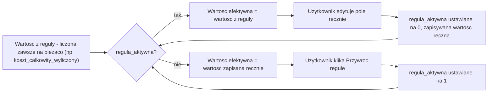

# 03. Model danych

> **Aktualizacja po warsztacie 2026-09-04.** Widok rozdzielony na **Bazę danych** (klient = jeden wiersz, wnioski zagnieżdżone) i **Wnioski** (od etapu 3) [D-128]. Odwrócenie wyliczania: **koszt całkowity z dopłatą ręczny, koszt całkowity wyliczany** [D-134]. **"Przyznano" edytowalne** [D-135]. Wielkość przedsiębiorstwa i dane kontaktowe **edytowalne per wniosek** [D-132, D-133]. Brak migracji danych historycznych, roczne zakładki [D-129]. Jeden klient może być u wielu instytucji [D-144]. Pełny kontekst i konflikty: [17. Warsztat doprecyzowujący](17-warsztat-2026-09-04.md).

> **Aktualizacja po rundzie decyzji i przeglądzie diagramu (2026-09-29).** Schemat ma 33 tabele. Nowe: `szkoleniowcy` [D-167], `sesje` (sesja logowania, [D-179]) i `podsumowania_historyczne` [D-175]. Zlikwidowana: `progi_prowizyjne`, progi są listą JSON w `warunki_prowizyjne` [D-168]. Nowe kolumny: dane instytucji [D-166], dane zmienne we wniosku [D-169], `faktury.klient_id`, `rodzaj` i `faktura_pierwotna_id` [D-170], `wnioski.prog_dofinansowania_id` [D-171], `doplata_na_fakturze_kfs` [D-174], `formularze_oczekujace.wypelnil` [D-181], skrót hasła z solą zamiast jawnego hasła. Nowe widoki: `v_faktura_szczegoly` i `v_podsumowanie_roku`. Opis encji niżej jest poprawiony wg `schema.sql`.

> **Aktualizacja z budowy makiety na bazie danych (2026-09-23).** Model danych został zaimplementowany jako prawdziwa baza SQLite. **Schemat bazy jest teraz źródłem prawdy o strukturze danych** [D-151], reguły wyliczeń są zapisane jako widoki SQL, nie powielane w kodzie ekranów [D-152]. Ten rozdział opisuje ten sam model słowami, ale przy rozjeździe wygrywa `makieta/db/schema.sql`. Rozdział uwzględnia też decyzje wykonawcze D-148 - D-157 (separacja na poziomie danych, dwuwariantowe pola wyliczane, konta klientów).

Model wypracowany na warsztacie, w kilku miejscach na żywo skorygowany. Wykonawca odkrył w trakcie ćwiczenia brakującą tabelę:

> **Paweł (1:52:56):** "Bo ja tu widzę w bazie jeszcze jedną tabelę, o której nie myślałem wcześniej."

---

## Diagram encji

Interaktywna wersja tego diagramu, z opisem i kolumnami każdej tabeli po kliknięciu, jest w klikalnej dokumentacji: **Diagram tabel (interaktywny)** (`dokumentacja/sekcje/18-model-tabel.html`, dane generuje `node tools/build-model.mjs`).

Diagram odzwierciedla `makieta/db/schema.sql` (33 tabele). Krotność `||--o{` oznacza relację obowiązkową (klucz obcy `NOT NULL`), `|o--o{` oznacza relację opcjonalną (klucz obcy dopuszcza `NULL`).

```mermaid
erDiagram
    urzedy_pracy {
        string id PK
        string nazwa
        string wojewodztwo
        string powiat
    }

    lata_zestawien {
        string rok PK "cztery cyfry, np. 2026"
        string opis
        string utworzono
        string utworzyl
    }

    progi_dofinansowania {
        string id PK
        string wielkosc "mikro/maly/sredni/duzy/inny"
        real procent_dofinansowania "domyslnie 90 lub 70, edytowalne"
        string obowiazuje_od
        string obowiazuje_do "NULL = wersja aktualna"
    }

    instytucje {
        string id PK
        string nazwa
        string skrot
        string siedziba_miejscowosc "zrodlo pola na certyfikacie"
        string nip
        string strona_www
        string osoba_kontaktowa "do trzech kontaktow, _2 i _3"
        string opis_dzialalnosci
        string model_terminow "kalendarz/z_gory"
        int aktywna
    }

    szkoleniowcy {
        string id PK
        string instytucja_id FK
        string imie
        string nazwisko
        string telefon
        string email
        string specjalizacja
        int aktywny
    }

    warunki_prowizyjne {
        string id PK
        string instytucja_id FK
        string obowiazuje_od
        string obowiazuje_do "NULL = aktualne"
        string model "A/B/C/D"
        string rodzaj_kumulacji "miesieczny/roczny/brak"
        string sposob_liczenia "od_calosci/od_nadwyzki/stala"
        real stawka_stala
        string progi "lista JSON, CHECK json_valid"
    }

    katalog_szkolen {
        string id PK
        string instytucja_id FK
        string nazwa
        int liczba_godzin
        int liczba_dni
        string tryb
        real cena
    }

    terminy {
        string id PK
        string instytucja_id FK
        string szkolenie_id FK
        string data_od
        string data_do
        string status_realizacji
        int zapisani
        int limit_miejsc
    }

    klienci {
        string id PK
        int numer_klienta "sekwencyjny w roku"
        string nazwa
        string nip
        string wielkosc_przedsiebiorstwa
        string osoba_kontaktowa "do trzech kontaktow, _2 i _3"
        string instytucja_id FK "instytucja pozyskujaca, opcjonalne"
        string pup_id FK
        int zainteresowany_naborem
        string utworzono "poczatek biegu retencji"
    }

    klient_instytucja {
        string klient_id PK
        string instytucja_id PK
    }

    nabory {
        string id PK
        string pup_id FK
        string rodzaj
        string status
        string data_prognozowana
        string data_od
        string data_do
        int liczba_klientow
    }

    faktury {
        string id PK
        string numer
        string instytucja_id FK
        string klient_id FK "opcjonalne"
        string rodzaj "zwykla/korygujaca"
        string faktura_pierwotna_id FK "tylko dla korekty"
        real kwota
        string vat
        string data_wystawienia
        string status
        int liczba_projektow
        string plik_pdf "PDF z importu"
    }

    wnioski {
        string id PK
        int numer
        string rok FK "NULL = nieprzypisany, ON DELETE SET NULL"
        string klient_id FK
        string instytucja_id FK
        string pup_id FK
        string nabor_id FK
        string szkolenie_glowne_id FK
        string faktura_id FK
        int etap "1-10"
        string wielkosc_przedsiebiorstwa "nadpisanie per wniosek"
        int liczba_zatrudnionych "na dzien wniosku"
        string osoba_kontaktowa "do dwoch kontaktow, _2"
        string prog_dofinansowania_id FK "wybrany we wniosku"
        int prog_regula_aktywna
        real koszt_calkowity_z_doplata "RECZNE, podstawa prowizji"
        real kwota_doplaty_dodatkowej "RECZNE, domyslnie 0"
        real koszt_calkowity "WYLICZANE"
        int koszt_regula_aktywna
        real przyznano "WYLICZANE, edytowalne"
        int przyznano_regula_aktywna
        real wklad_wlasny "reszta, nadpisywalna"
        int wklad_regula_aktywna
        int doplata_na_fakturze_kfs "1 = doplata w podstawie prowizji"
        int prowizja_regula_aktywna
        string prowizja_typ_nadpisania "procent/kwota"
        real prowizja_wartosc
        string status_skladania
        string status_decyzji
        string status_finansowy
        string data_wystawienia_faktury "okres rozliczeniowy prowizji"
    }

    uczestnicy {
        string id PK
        string wniosek_id FK
        string imie_nazwisko
        string pesel "dane wrazliwe"
        string szkolenie_id FK
        string termin_id FK
        real kwota
        string status_kwalifikacji "zakwalifikowany/niezakwalifikowany"
        string powod_niezakwalifikowania
        string utworzono "poczatek biegu retencji"
    }

    role {
        string id PK
        string nazwa
        string zakres "ldit/instytucja/klient"
        int systemowa
    }

    moduly {
        string id PK
        string nazwa
        string grupa
        int kolejnosc
    }

    uprawnienia {
        string rola_id PK
        string modul_id PK
        string poziom "brak/podglad/edycja"
    }

    uprawnienia_pol {
        string rola_id PK
        string klucz PK
        int widoczne
    }

    uzytkownicy {
        string id PK
        string login
        string haslo_skrot "skrot z sola, nie jawne haslo"
        string haslo_sol
        int nieudane_proby
        string zablokowane_do
        string imie_nazwisko
        string rola_id FK
        string instytucja_id FK "konto IS, opcjonalne"
        string klient_id FK "konto klienta koncowego, opcjonalne"
        int wszystkie_instytucje
        int zablokowane
    }

    uzytkownik_instytucja {
        string uzytkownik_id PK
        string instytucja_id PK
    }

    sesje {
        string token PK
        string uzytkownik_id FK
        string utworzono
        string wygasa
        string ostatnia_aktywnosc
    }

    przebieg_wniosku {
        string id PK
        string wniosek_id FK
        string czas
        int etap_z
        int etap_do
        string komentarz
        string uzytkownik_id FK
    }

    zadania {
        string id PK
        string tytul
        string typ "reczne/automatyczne"
        string wniosek_id FK
        string przypisane_do FK
        string termin
        string status
        string zrodlo_statusu
    }

    notatki {
        string id PK
        string klient_id FK
        string instytucja_id FK
        string czas
        string autor_id FK
        string tresc
    }

    korespondencja {
        string id PK
        string klient_id FK
        string instytucja_id FK
        string data
        string kierunek
        string od_kogo
        string temat
        string skrzynka
        int zalaczniki
    }

    formularze_oczekujace {
        string id PK
        string data
        string firma
        string nip
        string instytucja_id FK
        int osob
        string szkolenie
        string wypelnil "klient/handlowiec"
        string status "oczekuje/zaakceptowany/odrzucony"
    }

    szablony_maili {
        string id PK
        string nazwa
        string odbiorca
        string autor
        int uzyc
    }

    zgloszenia {
        string id PK
        string data
        string podmiot_typ
        string podmiot "tekst, nie klucz obcy"
        string typ
        string waga
    }

    rejestr_aktywnosci {
        string id PK
        string czas
        string kto
        string obiekt
        string pole
    }

    logowania {
        string id PK
        string czas
        string kto
        string wynik
    }

    cele {
        string id PK
        string nazwa
        real cel
        real obecnie
    }

    podsumowania_historyczne {
        string id PK
        string rok
        string instytucja_id FK "NULL = calosc"
        string miara "wnioski_zlozone/obrot/prowizja..."
        real wartosc
        string zrodlo
    }

    meta {
        string klucz PK
        string wartosc
    }

    instytucje ||--o{ warunki_prowizyjne : "ma wersje warunkow"
    instytucje ||--o{ szkoleniowcy : "zatrudnia"
    instytucje |o--o{ podsumowania_historyczne : "podsumowanie liczbowe"
    instytucje ||--o{ katalog_szkolen : "oferuje"
    instytucje ||--o{ terminy : "organizuje"
    katalog_szkolen ||--o{ terminy : "ma realizacje"
    instytucje |o--o{ klienci : "pozyskala"
    urzedy_pracy |o--o{ klienci : "wlasciwy PUP"
    klienci ||--o{ klient_instytucja : "widoczny u"
    instytucje ||--o{ klient_instytucja : "widzi klienta"
    urzedy_pracy ||--o{ nabory : "oglasza"
    instytucje ||--o{ faktury : "wystawiona dla"
    lata_zestawien |o--o{ wnioski : "zakladka roczna, NULL = nieprzypisany"
    klienci ||--o{ wnioski : "sklada"
    instytucje ||--o{ wnioski : "obsluguje"
    urzedy_pracy |o--o{ wnioski : "rozpatruje"
    nabory |o--o{ wnioski : "w ramach naboru"
    katalog_szkolen |o--o{ wnioski : "szkolenie glowne"
    faktury |o--o{ wnioski : "rozliczony faktura"
    progi_dofinansowania |o--o{ wnioski : "prog wybrany we wniosku"
    klienci |o--o{ faktury : "faktura klienta"
    faktury |o--o{ faktury : "korekta wskazuje pierwotna"
    wnioski ||--o{ uczestnicy : "obejmuje"
    katalog_szkolen |o--o{ uczestnicy : "szkolenie uczestnika"
    terminy |o--o{ uczestnicy : "termin uczestnika"
    role ||--o{ uprawnienia : "ma dostep do modulow"
    moduly ||--o{ uprawnienia : "jest przedmiotem uprawnienia"
    role ||--o{ uprawnienia_pol : "ma widocznosc pol"
    role ||--o{ uzytkownicy : "przypisana do konta"
    instytucje |o--o{ uzytkownicy : "konto macierzyste"
    klienci |o--o{ uzytkownicy : "konto klienta koncowego"
    uzytkownicy ||--o{ sesje : "ma sesje"
    uzytkownicy ||--o{ uzytkownik_instytucja : "ma dostep do"
    instytucje ||--o{ uzytkownik_instytucja : "udostepniona kontu"
    wnioski ||--o{ przebieg_wniosku : "ma historie etapow"
    uzytkownicy |o--o{ przebieg_wniosku : "autor zmiany"
    wnioski |o--o{ zadania : "generuje"
    uzytkownicy |o--o{ zadania : "przypisane do"
    klienci |o--o{ notatki : "dotyczy klienta"
    instytucje |o--o{ notatki : "dotyczy instytucji"
    uzytkownicy |o--o{ notatki : "autor"
    klienci |o--o{ korespondencja : "dotyczy klienta"
    instytucje |o--o{ korespondencja : "dotyczy instytucji"
    instytucje |o--o{ formularze_oczekujace : "zrodlo zgloszenia"
```

Poza diagramem (tabele bez relacji z kluczem obcym): `szablony_maili`, `zgloszenia`, `rejestr_aktywnosci`, `logowania`, `cele`, `meta`. Tabela `zgloszenia` celowo przechowuje `podmiot` jako tekst, nie jako klucz obcy, bo dotyczy zarówno instytucji, jak i klienta i ma być czytelna nawet po ewentualnym usunięciu powiązanego rekordu.

---

## Schemat w postaci wykonywalnej

Model danych nie jest już wyłącznie opisem w tym pliku. Ma wykonywalną, testowalną postać:

- **`makieta/db/schema.sql`** definiuje strukturę: 33 tabele, klucze obce z regułami `ON DELETE CASCADE` tam, gdzie usunięcie rodzica ma sens (np. usunięcie wniosku kasuje jego uczestników i przebieg), ograniczenia `CHECK` dla wartości enumeratywnych (`wielkosc`, `status_kwalifikacji`, `poziom` uprawnienia, `etap` w zakresie 1-10) oraz indeksy pod typowe filtry (rok, instytucja, NIP, status zadania).
- **`makieta/db/views.sql`** zawiera reguły wyliczeń jako widoki SQL: `v_warunki_aktywne` (aktualna wersja warunków prowizyjnych, D-22), `v_wniosek_finanse` (cały łańcuch finansowy wniosku, patrz [06. Model finansowy KFS](06-model-finansowy-kfs.md)), `v_faktura_szczegoly` i `v_podsumowanie_roku` (niżej), `v_klient_priorytet` (priorytet w Bazie klientów wg D-130) i `v_zakres_uzytkownika` (separacja danych, D-113, D-35, D-148).
- **`v_wniosek_finanse`** liczy teraz `przyznano`, wkład własny (jako resztę [D-184]), wybrany próg dofinansowania [D-171] oraz `podstawa_prowizji` ze znacznikiem dopłaty [D-174].
- **`v_faktura_szczegoly`** [D-170]: faktura razem z klientem, liczbą wniosków, nazwami szkoleń i `okres_rozliczeniowy` (miesiąc daty wystawienia, także dla korekty [D-161]). Klient z `faktury.klient_id`, a gdy go brak, z wniosku. Szkolenia i liczba projektów są czytane z wniosków, nie kopiowane.
- **`v_podsumowanie_roku`** [D-175]: miary roku pod dashboard. Lata przeniesione liczone z wniosków (`wnioski_zlozone`, `wnioski_pozytywne`), lata nieprzeniesione (2025) biorą same liczby z `podsumowania_historyczne`.

**Dlaczego to ma znaczenie dla dokumentacji:**

> Reguła zapisana w D-151 i D-152: schemat bazy jest źródłem prawdy o strukturze danych, a reguły pól wyliczanych są widokami SQL w jednym miejscu, zamiast być powielane w kodzie każdego ekranu makiety.

- Plik jest w zwykłym, przenośnym SQL (typy `TEXT` / `REAL` / `INTEGER`, standardowe `CHECK`, standardowe `FOREIGN KEY`). **Przenosi się na Postgresa praktycznie bez zmian** - jedyne oczekiwane różnice to zamiana `INTEGER` używanego jako `bool` (0/1) na typ `boolean`, ewentualne dodanie sekwencji/`SERIAL` zamiast generowanych po stronie aplikacji identyfikatorów tekstowych, oraz przejście z SQLite na `NUMERIC`/`DECIMAL` dla kwot (patrz reguły zaokrąglania w [06. Model finansowy KFS](06-model-finansowy-kfs.md)).
- Jeżeli ten rozdział i `schema.sql` się rozjadą, **wygrywa `schema.sql`**, a ten plik wymaga poprawki. Przy pracach nad niniejszą aktualizacją znaleziono kilka takich rozjazdów, opisanych przy właściwych encjach niżej (m.in. brak historyzacji ceny szkolenia, brak pola `wzor_certyfikatu` na instytucji, zmieniony kształt nadpisania prowizji).

---

## Kluczowe decyzje modelowe

### 1. Rozdzielenie Klienta od Wniosku [D-53, TWARDA]

Najważniejsza zmiana względem obecnego Excela, gdzie wszystko jest w jednym wierszu.

> **Paweł (1:44:21):** "czy nie lepiej byłoby, gdybyśmy mieli w systemie Człowieka jako jedną tabelę (...) Czyli rozróżniłbym człowieka od naboru. Jeden człowiek może mieć wiele naborów."
>
> **Bartek (1:44:48):** "O k dobra, nazwijmy to projektu (...) czyli jeden projekt to jeden wniosek."

**Zasada: jeden projekt = jeden wniosek.** Jeden klient ma wiele wniosków (do 3 razy w roku, wyjątkowo 5-6).

**Dane wspólne dla wszystkich wniosków klienta:** dane kontaktowe, korespondencja, notatki, historia ustaleń (forma zwracania się, preferowany kanał kontaktu).

> **Bartek (1:46:06):** "właściwie możemy zrobić jedną korespondencję, żeby się łączyła razem, całą historią była."

**Główny widok roboczy pozostaje widokiem wniosków**, nie klientów.

### 2. KFS przyznawany firmie, nie uczestnikowi [D-60, TWARDA]

> **Paweł (1:53:14):** "KFS jest pod firmy. Zawsze to firma dostaje dofinansowanie. Dobrze myślę, potwierdźmy proszę."
> **Bartek (1:53:22):** "Tak, tak, tak, tak."

Hierarchia: **firma (klient) -> wniosek -> uczestnicy**.

### 3. Dane kwotowe równocześnie na poziomie wniosku i uczestnika [D-62, TWARDA]

> **Paweł (1:55:41):** "Co byś chciał mieć na karcie wniosków, czy to jest firma, która dostaje 100000? Czy chcesz mieć to po uczestniku?"
> **Bartek (1:55:55):** "Tak i tak."

Kwota jest na wniosku firmy, ale rozstrzygnięcie kwalifikacji i przypisanie szkolenia jest per uczestnik.

### 4. Katalog szkoleń oddzielony od terminów [D-06, TWARDA]

Jedno szkolenie w katalogu (szablon) może być zrealizowane wielokrotnie (nawet 50 razy w roku). Termin wybiera pozycję z katalogu.

### 5. Warunki prowizyjne wersjonowane w czasie [D-22, WSTĘPNA]

Warunki to nie atrybut instytucji, tylko rekord z okresem obowiązywania.

> **Paweł (49:20):** "gdybyśmy zostawili to na sztywno, zmienią ci się warunki, to musiałbyś dodać nową instytucję szkoleniową. I byś miał 2."

Zmiany obowiązują od kolejnego roku kalendarzowego. **Historia rozliczeń nie może być przeliczana wstecz** [D-23]. Ta sama zasada wersjonowania datą została później zastosowana do progów dofinansowania [D-131] i jest zaimplementowana identycznie w obu tabelach (`obowiazuje_od` / `obowiazuje_do`, `NULL` = wersja aktualna).

---

## Encje

Poniżej encje pogrupowane tak, jak w `schema.sql`: słowniki i konfiguracja, instytucje szkoleniowe, klienci i wnioski, konta i uprawnienia, praca bieżąca i audyt.

### 1. Słowniki i konfiguracja

#### URZĄD_PRACY (`urzedy_pracy`)

| Pole | Typ | Uwagi |
|---|---|---|
| nazwa | tekst | |
| wojewodztwo | tekst | |
| powiat | tekst | |

340 urzędów w bazie, źródło naborów.

#### LATA_ZESTAWIEN (`lata_zestawien`) [NOWA TABELA, D-159]

| Pole | Typ | Uwagi |
|---|---|---|
| rok | tekst, klucz główny | Dokładnie cztery cyfry (`CHECK`). Na nim wisi klucz obcy `wnioski.rok` |
| opis | tekst, nullable | Notka widoczna na zakładce, np. "wniosków z 2025 nie przenosimy" |
| utworzono | data | |
| utworzyl | tekst, nullable | Kto dodał zakładkę |

Każdy wiersz to jedna zakładka "Dofinansowania RRRR". Nowy rok dodaje administrator przyciskiem na ekranie Zestawień (uprawnienie pola `admin.lata_zestawien`, sprawdzane w warstwie danych `assets/lata.js`, nie tylko w interfejsie [D-148]). Wniosku nie da się zapisać do roku bez zakładki. Zakładkę dodaje administrator albo pracownik LDIT [D-165]. Wniosek bez roku (`wnioski.rok` = `NULL`) jest "nieprzypisany": usunięcie roku odpina wnioski (`ON DELETE SET NULL`), a nie usuwa.

#### PROGI_DOFINANSOWANIA (`progi_dofinansowania`) [NOWA TABELA, D-131]

| Pole | Typ | Uwagi |
|---|---|---|
| wielkosc | enum | `mikro` / `mały` / `średni` / `duży` / `inny` |
| procent_dofinansowania | procent (0-100) | Wartość domyślna 90 dla mikro, 70 dla pozostałych. **Edytowalna** |
| obowiazuje_od | data | |
| obowiazuje_do | data, nullable | `NULL` = wersja aktualnie obowiązująca |

Realizuje D-131, koryguje D-59: progi 90/10 i 70/30 **nie są zaszyte w kodzie**, tylko wierszami tej tabeli, wersjonowanymi datą [D-155]. Widok `v_wniosek_finanse` dobiera właściwy próg wg wielkości przedsiębiorstwa i daty wniosku (a w jej braku - daty wpłynięcia formularza), z fallbackiem do 70%, gdyby dla danej wielkości i daty nie znaleziono żadnego wiersza. Pełny łańcuch użycia w [06. Model finansowy KFS](06-model-finansowy-kfs.md).

### 2. Instytucje szkoleniowe i ich warunki

#### INSTYTUCJA_SZKOLENIOWA (`instytucje`)

| Pole | Typ | Uwagi |
|---|---|---|
| nazwa, skrot | tekst | Skrót jako etykieta zakładki w widoku IS |
| nip | tekst | |
| strona_www | tekst | [D-166] |
| osoba_kontaktowa, email, telefon | tekst | Główna osoba kontaktowa |
| osoba_kontaktowa_2, email_2, telefon_2 | tekst | Druga osoba kontaktowa [D-166] |
| osoba_kontaktowa_3, email_3, telefon_3 | tekst | Trzecia osoba kontaktowa [D-166]. Razem do trzech osób |
| **siedziba_miejscowosc** | tekst | **Źródło pola "miejscowość" na certyfikacie** [D-99] |
| opis_dzialalnosci | tekst | [D-166] |
| standard_godzinowy | tekst | Np. 9:30-20:00, środa/czwartek/piątek |
| opiekun_ldit | tekst | |
| **model_terminow** | enum | `kalendarz` / `z_gory` [D-142] |
| aktywna | flaga | |

Powiązania: nadrzędna wobec szkoleniowców, katalogu szkoleń, terminów, klientów (opcjonalnie), warunków prowizyjnych, faktur i użytkowników IS.

**Rozjazd z wcześniejszą dokumentacją.** Wzór certyfikatu (`wzor_certyfikatu`, [D-98]) nie ma kolumny w `schema.sql`: moduł Certyfikaty jest w etapie III [12. Zakres i etapowanie](12-zakres-i-etapowanie.md). Wzór ma wgrywać instytucja w formacie HTML z polami [D-199], numeracja certyfikatów ciągła w roku, osobna dla instytucji [D-200]. Do czasu budowy modułu pozostaje wymaganiem docelowym, nieodwzorowanym w schemacie.

#### SZKOLENIOWIEC (`szkoleniowcy`) [NOWA TABELA, D-167]

| Pole | Typ | Uwagi |
|---|---|---|
| instytucja_id | FK -> instytucje, `ON DELETE CASCADE` | Jedna instytucja ma wielu szkoleniowców (1 : N) |
| imie, nazwisko | tekst, wymagane | |
| telefon, email | tekst | Dane kontaktowe szkoleniowca |
| specjalizacja | tekst, nullable | |
| aktywny | flaga | |

Szkoleniowiec jest zasobem instytucji, widocznym wyłącznie w jej kontekście (separacja wierszy, [D-177]). Indeks po `instytucja_id`.

#### WARUNKI_PROWIZYJNE (wersjonowane, `warunki_prowizyjne`)

| Pole | Typ | Wartości |
|---|---|---|
| instytucja_id | FK -> instytucje, `ON DELETE CASCADE` | |
| obowiazuje_od | data | Typowo 1 stycznia kolejnego roku |
| obowiazuje_do | data | `NULL` = aktualnie obowiązujące |
| model | enum | `A` / `B` / `C` / `D` |
| rodzaj_kumulacji | enum | `miesieczny` / `roczny` / `brak` (stała stawka) |
| sposob_liczenia | enum | `od_calosci` / `od_nadwyzki` / `stala` |
| stawka_stala | procent | Używana gdy `rodzaj_kumulacji = brak` |
| **progi** | JSON (tekst) | Lista `[{"od": kwota, "st": stawka}]`, `CHECK (json_valid(progi) AND json_type(progi) = 'array')` [D-168] |

Progi kwotowe (`od -> st`) leżą w kolumnie `progi` jako lista JSON [D-168]. Nowa wersja warunków działa od swojej daty obowiązywania, nigdy wstecz [D-162, D-23]. Szczegóły semantyki w [07. Silnik prowizji](07-silnik-prowizji.md).

**Zlikwidowana tabela `progi_prowizyjne`.** Wcześniej progi były osobną, znormalizowaną tabelą (`warunki_id`, `od_kwoty`, `stawka`). Decyzja D-168 łączy je z warunkami: jedna tabela, jeden wiersz na wersję warunków. Koszt: progi nie są osobnymi wierszami, więc nie da się ich odpytać zwykłym `JOIN`, a poprawność listy pilnuje `CHECK json_valid`. Zysk: wersja warunków jest jednym atomowym rekordem, bez ryzyka progów osieroconych albo niekompletnych. Znaczenie biznesowe bez zmian.

#### KATALOG_SZKOLEŃ (szablon, `katalog_szkolen`)

| Pole | Typ | Uwagi |
|---|---|---|
| instytucja_id | FK -> instytucje, `ON DELETE CASCADE` | |
| nazwa | tekst | Musi być spójna, bo trafia do formularza jako lista wyboru |
| liczba_godzin, liczba_dni | liczba | |
| tryb | enum | `Online` / `Stacjonarne` / `Mieszane` |
| cena | kwota | **Pojedyncza, bieżąca wartość** |
| plan_szkolenia | tekst | Program, zakres |

**Rozjazd z wcześniejszą dokumentacją.** Poprzednia wersja opisywała `cena` jako "historię cen, obowiązuje wg daty wnioskowania" oraz zawierała pole `procedura_przed_szkoleniem`. W `schema.sql` `cena` jest jedną kolumną `REAL` bez wersjonowania w czasie, a kolumny `procedura_przed_szkoleniem` nie ma. Historyzacja ceny szkolenia (analogiczna do wersjonowania warunków prowizyjnych czy progów dofinansowania) **nie została jeszcze zaimplementowana** i wymaga decyzji: albo dodać tabelę `historia_cen_szkolen`, albo świadomie zostawić jedną, aktualną cenę i przyjąć, że zmiana ceny nie wpływa wstecz na już złożone wnioski (bo te i tak mają własne pole `koszt_calkowity_z_doplata` wpisywane ręcznie, niezależne od ceny w katalogu).

Dodawanie nowego planu przez IS jest swobodne. **Edycja istniejącego wymaga przejścia przez administratora lub co najmniej go powiadamia** [D-43, WSTĘPNA, mechanizm do doprecyzowania].

#### TERMIN_SZKOLENIA (realizacja, `terminy`)

| Pole | Typ | Uwagi |
|---|---|---|
| instytucja_id | FK -> instytucje, `ON DELETE CASCADE` | |
| szkolenie_id | FK -> katalog_szkolen | Pozycja z katalogu |
| nazwa | tekst | |
| data_od / data_do | data | |
| miejsce | tekst | |
| status_realizacji | enum | `Wolny` / `Zaplanowany` / `Odbyty` |
| zapisani | liczba | Licznik zapisanych |
| limit_miejsc | liczba | |

**Rozjazd z wcześniejszą dokumentacją.** Poprzednia wersja wymieniała pola `linki_do_materialow` i `szczegoly_organizacyjne`, których w `schema.sql` nie ma, oraz `uczestnicy | lista ref` - to nie jest kolumna terminu, tylko relacja odwrotna (uczestnik ma `termin_id`, nie termin ma listę uczestników). Pola `zapisani` i `limit_miejsc` są w schemacie, ale nie były wcześniej udokumentowane - potrzebne do widoku kalendarza per instytucja [D-142].

### 3. Klienci i wnioski

#### KLIENT (firma końcowa, `klienci`)

| Pole | Typ | Uwagi |
|---|---|---|
| numer_klienta | liczba | **Sekwencyjny w ramach roku**, trafia na fakturę [D-112] |
| nazwa, nip | tekst | NIP jest kryterium wyszukiwania |
| adres_siedziby | tekst | Do maila "dane do faktury" |
| osoba_kontaktowa, telefon, email | tekst | Główna osoba kontaktowa |
| osoba_kontaktowa_2, telefon_2, email_2 | tekst | Druga osoba kontaktowa [D-169] |
| osoba_kontaktowa_3, telefon_3, email_3 | tekst | Trzecia osoba kontaktowa [D-169]. Razem do trzech osób |
| miasto | tekst | |
| **wielkosc_przedsiebiorstwa** | enum | `mikro` / `mały` / `średni` / `duży` / `inny` |
| instytucja_id | FK -> instytucje, nullable | Instytucja, która **pozyskała** klienta jako pierwsza |
| pup_id | FK -> urzedy_pracy, nullable | Właściwy urząd pracy |
| **zainteresowany_naborem** | flaga | Wyznacza priorytet w Bazie klientów razem z datą końca naboru [D-130] |
| utworzono | data | Początek biegu retencji danych [D-186] |

Dane stałe w czasie. **Liczba zatrudnionych przeniosła się z klienta do wniosku** [D-169], bo zmienia się w czasie i wyznacza wielkość przedsiębiorstwa (do 9 osób = mikro) na dzień wniosku. Hierarchia: instytucja -> klienci -> wnioski, katalog szkoleń -> wnioski, nabór jest dodatkiem do wniosku [D-169]. Dane zmienne siedzą we wniosku - i od warsztatu 04.09 mogą być tam **nadpisane** (patrz niżej, D-132/D-133).

> **Paweł (1:58:07):** rozdzielenie danych stałych (telefon, dane kontaktowe) od danych finansowych wniosku.

#### KLIENT_INSTYTUCJA (`klient_instytucja`) [NOWA TABELA, D-144]

| Pole | Typ | Uwagi |
|---|---|---|
| klient_id | PK, FK -> klienci, `ON DELETE CASCADE` | |
| instytucja_id | PK, FK -> instytucje, `ON DELETE CASCADE` | |

Klucz główny złożony z obu kolumn. Jeden klient może być przypisany do **wielu instytucji** jednocześnie, każda widzi go wyłącznie we własnym kontekście [D-144]. To jest tabela **egzekwująca separację danych** dla klientów współdzielonych - komentarz w `schema.sql` mówi to wprost. Uzupełnia ją decyzja wykonawcza D-150: informacja, która instytucja pozyskała klienta (`klienci.instytucja_id`), **nie może wyciec** do innej instytucji widzącej tego samego klienta, bo sama w sobie jest przewagą konkurencyjną.

#### NABÓR (`nabory`)

| Pole | Typ | Uwagi |
|---|---|---|
| pup_id | FK -> urzedy_pracy | 340 urzędów w bazie |
| rodzaj | tekst | KFS (obecnie), powiatowy, inne. **Model musi dopuszczać kolejne** |
| status | tekst | Aplikacyjnie: Brak naboru / W trakcie kontaktu / Nabór ogłoszony / Po naborze. **Nie jest ograniczone przez `CHECK`** w schemacie, więc dyscyplina wartości leży po stronie interfejsu |
| data_prognozowana | data | Z aplikacji do przewidywania naborów |
| data_od / data_do | data | Faktyczny termin |
| liczba_klientow | liczba | Licznik klientów przypisanych do naboru przez ten sam PUP |

Zasilane z istniejącej aplikacji do przewidywania naborów. System jest odbiorcą, nie liczy prognoz.

#### FAKTURA (`faktury`)

Faktury pochodzą z importu CSV systemu księgowego [D-163]. Szczegóły szkolenia nie są kopiowane do faktury: czyta je widok `v_faktura_szczegoly` z wniosków, które faktura rozlicza [D-170].

| Pole | Typ | Uwagi |
|---|---|---|
| instytucja_id | FK -> instytucje | |
| **klient_id** | FK -> klienci, nullable | Faktura po kliencie i instytucji [D-170] |
| numer | tekst | |
| **rodzaj** | enum | `zwykla` / `korygujaca` [D-170] |
| **faktura_pierwotna_id** | FK -> faktury (samo do siebie), nullable | Wypełnione wyłącznie dla korekty. `CHECK ((rodzaj = 'korygujaca') = (faktura_pierwotna_id IS NOT NULL))` |
| kwota | kwota | Z importu CSV. Dla korekty ujemna |
| vat | tekst | |
| data_wystawienia, termin_platnosci | data | Korekta należy do okresu swojej daty wystawienia, nie faktury pierwotnej [D-161] |
| status | tekst | |
| liczba_projektow | liczba | Ile wniosków rozlicza ta faktura |
| plik_pdf | plik | PDF z importu, **podgląd w systemie** [D-40] i dołączany do paczki ZIP [D-183] |

#### WNIOSEK / PROJEKT (`wnioski`)

Kompletna specyfikacja pól finansowych i przykłady liczbowe w [06. Model finansowy KFS](06-model-finansowy-kfs.md). Ta tabela pokazuje **aktualny kształt kolumn**, po odwróceniach D-134/D-135/D-136.

| Pole | Typ | Ręczne / wyliczane |
|---|---|---|
| klient_id, instytucja_id | FK, wymagane | |
| pup_id, nabor_id, szkolenie_glowne_id, faktura_id | FK, opcjonalne | Numer faktury trzymany bezpośrednio przy wniosku [D-139] |
| numer | liczba | |
| **rok** | tekst, FK -> lata_zestawien, nullable | Klucz zakładki rocznej. `NULL` = wniosek nieprzypisany, usunięcie roku odpina wnioski (`ON DELETE SET NULL`) [D-165] |
| **prog_dofinansowania_id** | FK -> progi_dofinansowania, nullable | Próg wybrany we wniosku [D-171]. Reguła dobiera go sama z wielkości i daty, ręczny wybór wyłącza regułę (`prog_regula_aktywna`, [D-19]) |
| **etap** | liczba 1-10 | Etapy wg `Etapy_procesu.png` [D-146]. Klient trafia do tabeli Wnioski dopiero od **etapu 3**, wartość domyślna nowego wniosku to `3` |
| **wielkosc_przedsiebiorstwa** | enum, nullable | **Nadpisanie per wniosek** [D-132]. `NULL` = bierz z klienta. Kryterium liczby zatrudnionych bywa niewystarczające (obrót >2 mln EUR wyklucza mikro mimo małego zatrudnienia) |
| **liczba_zatrudnionych** | liczba, nullable | Na dzień wniosku, wyznacza wielkość [D-169]. Przeniesiona z klienta |
| **osoba_kontaktowa, telefon, email** | tekst, nullable | **Nadpisanie danych kontaktowych per wniosek** [D-133]. `NULL` = bierz z klienta |
| **osoba_kontaktowa_2, telefon_2, email_2** | tekst, nullable | Druga osoba kontaktowa we wniosku. Razem do 2 osób i 2 adresów e-mail [D-169]. Po adresach e-mail wniosku dopasowywana jest korespondencja [D-178] |
| **calkowita_wartosc_szkolenia** | kwota | Wyliczane (suma warunkowa po zakwalifikowanych uczestnikach, z widoku, nie z kolumny) [D-79] |
| **koszt_calkowity_z_doplata** | kwota | **RĘCZNE** [D-134, odwraca D-64]. To jest zarazem **podstawa prowizji LDIT** [D-64] |
| **kwota_doplaty_dodatkowej** | kwota, domyślnie 0 | **RĘCZNE** [D-63] |
| **koszt_calkowity** | kwota | **Wyliczane** = `koszt_calkowity_z_doplata - kwota_doplaty_dodatkowej` [D-134]. Ma parę `koszt_regula_aktywna` + mechanizm "Przywróć regułę" [D-19, D-153] |
| **przyznano** | kwota | **Wyliczane, ale edytowalne** = `koszt_calkowity_efektywny x procent_dofinansowania` (tylko gdy `status_decyzji = Pozytywna`) [D-135, odwraca D-58]. Ma parę `przyznano_regula_aktywna` + "Przywróć regułę" |
| status_skladania | enum | Złożony / Niezłożony / NW / Rezygnacja |
| status_decyzji | enum | Pozytywna / Negatywna / Rezygnacja po napisaniu |
| status_finansowy | enum | Oczekuje / Zafakturowany / Rozliczone |
| data_wplyniecia_formularza | data | **Rejestrowana automatycznie** [D-94] |
| data_wniosku | data | |
| **data_wystawienia_faktury** | data | Domyślnie ostatni dzień szkolenia, edytowalna. **Wyznacza okres rozliczeniowy prowizji** [D-13] |
| data_aktualizacji | data | Automatyczna |
| **wklad_wlasny** | kwota, nullable | Domyślnie reszta `koszt_calkowity - przyznano`, **nadpisywalna ręcznie** [D-172], liczona od kosztu uznanego przez urząd [D-173]. Ma parę `wklad_regula_aktywna` + "Przywróć regułę" |
| **doplata_na_fakturze_kfs** | flaga, domyślnie prawda | Znacznik przy dopłacie [D-174]. `1` = dopłata w podstawie prowizji (`podstawa_prowizji` w widoku) |
| **prowizja_regula_aktywna** | flaga, domyślnie prawda | Licz wg warunków IS. Nadpisanie kasuje regułę, "Przywróć regułę" ją odtwarza [D-16, D-19] |
| **prowizja_typ_nadpisania** | enum, nullable | `procent` albo `kwota` [D-136, koryguje D-21]. `NULL` = brak nadpisania, licz z warunków instytucji |
| **prowizja_wartosc** | liczba, nullable | Interpretacja zależy od `prowizja_typ_nadpisania`. Nadpisanie jest **wyłącznie dla administratora** [D-93] i **wlicza się do puli progowej** miesięcznej/rocznej instytucji [D-137] |

**Rozjazd z wcześniejszą dokumentacją.** Poprzednia wersja tej tabeli opisywała: `koszt_calkowity` jako pole ręczne i `koszt_calkowity_z_doplata` jako wyliczane (kierunek sprzed D-134); `przyznano` jako "wyliczane, nieedytowalne" (sprzed D-135); osobne kolumny `prowizja_procent` i `prowizja_kwota` (sprzed D-136). Żadne z nich nie istnieje w tej postaci w `schema.sql`. **Wkład własny ma teraz kolumnę** `wklad_wlasny` z flagą reguły [D-172], a domyślną wartość liczy widok `v_wniosek_finanse` jako resztę (`wklad_wlasny_wyliczony`, [D-184]). Pole `doplata_standard` nie ma odpowiednika w schemacie. Szczegóły w [06. Model finansowy KFS](06-model-finansowy-kfs.md).

#### UCZESTNIK_WNIOSKU (`uczestnicy`)

| Pole | Typ | Uwagi |
|---|---|---|
| wniosek_id | FK -> wnioski, `ON DELETE CASCADE` | |
| imie_nazwisko | tekst | Trafia na certyfikat i do urzędu |
| pesel | tekst | Z formularza. Dane wrażliwe, widoczność sterowana przez `uprawnienia_pol` |
| **szkolenie_id** | FK -> katalog_szkolen, nullable | **Jeden wniosek może obejmować kilka różnych szkoleń** [D-78] |
| termin_id | FK -> terminy, nullable | Przypisany termin realizacji |
| kwota | kwota | Cena szkolenia dla tej osoby |
| **status_kwalifikacji** | enum | `zakwalifikowany` / `niezakwalifikowany` [D-61] |
| powod_niezakwalifikowania | tekst | Uzupełniane, gdy status = `niezakwalifikowany` [D-197] |
| utworzono | data | Początek biegu retencji danych osobowych [D-186] |

**Reguła:** do sumy `calkowita_wartosc_szkolenia` wchodzą wyłącznie uczestnicy zakwalifikowani [D-61, D-79].

> **Bartek (2:23:44):** "7 osób ma szkolenie to samo za 10 tysięcy, 8 osoba ma szkolenie za 5000, a druga ma za 15. Czyli są 3 różne szkolenia. Byśmy też rozróżnienie."

### 4. Konta, role i uprawnienia

Pełna semantyka ról i konfiguratora uprawnień jest opisana w [02. Aktorzy i uprawnienia](02-aktorzy-i-uprawnienia.md). Tu tylko kształt tabel, bo wcześniejsza wersja tego rozdziału w ogóle ich nie wymieniała.

#### ROLE (`role`) [NOWA TABELA]

| Pole | Typ | Uwagi |
|---|---|---|
| nazwa, opis | tekst | |
| zakres | enum | `ldit` / `instytucja` / `klient` [D-35] |
| systemowa | flaga | Odróżnia role wbudowane od ewentualnych ról własnych |

#### MODUŁY (`moduly`) [NOWA TABELA]

| Pole | Typ | Uwagi |
|---|---|---|
| nazwa, plik, ikona | tekst | |
| grupa | tekst | Grupowanie w menu |
| kolejnosc | liczba | Kolejność w menu |

#### UPRAWNIENIA (`uprawnienia`) [NOWA TABELA]

Macierz rola x moduł [D-36].

| Pole | Typ | Uwagi |
|---|---|---|
| rola_id | PK, FK -> role, `ON DELETE CASCADE` | |
| modul_id | PK, FK -> moduly, `ON DELETE CASCADE` | |
| poziom | enum | `brak` / `podglad` / `edycja`. `brak` = pozycja znika z menu |

#### UPRAWNIENIA_POL (`uprawnienia_pol`) [NOWA TABELA]

Widoczność pól wrażliwych per rola, niezależna od widoczności modułu.

| Pole | Typ | Uwagi |
|---|---|---|
| rola_id | PK, FK -> role, `ON DELETE CASCADE` | |
| klucz | PK, tekst | Identyfikator pola (np. stawka prowizji, PESEL, zysk firmy) |
| widoczne | flaga | |

Tu egzekwowane jest, że pracownik LDIT nie widzi zysków firmy ani stawek prowizji [D-114, D-34], że instytucja nie widzi własnej ani cudzej stawki [D-76], oraz że konfigurator prowizji jest widoczny wyłącznie dla administratora [D-07]. Decyzja wykonawcza D-149 mówi wprost: uprawnienia działają na **trzech niezależnych poziomach** - moduł (ta tabela wyżej), pole (ta tabela) i wiersz (kto czyje instytucje i czyich klientów widzi, realizowane przez `klient_instytucja` i `uzytkownik_instytucja`). Żadnego poziomu nie da się obejść ustawieniem innego.

#### UŻYTKOWNICY (`uzytkownicy`)

| Pole | Typ | Uwagi |
|---|---|---|
| login | tekst, unikalny | |
| haslo_skrot, haslo_sol | tekst | Skrót hasła z solą, nigdy jawne hasło (`assets/haslo.js`). Docelowo bcrypt z frameworka [D-176] |
| nieudane_proby, zablokowane_do | liczba / data | Blokada czasowa po serii nieudanych prób (5 prób, 15 minut) |
| imie_nazwisko | tekst | |
| rola_id | FK -> role | |
| instytucja_id | FK -> instytucje, nullable | Konto pracownika IS: instytucja macierzysta |
| **klient_id** | FK -> klienci, nullable | Konto klienta końcowego [D-154, WSTĘPNA], powiązane z konkretnym rekordem klienta - bez tego powiązania panel klienta nie wie, czyj wniosek pokazać [P-33] |
| wszystkie_instytucje | flaga | Konto bez ograniczenia widoku, np. admin LDIT [D-113] |
| ostatnie_logowanie, dwa_fa | tekst / flaga | |
| zablokowane | flaga | Admin LDIT blokuje konta IS [D-126] |

#### SESJE (`sesje`) [NOWA TABELA]

| Pole | Typ | Uwagi |
|---|---|---|
| token | tekst, klucz główny | Przeglądarka trzyma wyłącznie token |
| uzytkownik_id | FK -> uzytkownicy, `ON DELETE CASCADE` | |
| utworzono, wygasa | data/czas | Wygaśnięcie po 8 godzinach |
| ostatnia_aktywnosc | data/czas | Wygaśnięcie po 30 minutach bezczynności |

Rola i zakres są przy każdym odczycie brane z bazy, więc edycja pamięci przeglądarki nie podnosi uprawnień [D-179]. Wzorzec tabeli `sessions` z Open Mercato [D-176]. Ograniczenia makiety: [10. Bezpieczeństwo i RODO](10-bezpieczenstwo-i-rodo.md).

#### UŻYTKOWNIK_INSTYTUCJA (`uzytkownik_instytucja`) [NOWA TABELA]

| Pole | Typ | Uwagi |
|---|---|---|
| uzytkownik_id | PK, FK -> uzytkownicy, `ON DELETE CASCADE` | |
| instytucja_id | PK, FK -> instytucje, `ON DELETE CASCADE` | |

Przydział pracownika LDIT do konkretnych instytucji [D-113]. **Brak wiersza = brak dostępu.** Razem z `wszystkie_instytucje` na koncie i z `klient_instytucja` tworzy pełny "poziom wiersza" z D-149.

### 5. Praca bieżąca, komunikacja, audyt

#### PRZEBIEG_WNIOSKU (`przebieg_wniosku`) [NOWA TABELA, D-145]

| Pole | Typ | Uwagi |
|---|---|---|
| wniosek_id | FK -> wnioski, `ON DELETE CASCADE` | |
| czas | data/czas | |
| etap_z | liczba, nullable | Etap przed zmianą |
| etap_do | liczba | Etap po zmianie |
| komentarz | tekst | |
| uzytkownik_id | FK -> uzytkownicy, nullable | Autor zmiany |

Timeline wniosku **budowany automatycznie z logów zmian statusu/etapu**, a nie z ręcznego wyboru wartości z listy. Zmiana następuje przyciskiem "przejdź do następnego etapu" plus komentarz [D-145]. To jest nowa tabela, odkryta i uzasadniona dopiero przy modelowaniu drugiego warsztatu - poprzednia wersja tego rozdziału jej nie miała.

#### ZADANIA (`zadania`) [NOWA TABELA, D-140]

Moduł zadań i powiadomień **wrócił do zakresu** [D-140], po tym jak wcześniej był z niego wyłączony [D-118, unieważnione].

| Pole | Typ | Uwagi |
|---|---|---|
| tytul | tekst | |
| typ | enum | `reczne` / `automatyczne` |
| wniosek_id | FK -> wnioski, nullable, `ON DELETE CASCADE` | |
| przypisane_do | FK -> uzytkownicy, nullable | |
| termin | data | |
| status | enum | `otwarte` / `zrobione` / `anulowane` |
| zrodlo_statusu | tekst | Status wniosku, który wygenerował zadanie automatyczne (np. przygotowanie rozliczenia liczone od daty ostatniego dnia szkolenia) |

#### FORMULARZE_OCZEKUJĄCE (`formularze_oczekujace`) [NOWA TABELA, D-105]

| Pole | Typ | Uwagi |
|---|---|---|
| data | data | Data wypełnienia formularza |
| firma, nip | tekst | |
| instytucja_id | FK -> instytucje, nullable, `ON DELETE CASCADE` | |
| osob | liczba | Liczba osób zgłoszonych |
| szkolenie | tekst | Wybór z katalogu szkoleń [D-188] |
| kontakt | tekst | |
| **wypelnil** | enum | `klient` / `handlowiec`, system zapisuje kto wypełnił [D-181] |
| status | enum | `oczekuje` / `zaakceptowany` / `odrzucony` |

To jest **bramka ręcznej akceptacji formularza elektronicznego przed wejściem rekordu do bazy** - mechanizm anty-spam [D-105]. Rekordy oczekujące zasilają licznik "wniosków oczekujących na akceptację" pokazywany w interfejsie [D-140]. Po akceptacji rekord przestaje być formularzem oczekującym i staje się parą klient + wniosek.

#### NOTATKI (`notatki`)

| Pole | Typ | Uwagi |
|---|---|---|
| klient_id | FK -> klienci, nullable, `ON DELETE CASCADE` | |
| instytucja_id | FK -> instytucje, nullable, `ON DELETE CASCADE` | |
| czas | data/czas | |
| autor_id | FK -> uzytkownicy, nullable | |
| tresc | tekst | |

Notatka z rozmowy telefonicznej przy kliencie lub przy instytucji. Widoczna dwustronnie, osobno od `przebieg_wniosku` (timeline statusów) [D-145].

#### KORESPONDENCJA (`korespondencja`)

| Pole | Typ | Uwagi |
|---|---|---|
| klient_id | FK -> klienci, nullable, `ON DELETE CASCADE` | Wspólna dla wszystkich wniosków klienta |
| instytucja_id | FK -> instytucje, nullable, `ON DELETE CASCADE` | Alternatywnie, korespondencja z IS |
| data, kierunek, od_kogo, temat | | Indeksowane do wyszukiwania |
| skrzynka | tekst | Skrzynka pracownika, z której zaciągnięto wiadomość |
| zalaczniki | liczba | Licznik załączników, nie lista plików |

Nazwa kolumny w schemacie to `skrzynka`, nie `skrzynka_zrodlowa` jak we wcześniejszej wersji tego rozdziału. `zalaczniki` jest licznikiem (`INTEGER`), nie listą obiektów plikowych.

#### ZGŁOSZENIE (incydent, `zgloszenia`)

| Pole | Typ | Uwagi |
|---|---|---|
| data | data | |
| podmiot_typ | tekst | Rozróżnia, czy `podmiot` to instytucja czy klient |
| **podmiot** | **tekst, nie klucz obcy** | Nazwa podmiotu wpisana jako zwykły tekst |
| typ, powod, opis | tekst | Np. podejrzenie o oszustwo |
| autor | tekst | Domyślnie zalogowany użytkownik, edytowalny [D-121] |
| waga | tekst | |

**Rozjazd z wcześniejszą dokumentacją.** Poprzednia wersja opisywała `podmiot` jako `ref` (klucz obcy do instytucji lub klienta). W `schema.sql` jest to zwykły `TEXT` - świadomy wybór, żeby zgłoszenie zostało czytelne nawet po ewentualnym usunięciu powiązanego rekordu. **Widoczne wyłącznie dla administratora i pracowników LDIT** [D-107]. Nie jest podzakładką instytytucji ani klienta.

#### PODSUMOWANIA_HISTORYCZNE (`podsumowania_historyczne`) [NOWA TABELA, D-175]

| Pole | Typ | Uwagi |
|---|---|---|
| rok | tekst | Rok, którego wniosków nie przenosimy (np. 2025) [D-160] |
| instytucja_id | FK -> instytucje, nullable, `ON DELETE CASCADE` | `NULL` = całość |
| miara | enum | `wnioski_zlozone` / `wnioski_pozytywne` / `kwota_przyznana` / `obrot` / `prowizja` |
| wartosc | liczba | |
| zrodlo | tekst, nullable | Skąd liczba |

Unikalność `(rok, instytucja_id, miara)`. Źródło porównań rok do roku na dashboardzie dla lat nieprzeniesionych, same liczby bez wniosków [D-129, D-160, D-175].

#### REJESTR_AKTYWNOŚCI, LOGOWANIA, SZABLONY_MAILI, CELE, META

Tabele pomocnicze, bez zmian względem intencji z warsztatu:

- **`rejestr_aktywnosci`** - rejestr zmian: kto, co i kiedy zmienił [D-32]. Kolumny `obiekt` i `pole` pozwalają zapytać "co się zmieniło w tym polu tego rekordu".
- **`logowania`** - historia logowań (czas, kto, IP, wynik, urządzenie), pod kątem bezpieczeństwa i 2FA.
- **`szablony_maili`** - szablony korespondencji z licznikiem użyć.
- **`cele`** - cele sprzedażowe i status ich realizacji (metryka i okres rozliczeniowy pozostają otwarte, [P-15]).
- **`meta`** - para klucz-wartość na potrzeby samej makiety (np. wersja seeda), bez odpowiednika biznesowego.

---

## Pola wyliczane vs ręczne

Zasada ogólna ustalona na warsztacie, obowiązująca w całym systemie:

> **Bartek (46:16):** "wszystko co będzie chciałbym mieć możliwość edycji ręcznej, tak żeby ta reguła się usunęła w momencie, jak ja sobie edytuję ręcznie."
>
> **Bartek (44:57):** "przypadkiem nie wiem zemdleję, uderzę głową w klawiaturę i akurat się zmieni wartość prowizji i reguła się usunie, więc mogę przywrócić regułę. Jakąś pamięć po prostu trzeba."

**Wymaganie implementacyjne:** każde pole wyliczane potrzebuje trzech rzeczy:
1. flagi `regula_aktywna` (bool)
2. przechowanej `wartosc_wyliczona` (nawet gdy reguła nieaktywna)
3. akcji **Przywróć regułę** w interfejsie

### Mechanizm w praktyce (D-19, D-153)

Decyzja wykonawcza D-153 doprecyzowuje, jak dokładnie ten mechanizm jest zaimplementowany w widokach SQL: każde pole wyliczane ma **dwa warianty**, `*_wyliczone` (liczone zawsze, także gdy reguła jest wyłączona - inaczej przycisk "Przywróć regułę" nie miałby do czego wracać) i `*_efektywne` (to, co faktycznie widzi i edytuje użytkownik).

To dotyczy dziś kolumn `koszt_regula_aktywna`, `przyznano_regula_aktywna` i `prowizja_regula_aktywna` na wniosku - każda z osobnym przełącznikiem, bo są od siebie niezależne (można nadpisać samą prowizję, nie ruszając kosztu, albo odwrotnie).

### Spór historyczny o pole `przyznano` - ROZSTRZYGNIĘTY

Na pierwszym warsztacie wykonawca zadeklarował, że pole `przyznano` będzie **wyjątkiem** od ogólnej zasady - nieedytowalnym:

> **Paweł (2:00:52):** "Czyli to się wylicza, tego nie edytuję. Czyli przyznano nie edytuję, koszt całkowity uzupełniam ręcznie, kwota wnioskowana uzupełniam ręcznie."

Było to sprzeczne z dokumentem klienta sprzed warsztatu (gdzie reguła miała się wyłączać po edycji każdego pola) oraz z ogólną zasadą D-19. Bartek nie zaprotestował w danym momencie, ale też nie potwierdził wprost - stąd otwarte pytanie P-30.

**Na warsztacie doprecyzowującym 04.09.2026 spór został zamknięty decyzją D-135**, która odwraca D-58: pole `przyznano` **jest edytowalne** ręcznie (odblokowanie komórki), z akcją "Przywróć regułę", tak jak każde inne pole wyliczane. Bartek dopowiedział wprost:

> **Bartek:** "jeszcze przyznano musi być do edycji. Ja o tym cały czas mówię."

W `schema.sql` odzwierciedla to kolumna `przyznano_regula_aktywna` obok `przyznano`, dokładnie wg wzorca opisanego wyżej.

W makiecie przyjęto konwencję: **pola ręczne oznaczone na żółto** [D-81].

---

## Podział na roczniki

Baza wniosków dzielona na roczniki, odwzorowanie dzisiejszych zakładek Excela.

> **Bartek (50:49):** "żebyśmy w tym spisie klientów mieli zestawienie 2026 i zestawienie 2025. No i na kolejne lata po prostu. Musimy też móc to zestawienie sobie sami [tworzyć]."

Nawigacja: **Zestawienia -> 2025 / 2026 / 2027** jako drzewo w lewym menu [D-55].

W `schema.sql` kolumna `wnioski.rok` jest typu `TEXT`, nie liczbowego - **filtr po roku na jednej tabeli**, zgodnie z rekomendacją poniżej, a nie osobne fizyczne zbiory danych. Numeracja klientów (`numer_klienta`) jest roczna, ale klient i jego korespondencja są ciągłe w czasie, więc `klienci` nie ma kolumny `rok`.

Nierozstrzygnięte pierwotnie: czy to osobne widoki, filtr po roku, czy fizycznie osobne zbiory danych. **Rozstrzygnięcie zaimplementowane:** filtr po roku na jednej tabeli `wnioski`.

**Aktualizacja 2026-09-29 [D-159, D-160].** Lista lat przestała być zaszyta w kodzie ekranu. Leży w tabeli `lata_zestawien`, a `wnioski.rok` jest do niej kluczem obcym. W makiecie są trzy zakładki: 2025 (pusta, wniosków z tego roku nie przenosimy), 2026 (rok bieżący, jedyny objęty testem migracji z Excela) i 2027 (pusta). Kolejny rok administrator dodaje sam.
