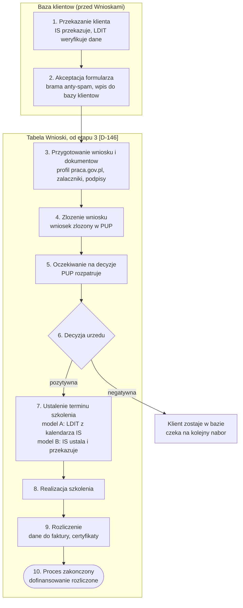
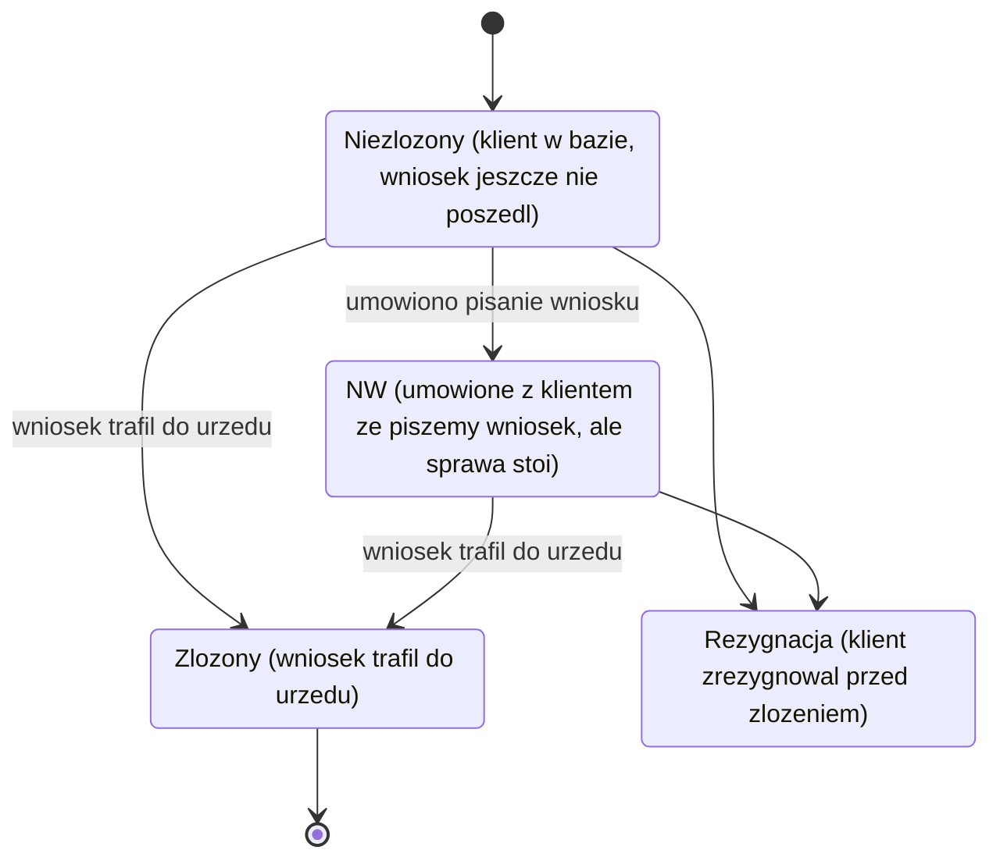
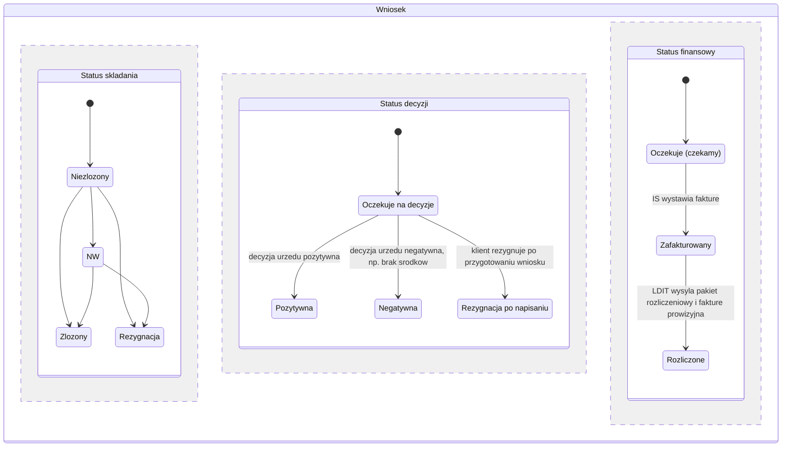

# 04. Proces i statusy

## Przebieg procesu end-to-end

```
1. POZYSKANIE           handlowiec IS pozyskuje klienta końcowego
                        wysyła link do formularza zgłoszeniowego
                                    |
2. FORMULARZ            klient końcowy wypełnia formularz online
                        system rejestruje datę wpłynięcia automatycznie
                                    |
3. AKCEPTACJA           Bartek klika "Akceptuj", rekord wchodzi do bazy
                        (bramka anty-spamowa)
                                    |
                        >>> ROLA HANDLOWCA IS SIĘ KOŃCZY <<<
                                    |
4. OCZEKIWANIE          klient trafia do bazy "Niezłożone"
   NA NABÓR             system wiąże go z naborem właściwego PUP
                        (aktualnym lub prognozowanym)
                                    |
5. PRZYGOTOWANIE        rejestracja klienta w BUR
   WNIOSKU              przygotowanie wniosku, ustalenie szkoleń i kwot
                                    |
6. ZŁOŻENIE             wniosek złożony w PUP
                                    |
7. DECYZJA              urząd wydaje decyzję pozytywną lub negatywną
                        urząd może obciąć kwotę lub liczbę osób
                                    |
8. USTALENIE            termin szkolenia ustalony (model A lub B)
   TERMINU              ewentualne pismo do PUP o zmianie terminu
                                    |
9. REALIZACJA           szkolenie się odbywa
                                    |
10. ROZLICZENIE         IS wystawia fakturę
                        system generuje certyfikaty (paczka ZIP)
                        LDIT wysyła klientowi paczkę rozliczeniową
                        LDIT wystawia fakturę prowizyjną instytucji
```

### Aktualizacja 2026-09-04: proces Działu Dotacji w 10 etapach [D-146]

Na warsztacie doprecyzowującym klient dostarczył diagram `Etapy_procesu.png` ze szczegółowym procesem obsługi klienta przez Dział Dotacji. Pełny opis etapów, role i cytaty są w [17. Warsztat 2026-09-04](17-warsztat-2026-09-04.md#proces-obsługi-klienta-przez-dział-dotacji). Poniższy diagram porządkuje te same 10 etapów i zaznacza granicę, od której klient wchodzi do tabeli **Wnioski** (wcześniej figuruje wyłącznie w **Bazie klientów**).



> Klient wchodzi do tabeli Wnioski dopiero od etapu 3, wcześniej figuruje tylko w Bazie klientów, patrz [17. Warsztat 2026-09-04](17-warsztat-2026-09-04.md).

---

## Statusy

W obecnym Excelu funkcjonują **dwa niezależne statusy** na jednym wierszu. Warsztat potwierdził ich istnienie, ale nie ustalił, czy w systemie zostaną dwa pola, czy jeden łańcuch [P-42].

### Status składania (dziś: "status lewy")

Cztery stany i przejścia między nimi (znaczenie każdego stanu w opisie węzła):



> **Bartek (1:43:10):** o statusie NW: "w momencie jak już [umówiliśmy się z] klientem, że piszemy wniosek, ale na razie się nic nie dzieje (...) nie wiem od czego to jest skrót, kiedyś wymyśliłem i tak zostało."

**`NW` to nazwa do zmiany** [P-11]. Rozwinięcie skrótu zostało zapomniane przez samego klienta.

### Status decyzji (dziś: "status prawy")

| Status | Kolor wiersza | Znaczenie |
|---|---|---|
| `Pozytywna` | **zielony** (delikatny) | Dofinansowanie przyznane |
| `Negatywna` | **pomarańczowy** (intensywny, dawniej czerwony jasny) | Odmowa (często brak środków w urzędzie) |
| `Rezygnacja po napisaniu` | **żółty** | Klient zrezygnował po przygotowaniu wniosku |

### Status finansowy

| Status | Kolor wiersza |
|---|---|
| `Oczekuje` (czekamy) | **biały** |
| `Zafakturowany` | brak |
| `Rozliczone` | **granatowy** (z delikatnym fioletem) |

### Diagram stanów: trzy wymiary statusu razem

Poniższy diagram łączy wszystkie trzy statusy w jednym widoku, jako trzy równoległe regiony jednego stanu "Wniosek". Nie zakłada to, że w systemie będzie to jeden łańcuch, to wciąż zależy od rozstrzygnięcia [P-42]. Diagram pokazuje tylko przejścia potwierdzone w dokumentacji, bez łączenia strzałkami statusu składania ze statusem decyzji, bo ta zależność nie została jednoznacznie opisana na warsztacie.



---

## Kolorowanie wierszy [D-01, TWARDA; paleta D-123, kody HEX z Excela D-158]

Kolor obejmuje **cały wiersz** i zmienia się **automatycznie** przy zmianie statusu. Na warsztacie ustalono paletę trójbarwną (czerwony/zielony/fioletowy). **2026-09-04 klient rozszerzył ją do pięciu stanów** [D-123], a **2026-09-29 podał dokładne kody HEX z obecnego Excela** [D-158].

### Paleta obowiązująca (5 stanów, kody z Excela klienta) [D-158]

| Status | Kolor | Tło (hex) | Tekst (hex) |
|---|---|---|---|
| **Czekamy** (oczekuje na decyzję) | biały | `#FFFFFF` | `#334155` |
| **Pozytywna** (decyzja pozytywna) | zielony | `#C6E0B4` | `#1E3A10` |
| **Negatywna** (decyzja negatywna) | łososiowy | `#F8CBAD` | `#5C2400` |
| **Rezygnacja** | żółty | `#FFE699` | `#5C4A00` |
| **Rozliczony** (kompletnie) | jasnoniebieski | `#B4C6E7` | `#1F3864` |

Tła są dokładnie tymi kodami, których zespół używa dziś w Excelu. Kolor tekstu dobrał wykonawca tak, żeby na każdym tle był czytelny. Poprzednia paleta z D-123 (pomarańcz `#f6a94a`, granat `#3a3f72`) przestaje obowiązywać.

Osobny kontekst: klient z aktywnym naborem w widoku "Baza klientów" (dawniej "Niezłożone") wyróżniany jest zielonym akcentem na krawędzi wiersza, niezależnie od statusu decyzji.

> **Bartek (0:14):** "w przypadku negatywnej odpowiedzi używamy po całym wierszu koloru czerwonego, takiego jasnego, w przypadku pozytywnej używamy zielonego, w przypadku już rozliczenia kompletnego całego projektu używamy fioletowego koloru, więc żebyśmy te kolory też utrzymali. Czyli jeżeli zmienimy status wniosku z pozytywnej na rozliczony, żeby kolor się po całej długości ustawił."

> **Aktualizacja 2026-09-04 (D-123).** Klient doprecyzował kolory: negatywny zmienia się z czerwonego na bardziej intensywny pomarańczowy (ewentualnie jasny czerwony), dochodzi żółty dla rezygnacji i biały dla stanu "czekamy", a rozliczone przechodzi z fioletu na granatowy z domieszką delikatnego fioletu (albo granatowy z szarym).

> **Bartek (feedback 29.09.2026):** "Moim zdaniem wygląda to czytelnie, więc w dobrym kierunku idziemy. Zmienimy jedynie kolory na identyczne jakimi operowaliśmy teraz (statusy)."

> **Aktualizacja 2026-09-29 (D-158).** Kody HEX: Pozytywna `#C6E0B4`, Negatywna `#F8CBAD`, Rozliczony `#B4C6E7`, Rezygnacja `#FFE699`. Wszystkie cztery tła są jasne, więc tekst na każdym wierszu jest ciemny.

**Uwaga dostępnościowa:** kolor jest dodatkiem do statusu tekstowego, nie jego zamiennikiem. Nazwane statusy muszą być widoczne obok kolorów.

---

## Wyzwalacze powiadomień

Powiadomienia mailowe wyzwalane zmianą statusu lub datą. Szczegóły w [08. Powiadomienia i automatyzacje](08-powiadomienia-i-automatyzacje.md).

| Wyzwalacz | Powiadomienie | Odbiorca | Tryb |
|---|---|---|---|
| Status = Pozytywna decyzja | Prośba o ustalenie terminu | Instytucja (osoba od terminów) | Automatyczny |
| IS wpisała termin | Termin ustalony, zgłoś do urzędu | LDIT | Automatyczny |
| Ręcznie, przyciskiem | Wniosek w trakcie przygotowania | Klient końcowy | Ręczny |
| Ręcznie, przy wniosku | Dane do faktury | Instytucja | Ręczny [D-104] |
| IS oznaczyła fakturę wystawioną | Alert o fakturze | Osoba odpowiedzialna za faktury | Automatyczny |
| Zbliżający się termin (8 dni) | Sprawdzenie kompletu dokumentów | LDIT | Automatyczny |
| Dzień lub dwa przed terminem | Szczegóły organizacyjne | Uczestnicy terminu | Automatyczny |
| Ręcznie, przyciskiem | Instrukcja zakładania konta praca.gov.pl | Klient końcowy | Ręczny [D-106] |
| Ręcznie, przyciskiem | Prośba o opinię w Google | Klient końcowy | Ręczny, do dosłania |

**Kanał: wyłącznie e-mail.** SMS odrzucony w etapie I [D-04].

**Alerty konfigurowalne** [D-89]: obok automatyzacji systemowych administrator i pracownicy mogą ustawić alert ręcznie na wybraną datę (np. "7 dni przed szkoleniem sprawdź harmonogram"). Cztery alerty rozpisane przez klienta są wypisane w [08. Powiadomienia](08-powiadomienia-i-automatyzacje.md#cztery-alerty-rozpisane-przez-klienta).

---

## Widok "Niezłożone" jako baza klientów [D-43, TWARDA]

Nazwa myląca, do zmiany. To jest **baza wszystkich klientów**, niezależnie od tego, czy wniosek już poszedł.

> **Bartek (2:46:58):** "teraz co tu: klienci, którzy już byli złożeni, plus 5, którzy oczekują na nabór. Czasami [klient] idzie 3 razy w roku na inne szkolenie, 3 razy wnioskuje do urzędu. Inaczej bym to nazwał: baza klientów."

### Wymagane zachowanie

1. **Powiązanie z modułem naborów**, w tym naborami prognozowanymi. Dziś Bartek ręcznie wpisuje daty naboru i zaznacza rekordy na zielono.
2. **Wizualne wyróżnienie** klienta, u którego ruszył lub zaraz ruszy nabór.
3. **Sortowanie po dacie zakończenia naboru rosnąco** (najpilniejsze na górze).
4. **Widok zestawienia, nie alerty.** Wykonawca wprost odróżnił: "dostawać może nie alerty, ale jeden taki widok z zestawienia."

> **Bartek (2:48:57):** "żeby to było posortowane: najszybciej się kończy do najpóźniej się kończy ten nabór."

### Kto tego nie widzi

Handlowiec IS **nie** dostaje tej informacji [D-91, propozycja wykonawcy odrzucona].

> **Bartek (2:49:28):** "my się kontaktujemy z klientem, nie handlowiec. Jak już dostaniemy formularz, to wszystkie operacje są już po naszej stronie, więc to jest zbędna informacja do handlowca."

---

## Masowa aktualizacja statusów

Realny scenariusz pracy: urząd ogłasza wyniki, LDIT filtruje wnioski po PUP i masowo zmienia statusy.

**Wymaganie:** filtr po urzędzie pracy na zakładce wniosków + oznaczanie wyników kolorami (zielony pozytywny, czerwony negatywny) w widoku przefiltrowanym [D-110].

Przykład podany na warsztacie: "wszystkie wnioski na Warszawę".

---

## Rejestracja dat

Trzy daty są krytyczne i mają różne role:

| Data | Rejestracja | Rola |
|---|---|---|
| **Data wpłynięcia formularza** | Automatyczna [D-94] | Dowód, kiedy dokumenty dotarły. Obrona przed pretensjami |
| **Data aktualizacji rekordu** | Automatyczna | Ślad zmian |
| **Data wystawienia faktury** | Domyślnie ostatni dzień szkolenia, edytowalna [D-13] | **Wyznacza okres rozliczeniowy prowizji** |

Uzasadnienie automatycznej rejestracji daty formularza:

> **Bartek (2:52:40):** "mieliśmy sytuację, gdzie kończył się nabór 5 kwietnia, dostaliśmy formularz też 5 kwietnia i były do nas pretensje, czemu nie zrobiliśmy wniosku. Musiałem prześledzić maila, kiedy dostaliśmy formularz od tego handlowca, żeby przekazać instytucji szkoleniowej, że handlowiec nawalił, przesłał w ostatni dzień terminu naboru."

Uzasadnienie rozdzielenia daty faktury od daty szkolenia:

> **Bartek (26:22):** "chcieli od niego faktury [wcześniej]. Więc ten przychód liczy się nie do grudnia, tylko do sierpnia."
