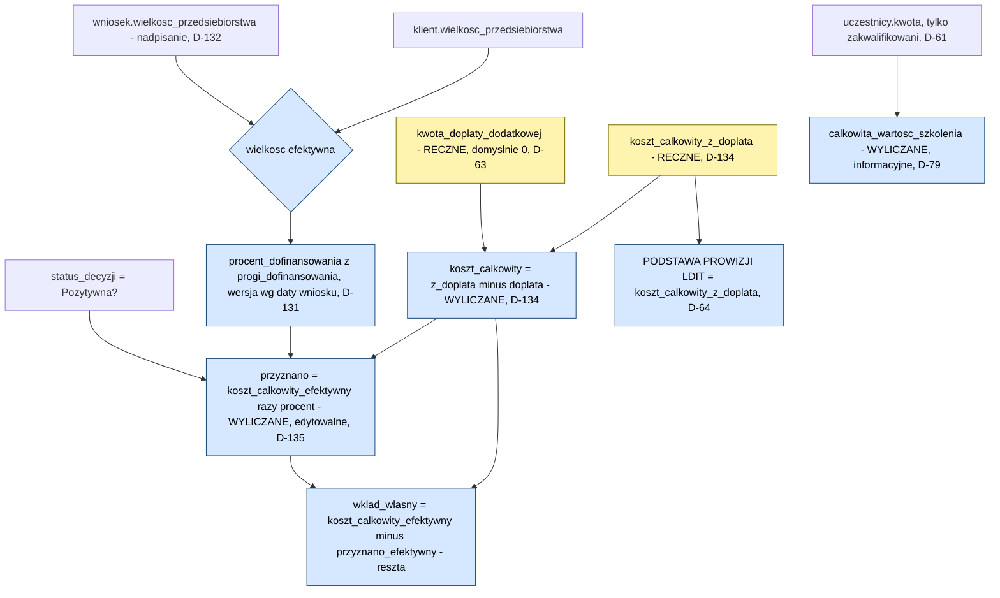

# 06. Model finansowy KFS

> **Aktualizacja po warsztacie 2026-09-04.** Progi dofinansowania są **konfigurowalne i wersjonowane datą** [D-131] (koryguje D-59, nie są już sztywne). Wielkość przedsiębiorstwa **edytowalna per wniosek**, z kryterium obrotu >2 mln EUR [D-132] (koryguje D-68). **"Koszt całkowity z dopłatą" ręczny, "koszt całkowity" wyliczany** [D-134] (odwraca D-64). **"Przyznano" edytowalne** z przywracaniem reguły [D-135] (odwraca D-58, zamyka P-30). Konflikty i pełny kontekst: [17. Warsztat doprecyzowujący](17-warsztat-2026-09-04.md).

> **Aktualizacja z budowy makiety na bazie danych (2026-09-23).** Cały łańcuch wyliczeń opisany niżej jest zaimplementowany jako widok SQL `v_wniosek_finanse` w `makieta/db/views.sql` - jedno miejsce, z którego korzysta każdy ekran makiety [D-152]. Progi 90/10 i 70/30 są wierszami tabeli `progi_dofinansowania`, nie liczbami w kodzie [D-131, D-155]. Ten rozdział został przepisany tak, żeby kolejność wyliczeń zgadzała się z tym widokiem.

Ten rozdział opisuje kwoty **po stronie klienta końcowego i urzędu**. Prowizja LDIT jest opisana osobno w [07. Silnik prowizji](07-silnik-prowizji.md) - tu tylko wskazujemy, które pole jest jej podstawą.

---

## Reguły zewnętrzne KFS

To są przepisy, nie preferencje klienta. Nie podlegają negocjacji.

### Wskaźnik dofinansowania zależy od wielkości przedsiębiorstwa

| Wielkość | Kryterium | Dofinansowanie | Wkład własny |
|---|---|---|---|
| **Mikroprzedsiębiorca** | do **9 osób** zatrudnionych łącznie na umowie o pracę | **90%** (x 0,9) | 10% |
| Mały, średni, duży, inny | powyżej 9 osób | **70%** (x 0,7) | 30% |

> **Bartek (1:51:21):** "Jeżeli firma zatrudnia do 9 osób łącznie na umowie o pracę, jest mikroprzedsiębiorcą. Wszystko powyżej to już mały, średni, duży, inny przedsiębiorca. I wszyscy ci powyżej mikro mają 70% dofinansowania, 30 wkładu własnego. Znajdziemy tę informację o zatrudnieniu w formularzu klienta."

**Te wartości nie są stałą regułą zewnętrzną w sensie informatycznym - są konfigurowalne i wersjonowane datą [D-131].**

> To jest istotne rozróżnienie: 90/10 i 70/30 to reguła KFS jako program dofinansowania (nie da się z nią negocjować), ale sposób, w jaki system ją przechowuje, **musi dopuszczać zmianę na kolejny rok** bez ingerencji w kod. Tabela `progi_dofinansowania` ma kolumny `wielkosc`, `procent_dofinansowania`, `obowiazuje_od`, `obowiazuje_do` [D-131, D-155]. `obowiazuje_do = NULL` oznacza wersję aktualną. Widok `v_wniosek_finanse` dobiera właściwy wiersz wg wielkości i daty wniosku, z fallbackiem do 70%, jeśli nie znajdzie dopasowania. **Nie wolno tych liczb zaszywać na sztywno w kodzie ani w konfiguratorze** - dokładnie ta sama zasada wersjonowania datą, co przy warunkach prowizyjnych [D-22].

**Wkład własny nie jest osobną kolumną przechowywaną w bazie.** Jest liczony jako **reszta**: `koszt_calkowity_efektywny - przyznano_efektywny`, wyłącznie w widoku i w kodzie ekranu wniosku (patrz sekcja "Reguły zaokrąglania" niżej). Wcześniejsza wersja tego rozdziału opisywała `wklad_wlasny_procent` jako osobne pole wyliczane z wielkości przedsiębiorstwa - takiej kolumny nie ma w `schema.sql`. Procent wkładu (`100 - procent_dofinansowania`) jest liczony doraźnie do wyświetlenia, nie przechowywany.

> **KONFLIKT DECYZJI [P-53], stan na dziś.** Warsztat wydał dwie sprzeczne decyzje o wkładzie własnym, obie oznaczone jako TWARDE:
> - **D-59** (1:51:21): wkład własny **wynika z wielkości przedsiębiorstwa**, przechowywany procentowo, czyli wyliczany
> - **D-80** (2:25:46): wkład własny i kwota dopłaty dodatkowej **wpisywane ręcznie**
>
> **To, co faktycznie zaimplementowano w `schema.sql`/`views.sql`, jest zbliżone do rekomendacji pogodzenia obu decyzji**, opisanej pierwotnie w tym rozdziale: procent dofinansowania jest wyliczany z wielkości przedsiębiorstwa i daty (D-59, D-131), a **kwoty**, które o nim decydują, są w większości ręczne i podlegają regule kasowania/przywracania [D-19] - `koszt_calkowity_z_doplata` jest wprost ręczny [D-134], `przyznano` jest wyliczane z reguły, ale edytowalne [D-135], a `kwota_doplaty_dodatkowej` jest ręczna od początku [D-63]. Formalnie **P-53 pozostaje pytaniem otwartym do potwierdzenia z klientem** (nie zmieniamy tego pliku), ale bieżąca implementacja jest z nim spójna.

### Dofinansowanie przyznawane firmie, nie osobie

Beneficjentem jest zawsze pracodawca. Uczestnicy są przypisani do firmy i do wniosku.

### Kwalifikowalność uczestnika

Osoba bez umowy o pracę nie kwalifikuje się do KFS. Typowy przypadek: prezes zarządu będący większościowym udziałowcem.

> **Bartek (2:30:45):** "Jestem prezesem zarządu, który jest większościowym udziałowcem, i nie ma na dodatek umowy o pracę, czyli się w ogóle do KFS nie kwalifikuje."

**Konsekwencja twarda:** osoby niezakwalifikowanej **nie wolno dopisać do kosztu całkowitego projektu**. Wymaga odrębnej faktury komercyjnej.

> **Bartek (2:30:18):** "Osoba dziesiąta, która się nie zakwalifikowała, nie możemy jej wystawić tutaj 10000, dopisać do kosztów całkowitych, bo jej w ogóle to szkolenie nie obejmuje z tego projektu, tylko musisz jej wystawić odrębną fakturę na 10000 jako komercyjne."

W bazie odpowiada temu kolumna `uczestnicy.status_kwalifikacji` i warunek w widoku `v_wniosek_finanse`: do `calkowita_wartosc_szkolenia` wchodzą wyłącznie wiersze ze statusem `zakwalifikowany` [D-61, D-79].

---

## Łańcuch wyliczeń - kolejność po D-134/D-135

**Kierunek wyliczeń został odwrócony względem pierwszego warsztatu.** Pierwotnie (D-58, D-64) pracownik wpisywał `koszt_calkowity`, system liczył z niego `przyznano`, a `koszt_calkowity_z_doplata` był sumą kosztu i dopłaty. Od warsztatu 04.09.2026 jest odwrotnie:

1. **Wielkość efektywna** = nadpisanie na wniosku (`wnioski.wielkosc_przedsiebiorstwa`), a gdy puste - wielkość klienta [D-132].
2. **Procent dofinansowania** = z tabeli `progi_dofinansowania`, wersja obowiązująca w dniu wniosku [D-131].
3. **Koszt całkowity z dopłatą** - pole **RĘCZNE**, wpisywane przez pracownika wprost [D-134]. To jest zarazem **podstawa prowizji LDIT** [D-64].
4. **Kwota dopłaty dodatkowej** - pole **RĘCZNE**, domyślnie 0 [D-63].
5. **Koszt całkowity** - **WYLICZANY** jako `koszt_calkowity_z_doplata - kwota_doplaty_dodatkowej` [D-134]. Ma własną regułę (`koszt_regula_aktywna`) i można go ręcznie nadpisać z przywróceniem reguły [D-19].
6. **Przyznano** - **WYLICZANE z reguły, ale edytowalne** jako `koszt_calkowity_efektywny x procent_dofinansowania`, tylko gdy `status_decyzji = Pozytywna` [D-135]. Ma własną regułę (`przyznano_regula_aktywna`).
7. **Wkład własny (kwota)** - liczony jako **reszta**: `koszt_calkowity_efektywny - przyznano_efektywny`, żeby równanie kontrolne zawsze się domykało (patrz "Reguły zaokrąglania" niżej).
8. **Całkowita wartość szkolenia** - suma warunkowa po uczestnikach zakwalifikowanych [D-79, D-61]. To pole jest **informacyjne i niezależne** od powyższego łańcucha - odkąd `koszt_calkowity_z_doplata` jest ręczny, nie musi już z niego wprost wynikać (pracownik może np. wpisać kwotę uznaną przez urząd inną niż suma uczestników, tak jak w przykładzie 3 niżej).

### Diagram łańcucha



Żółte węzły są polami ręcznymi, niebieskie są wyliczane (część z nich - `koszt_calkowity` i `przyznano` - jest wyliczana z regułą, którą można nadpisać ręcznie i przywrócić, patrz [03. Model danych](03-model-danych.md#mechanizm-w-praktyce-d-19-d-153)).

---

## Pola kwotowe wniosku

| Pole | Sposób | Definicja |
|---|---|---|
| **Koszt całkowity z dopłatą** | **ręczne** | Wpisywane wprost przez pracownika. **Podstawa prowizji LDIT** [D-64, D-134] |
| **Kwota dopłaty dodatkowej** | **ręczne**, domyślnie 0 | Dodatkowa kwota poza standardowym wkładem własnym [D-63] |
| **Koszt całkowity** | wyliczane, edytowalne z przywróceniem reguły | `koszt_calkowity_z_doplata - kwota_doplaty_dodatkowej`. Odpowiednik dawnego "kosztu uznanego przez urząd" [D-134] |
| **Przyznano** | wyliczane, edytowalne z przywróceniem reguły | `koszt_calkowity x wskaznik` (0,9 lub 0,7), tylko gdy decyzja jest pozytywna [D-135] |
| **Wkład własny (kwota)** | wyliczane, tylko do wyświetlenia | `koszt_calkowity - przyznano` (reszta, nie osobna kolumna) |
| **Wkład własny (%)** | wyliczane, pomocnicze, tylko do wyświetlenia | `100 - procent_dofinansowania`, niezależnie liczony z tabeli progów |
| **Całkowita wartość szkolenia** | wyliczane | Suma kwot uczestników **zakwalifikowanych**. Niezależna od reszty łańcucha [D-79] |

### Korekta nazewnictwa z warsztatu

> **Bartek (2:03:18):** "To jest nie kwota wnioskowana, tylko wartość na jaką szkolenie będzie, wartość szkolenia. Czyli to jest ten koszt całkowity jaki wnioskujemy, a nie samo dofinansowanie."

Pole nazywane wcześniej "kwota wnioskowana" oznacza **całkowitą wartość szkolenia**.

### Spór o nazwę `koszt całkowity` [P-13, OTWARTE]

> **Bartek (2:06:02):** "to się nie nazywa koszt całkowity", proponował "dofinansowanie ze wkładem własnym".

Nazwa nie została ustalona. Rekomendacja: **"Koszt uznany przez urząd"**, bo to precyzyjnie oddaje semantykę i nie myli się z całkowitą wartością szkolenia ani z kosztem z dopłatą. Uwaga: po D-134 to pole `koszt_calkowity` jest wyliczane, a nie ręczne jak w chwili, gdy padał ten cytat - spór o nazwę pozostaje aktualny niezależnie od tego, które pole jest ręczne.

---

## Wzory

```
wskaznik_dofinansowania = z tabeli progi_dofinansowania,
                          wg wielkosci efektywnej (wniosek albo klient, D-132)
                          i daty wniosku (wersja wazna na ten dzien, D-131)
                          -- wartosci domyslne 0,90 dla mikro i 0,70 dla pozostalych,
                          -- ale konfigurowalne i bez gwarancji, ze zostana takie na zawsze

wielkosc_efektywna = COALESCE(wniosek.wielkosc_przedsiebiorstwa, klient.wielkosc_przedsiebiorstwa)

calkowita_wartosc_szkolenia = SUMA( uczestnik.kwota )
                              WHERE uczestnik.status = 'zakwalifikowany'
                              -- informacyjne, nie wchodzi wprost do ponizszego lancucha

// pola RECZNE:
koszt_calkowity_z_doplata     <- wpisuje pracownik. TO JEST PODSTAWA PROWIZJI LDIT
kwota_doplaty_dodatkowej      <- wpisuje pracownik, domyslnie 0

// pola WYLICZANE, kazde z para (regula_aktywna, wartosc_efektywna):
koszt_calkowity = koszt_calkowity_z_doplata - kwota_doplaty_dodatkowej

przyznano = koszt_calkowity_efektywny * wskaznik_dofinansowania
            WHERE status_decyzji = 'Pozytywna' (w przeciwnym razie brak wartosci)

wklad_wlasny = koszt_calkowity_efektywny - przyznano_efektywny   -- reszta, nie osobna kolumna
```

**Ograniczenie 1:** formuła `przyznano` **nie może uwzględniać dopłaty dodatkowej**. Dopłata to pieniądz klienta/instytucji, nie urzędu. Zasada zachowana mimo odwrócenia kierunku wyliczeń: dopłata jest odejmowana od `koszt_calkowity_z_doplata` **zanim** wynik trafi do wzoru na `przyznano`.

> **Bartek (2:01:41):** "jak doliczy się to do kosztu całkowitego, to się przyznano [zmieni], więc tutaj trzeba by było jeszcze w formule dopisać, że nie uwzględnia tej dopłaty."

**Ograniczenie 2:** dopłata dodatkowa **nie powinna** podnosić wartości ponad ustaloną całkowitą wartość szkolenia. Uwaga: to jest reguła biznesowa, nie ograniczenie egzekwowane przez `CHECK` w `schema.sql` - dziś nic w bazie nie blokuje wpisania `koszt_calkowity_z_doplata` wyższego niż `calkowita_wartosc_szkolenia`. Walidacja musi żyć w warstwie aplikacji, jeśli ma być egzekwowana.

> **Bartek (2:04:45):** "Nie mogą dopłacić więcej niż jeżeli ustawiliśmy, że koszt całkowity to było 200000. Nie może być za 220. Czyli dopłata jest w przypadku, jeżeli na przykład dostali za mało."

**Ograniczenie 3:** równanie kontrolne
```
przyznano + wklad_wlasny = koszt_calkowity
```
Domyka się zawsze, bo `wklad_wlasny` jest liczony jako reszta (`koszt_calkowity_efektywny - przyznano_efektywny`), a nie liczony niezależnie i potem sumowany. Przykład: 90 000 + 10 000 = 100 000.

---

## Reguły zaokrąglania i typ danych

> **Uwaga.** Ten rozdział nie wynika wprost z warsztatu jako gotowa decyzja klienta. To luka wykryta przy analizie dokumentacji, częściowo domknięta przy implementacji makiety [P-51].

**Problem.** Wskaźniki 0,9 i 0,7 dają wartości niecałkowite. Przykład: koszt całkowity 3 333,33 zł x 0,7 = 2 333,331 zł. Bez reguły zaokrąglania `przyznano + wkład własny` nie zsumuje się do kosztu całkowitego.

**Rozwiązanie zaimplementowane w makiecie:** wkład własny **nie jest liczony niezależnie i zaokrąglany osobno** - jest liczony jako reszta po zaokrągleniu `przyznano`. Dzięki temu równanie kontrolne domyka się zawsze, z definicji, a nie dzięki dyscyplinie zaokrągleń w dwóch miejscach.

```
koszt 3 333,33 x 0,7 = 2 333,331  ->  zaokraglone: 2 333,33   (przyznano)
wklad = koszt - przyznano = 3 333,33 - 2 333,33 = 1 000,00    (reszta, nie osobne mnozenie)
suma: 2 333,33 + 1 000,00 = 3 333,33   OK zawsze
```

**Pozostałe rekomendacje do zatwierdzenia** (nieegzekwowane dziś przez `schema.sql`, bo SQLite przechowuje kwoty jako `REAL`):

| Zasada | Wartość |
|---|---|
| Typ danych dla kwot | Docelowo (Postgres) dziesiętny stałoprzecinkowy, nigdy zmiennoprzecinkowy - `NUMERIC(12,2)`. W SQLite makiety kwoty są `REAL`, co jest świadomym uproszczeniem prototypu, nie do przenoszenia na produkcję bez zmiany |
| Precyzja prezentacji | 2 miejsca po przecinku |
| Metoda zaokrąglania | Matematyczna, do najbliższej setnej (0,005 w górę) |
| Stawki prowizji | Przechowywane z precyzją do 0,01 punktu procentowego (17,5% jako 17,50) |
| Prowizja przy podziale przez próg | Zaokrąglić **dopiero sumę** części, nie każdą część osobno |

**Do potwierdzenia u klienta:** czy urząd stosuje własne zaokrąglenia, które mogą się różnić od systemowych. Jeśli tak, to jest dodatkowym argumentem za tym, żeby zarówno `koszt_calkowity`, jak i `przyznano` pozostały edytowalne z możliwością ręcznej korekty - co zresztą już jest zaimplementowane [D-134, D-135].

---

## Przykłady liczbowe krok po kroku

Poniższe przykłady pokazują **aktualny** łańcuch wyliczeń (po D-134/D-135), z każdą wartością pośrednią, i wskazują, że **podstawą prowizji LDIT jest zawsze `koszt_calkowity_z_doplata`** [D-64], czyli pole ręczne, nie `przyznano` i nie `koszt_calkowity`.

### Przykład 1: mikroprzedsiębiorca, 90/10, bez dopłaty dodatkowej

```
Wielkosc efektywna:                  mikro
Procent dofinansowania (z progi_dofinansowania, D-131):   90%
Uczestnicy zakwalifikowani, suma kwot (informacyjnie):    100 000 zl

Krok 1 (RECZNE)  koszt_calkowity_z_doplata   =  100 000 zl
Krok 2 (RECZNE)  kwota_doplaty_dodatkowej    =        0 zl
Krok 3 (WYLICZANE) koszt_calkowity = 100 000 - 0            =  100 000 zl
Krok 4 (WYLICZANE) przyznano = 100 000 x 0,90                =   90 000 zl
Krok 5 (reszta)     wklad_wlasny = 100 000 - 90 000           =   10 000 zl

Rownanie kontrolne: 90 000 + 10 000 = 100 000  OK

PODSTAWA PROWIZJI LDIT = koszt_calkowity_z_doplata = 100 000 zl
```

### Przykład 2: firma powyżej mikro, 70/30, bez dopłaty dodatkowej

Oparte na przykładzie z warsztatu (10 osób zgłoszonych, 9 zakwalifikowanych - prezes bez umowy o pracę odpada, D-61).

```
Wielkosc efektywna:                  srednia
Procent dofinansowania:              70%
Uczestnicy zakwalifikowani:          9 osob
Suma kwot zakwalifikowanych (informacyjnie):   90 000 zl

Krok 1 (RECZNE)  koszt_calkowity_z_doplata   =  90 000 zl
Krok 2 (RECZNE)  kwota_doplaty_dodatkowej    =       0 zl
Krok 3 (WYLICZANE) koszt_calkowity = 90 000 - 0             =  90 000 zl
Krok 4 (WYLICZANE) przyznano = 90 000 x 0,70                 =  63 000 zl
Krok 5 (reszta)     wklad_wlasny = 90 000 - 63 000            =  27 000 zl

Rownanie kontrolne: 63 000 + 27 000 = 90 000  OK

PODSTAWA PROWIZJI LDIT = koszt_calkowity_z_doplata = 90 000 zl
```

Na warsztacie Bartek najpierw omyłkowo podał 81 000 zł (mnożąc x 0,9), po czym sam się poprawił: "nie możesz tego zrobić, bo to już nie jest mikroprzedsiębiorca." Błąd historyczny, zachowany w [17. Warsztat doprecyzowujący](17-warsztat-2026-09-04.md) i w poprzedniej wersji tego pliku - tu podana jest wyłącznie poprawna wersja liczb.

### Przykład 3: firma powyżej mikro z dopłatą dodatkową (instytucja nie schodzi z ceny)

Oparte na scenariuszu z warsztatu: IS wyceniła szkolenie na 200 000 zł, urząd uznał tylko 180 000 zł, instytucja dopłaca różnicę, żeby nie obniżać ceny referencyjnej u urzędu (patrz "Polityka cenowa wobec urzędów" niżej).

```
Wielkosc efektywna:                  srednia
Procent dofinansowania:              70%

Krok 1 (RECZNE)  koszt_calkowity_z_doplata   =  200 000 zl   <- pracownik wpisuje od razu pelna kwote
Krok 2 (RECZNE)  kwota_doplaty_dodatkowej    =   20 000 zl   <- to, co dopisala instytucja
Krok 3 (WYLICZANE) koszt_calkowity = 200 000 - 20 000        =  180 000 zl   <- kwota uznana przez urzad
Krok 4 (WYLICZANE) przyznano = 180 000 x 0,70                 =  126 000 zl
Krok 5 (reszta)     wklad_wlasny = 180 000 - 126 000           =   54 000 zl

Rownanie kontrolne: 126 000 + 54 000 = 180 000  OK (rownanie dotyczy koszt_calkowity, nie z_doplata)

PODSTAWA PROWIZJI LDIT = koszt_calkowity_z_doplata = 200 000 zl, NIE 180 000 zl
```

**To jest kluczowa różnica względem starego modelu.** W poprzednim kierunku wyliczeń (`koszt_calkowity` ręczny, `koszt_calkowity_z_doplata` wyliczany jako suma) trzeba było osobno wpisać kwotę uznaną przez urząd i osobno dopłatę, a system dodawał je do siebie. Dziś pracownik wpisuje od razu **całą kwotę z dopłatą** (200 000 zł, czyli to, co naprawdę zapłaci klient/instytucja łącznie), a system **odejmuje** dopłatę, żeby odtworzyć kwotę uznaną przez urząd - potrzebną wyłącznie do wyliczenia `przyznano`. Podstawa prowizji LDIT jest tą samą liczbą w obu modelach (200 000 zł), zmienił się tylko kierunek, w którym system do niej dochodzi.

> **NIESPÓJNOŚĆ HISTORYCZNA [P-14], nadal nierozstrzygnięta.** We wcześniejszej wersji tego przykładu "dopłata standard" liczona była od 200 000 zł (wartość wnioskowana), a `przyznano` od 180 000 zł (koszt uznany). W aktualnym modelu problem częściowo znika, bo nie ma już osobnego pola "dopłata standard" - jest tylko `wklad_wlasny` liczony jako reszta od `koszt_calkowity`. Pytanie, od której podstawy liczy się procentowy wkład własny **do celów informacyjnych** (np. w mailu do klienta), pozostaje otwarte.

---

## Kiedy pojawia się dopłata dodatkowa

Dwa scenariusze:

**Scenariusz A: urząd przyznał mniej niż potrzeba**

> **Bartek (2:04:45):** "urząd powiedział, że nie możemy wam dać 140, możemy wam dać góra 120."

**Scenariusz B: instytucja szkoleniowa nie zejdzie z ceny**

Cena bywa wyznaczana za grupę. Wypadnięcie jednej osoby oznacza albo dopłatę, albo niemożność realizacji.

> **Bartek (2:30:55):** "Cena była wyznaczona za grupę i nie zrealizujesz szkolenia za 90000 dla tych wszystkich osób. Muszą albo dopłacić 10000, albo niestety nie da się zrealizować szkolenia."

---

## Dodatkowe przykłady z warsztatu (kontekst historyczny)

Poniższe dwa przykłady padły na pierwszym warsztacie w kontekście starego kierunku wyliczeń (`koszt_calkowity` ręczny). Liczby są nadal poprawne jako **ilustracja reguł zewnętrznych KFS** (wskaźnik, kwalifikowalność, wielość szkoleń na wniosku), ale nie należy ich czytać jako opisu dzisiejszego przepływu pól - ten jest w przykładach 1-3 wyżej.

### Częściowe przyznanie i konwersja kwota przyznana -> koszt uznany

```
Wnioskowano (calkowita wartosc):     5 700 zl
Urzad przyznal tylko na 2 modulu
Kwota przyznana:                     4 000 zl
Wskaznik:                            0,9 (mikro)
Koszt uznany = 4 000 / 0,9  =  ok. 4 444 zl
Wklad wlasny (10%)          =  ok.   444 zl
```

To pokazuje **kierunek odwrotny**: gdy urząd podaje kwotę przyznaną (nie koszt uznany), trzeba ją podzielić przez wskaźnik, żeby odtworzyć koszt uznany, i to jest wartość, którą pracownik wpisze pośrednio przez pole `koszt_calkowity_z_doplata` (po doliczeniu ewentualnej dopłaty). System **nie liczy tego automatycznie w drugą stronę** - to nadal ręczna kalkulacja pracownika przed wpisaniem liczby do formularza, zgodnie z ryzykiem opisanym niżej.

### Negocjacja z urzędem (sprawa prowadzona przez Asię)

```
Klient dostal decyzje negatywna (brak srodkow w urzedzie)
Urzad oddzwonil: srodki jednak sa, ale koszt calkowity nie moze byc 16 000 zl
Urzad da maksymalnie:                12 000 zl
Liczba uczestnikow:                        2
Koszt uznany = 12 000 / 0,9  =  ok. 13 333 zl
Klient doplacil z wlasnych srodkow do:  16 000 zl
```

### Jeden wniosek, trzy różne szkolenia

```
7 osob x 10 000 zl  =  70 000 zl
1 osoba x  5 000 zl  =   5 000 zl
1 osoba x 15 000 zl  =  15 000 zl
                       ----------
Calkowita wartosc    =  90 000 zl
```

Reguła: **kwota dotyczy jednej osoby**, koszt całkowity to cena za osobę razy liczba osób, każda osoba wpisywana odrębnie.

> **Bartek (2:27:15):** "1900 zł za osobę szkolenia, wnioskuję 10 osób, czyli 19000, i każda ta osoba jest wpisywana odrębnie."

---

## Rozjazd danych źródłowych z urzędu [ryzyko]

Informacja od urzędu przychodzi **raz jako kwota przyznana, raz jako koszt całkowity z podanym procentem wkładu**. System musi obsłużyć konwersję w obie strony, ale dziś robi to **wyłącznie pracownik ręcznie przed wpisaniem liczby**, nie system automatycznie.

> **Paweł (2:00:33):** "no możemy to ujednolicić w systemie."

**Ryzyko:** urząd może przyznać kwotę, która nie wynika z mnożnika 0,7 ani 0,9 (przyznanie na część modułów, arbitralne obniżenie). Rozwiązanie przyjęte na warsztacie, czyli korekta pola `koszt_calkowity` (dziś: nadpisanie reguły przyznano lub kosztu, z przywróceniem reguły) tak, żeby wynik się zgadzał, jest **obejściem, nie modelem**. Patrz [15. Ryzyka](15-ryzyka.md).

---

## Polityka cenowa wobec urzędów

Reguła biznesowa istotna dla wartości systemu, choć nie jest wymaganiem funkcjonalnym etapu I.

**Precedens cenowy:** jeśli instytucja raz zejdzie z ceny, urząd nie zaakceptuje już wyższej kwoty dla tego szkolenia.

> **Bartek (2:33:35):** "Maciek zszedł z 6000 do 5. To żaden wniosek od tamtego momentu nie może być na 6. Wszystkie muszą być na 5, jeżeli chodzi o to szkolenie."

**Rekomendowana praktyka:** zamiast obniżać cenę, IS dopłaca ok. 1 000 zł z własnych środków. Dokładnie ten mechanizm jest widoczny w przykładzie 3 wyżej (`kwota_doplaty_dodatkowej`).

> **Bartek (2:33:35):** "Dopłacimy z naszej strony dodatkowe 1000 zł w celu realizacji szkolenia, żeby pokazać im, że jednak to szkolenie kosztuje 6000, a nie 5. Bo jeżeli zeszła instytucja do 5, to u następnych klientów też tak zrobi. A przy na przykład 100 wnioskach już będzie miało to duże znaczenie."

Skala efektu: **1 000 zł x 100 wniosków = 100 000 zł** utraconego przychodu instytucji.

**Potencjalne rozszerzenie (nie w etapie I):** system mógłby ostrzegać o historycznych cenach zaakceptowanych przez dany urząd dla danego szkolenia. Nie zgłoszone jako wymaganie, ale wynika wprost z tej reguły. Zauważmy, że `katalog_szkolen.cena` w dzisiejszym schemacie jest pojedynczą, bieżącą wartością bez historii (patrz rozjazd opisany w [03. Model danych](03-model-danych.md)) - takie ostrzeżenie wymagałoby najpierw historyzacji cen.

**W etapie I dopłaty i wkłady własne są wpisywane ręcznie**, bez automatyzacji [D-86].

> **Paweł (2:36:02):** "Dobra, zostawmy to. To będzie jako historia. Czyli jako taki status będziesz miał tę informację, ale to sobie wpiszesz z ręki, póki co."
