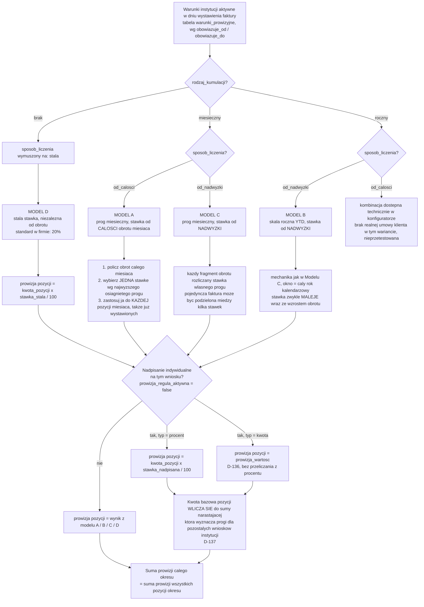

# 07. Silnik prowizji

> **Aktualizacja po warsztacie 2026-09-04.** Indywidualne nadpisanie per wniosek jako **procent albo kwota** [D-136] (koryguje D-21). Indywidualna stawka **wlicza się do puli progowej** miesięcznej lub rocznej [D-137] (rozstrzyga P-03). Nadpisanie robi się **z karty wniosku**; Administracja to podsumowanie po instytucjach plus dashboard prowizji miesięczny i narastająco [D-138]. Szczegóły: [17. Warsztat doprecyzowujący](17-warsztat-2026-09-04.md).

> **Uwaga o tej wersji dokumentu.** Ten rozdział jest napisany tak, żeby dało się go oddać modelowi bez dodatkowego kontekstu i otrzymać działającą implementację. Każdy z czterech modeli ma jednakową strukturę (opis, dane wejściowe, wzór, pełny przykład liczbowy, przypadki brzegowe). Wszystkie przykłady liczbowe zostały ręcznie przeliczone i zweryfikowane wobec działającej implementacji w `makieta/assets/prowizja.js` (funkcje `liczProwizje()` i `liczOkres()`) oraz wobec przypadków testowych w `makieta/strony/15-konfigurator-prowizji.html`.

> **Paweł (24:28):** "dzisiaj udało nam się przejść przez ten system prowizji, bo to jest chyba jedna z takich rzeczy trudniejszych."

To jest **najtrudniejszy element projektu**. Jeden fragment warsztatu (26:14 - 51:14, 25 minut) był poświęcony wyłącznie temu tematowi.

Silnik obsługuje dwa niezależne poziomy naliczania:
1. **Prowizja LDIT** pobierana od instytucji szkoleniowych (gotowa specyfikacja)
2. **Prowizja wewnętrzna** wypłacana pracownikom LDIT (specyfikacja niekompletna, blokada projektowa)

---

## Poziom 1: prowizja LDIT od instytucji szkoleniowych

### Podstawa naliczenia

**Koszt całkowity z dopłatą**, nie kwota przyznanego dofinansowania.

> **Bartek (39:38):** "Koszt całkowity, przyznanego nieprzyznanego [nie ma znaczenia], tylko koszt całkowity szkolenia."
>
> **Paweł (2:02:30):** "liczymy twoją prowizję od kosztu całkowitego z dopłatą."

**Prowizja zawsze wyrażana procentowo, nigdy kwotowo** [D-21] - z jednym udokumentowanym wyjątkiem: indywidualne nadpisanie per wniosek może być również kwotą [D-136], patrz sekcja "Nadpisanie indywidualne".

> **Bartek (45:36):** "To jest z procentów, prowizja zawsze wyliczana, zawsze ten procent jest, nie ma raczej stałej [kwoty]."

W schemacie bazy (`makieta/db/schema.sql`) po korekcie [D-134] podstawą jest kolumna `wnioski.koszt_calkowity_z_doplata` (pole **ręczne**), a `koszt_calkowity` jest wyliczany jako różnica (`z_doplata` minus `kwota_doplaty_dodatkowej`). To odwraca wcześniejszy kierunek wyliczenia opisany w `docs/03-model-danych.md` (linia 186, tam jeszcze nieaktualizowana po D-134) - w razie rozbieżności między tym rozdziałem a `03-model-danych.md`, źródłem prawdy dla silnika prowizji jest **ten dokument plus schema.sql**, bo oba zostały zaktualizowane po warsztacie 04.09.

### Okres rozliczeniowy

**Data wystawienia faktury**, przechowywana jako osobne pole per szkolenie/uczestnik (w schemacie: `wnioski.data_wystawienia_faktury`), niezależne od daty szkolenia. Domyślnie wypełniana datą ostatniego dnia szkolenia, **edytowalna ręcznie**.

> **Bartek (26:22):** "chcieli od niego faktury [wcześniej]. Więc ten przychód liczy się nie do grudnia, tylko do sierpnia."
>
> **Paweł (26:38):** "każde szkolenie, każda osoba powinna mieć swoją osobną kolumnę, niezależną od daty szkolenia, z datą wystawienia faktury. I na podstawie niej liczymy."

Realne przypadki wymuszające elastyczność:
- Faktura wystawiona w sierpniu za szkolenie w grudniu (urząd zażądał wcześniej)
- Faktura 7 dni po podpisaniu umowy przez klienta, nie po szkoleniu
- Termin płatności faktury prowizyjnej: 14 dni

**Uwaga o granularności.** W schemacie istnieje też tabela `faktury` (nagłówek księgowy: numer, kwota zbiorcza, `data_wystawienia`, `liczba_projektow`), do której wniosek odwołuje się przez `wnioski.faktura_id` [D-139]. To pole na fakturze jest wyłącznie do celów księgowych i wyszukiwania (numer faktury przy wniosku). **Okres rozliczeniowy prowizji wyznacza data na poziomie wniosku** (`wnioski.data_wystawienia_faktury`), nie data na nagłówku faktury zbiorczej - zgodnie z cytatem Pawła (26:38) o "osobnej kolumnie per szkolenie/osoba". Silnik traktuje więc jako "pozycję" pojedynczy wniosek (a nie wiersz tabeli `faktury`); pole `kwota` używane w `liczOkres()` odpowiada `wnioski.koszt_calkowity_z_doplata`.

---

## Architektura silnika: drzewo decyzyjne

Poniższy diagram pokazuje pełną ścieżkę decyzyjną: od warunków instytucji, przez `rodzaj_kumulacji` i `sposob_liczenia`, do wyboru jednego z czterech modeli, i dalej do sposobu naliczenia prowizji dla pozycji oraz ewentualnego nadpisania indywidualnego.



**Parametry konfiguratora** (pełny opis w sekcji "Struktura konfiguratora" niżej):

```
WARUNKI PROWIZYJNE (per instytucja, wersjonowane w czasie)
|
+-- rodzaj_kumulacji:  miesieczny | roczny | brak
|
+-- sposob_liczenia:   od_calosci | od_nadwyzki | stala
|
+-- progi[]:           [ (kwota_progu, stawka_%), ... ]
|
+-- stawka_stala:      %          (gdy rodzaj_kumulacji = brak)
|
+-- obowiazuje_od:     data       (typowo 1 stycznia kolejnego roku)
```

---

## Cztery modele naliczania

Wszystkie cztery występują w realnych umowach klienta. Silnik musi obsłużyć każdy. Każdy model opisany jest w jednakowej strukturze: opis słowny, dane wejściowe, wzór/pseudokod, pełny przykład liczbowy (minimum trzy pozycje w okresie) i przypadki brzegowe.

### Dane wejściowe wspólne dla wszystkich czterech modeli

| Tabela | Kolumna | Znaczenie |
|---|---|---|
| `warunki_prowizyjne` | `model` | `'A'` / `'B'` / `'C'` / `'D'`, etykieta czytelna dla administratora |
| `warunki_prowizyjne` | `rodzaj_kumulacji` | `'miesieczny'` / `'roczny'` / `'brak'` - okno czasowe, w którym sumuje się obrót do progów |
| `warunki_prowizyjne` | `sposob_liczenia` | `'od_calosci'` / `'od_nadwyzki'` / `'stala'` |
| `warunki_prowizyjne` | `stawka_stala` | używane tylko gdy `sposob_liczenia = 'stala'` (Model D) |
| `warunki_prowizyjne` | `obowiazuje_od` / `obowiazuje_do` | wersjonowanie w czasie [D-22]. `obowiazuje_do IS NULL` = warunki aktualne |
| `progi_prowizyjne` | `od_kwoty`, `stawka` | jeden wiersz na próg, posortowane rosnąco po `od_kwoty`. Pierwszy próg zawsze od 0 |
| `wnioski` | `koszt_calkowity_z_doplata` | podstawa naliczenia - to jest `kwota` pozycji w silniku |
| `wnioski` | `data_wystawienia_faktury` | wyznacza przynależność pozycji do miesiąca/roku okresu rozliczeniowego [D-13] |
| `wnioski` | `prowizja_regula_aktywna` | `false` = na tym wniosku aktywne jest nadpisanie indywidualne |
| `wnioski` | `prowizja_typ_nadpisania` | `'procent'` albo `'kwota'` [D-136], istotne tylko gdy `prowizja_regula_aktywna = false` |
| `wnioski` | `prowizja_wartosc` | wartość nadpisania (procent albo kwota, zależnie od typu) |

Kolejność pozycji w okresie to kolejność chronologiczna po `data_wystawienia_faktury`. Reguła tie-breakingu dla dwóch wniosków z identyczną datą **nie jest ustalona** - patrz [P-04].

---

### Model A: próg miesięczny, stawka od CAŁOŚCI

**Opis słowny.** Umowa "10/12%". Kumulacja miesięczna. Po przekroczeniu progu wyższa stawka obejmuje **cały obrót miesiąca**, nie tylko nadwyżkę - również te pozycje, które już wcześniej zostały rozliczone po niższej stawce.

> **Bartek (31:04):** "dokładnie od całej, tak, to nie jest od nadwyżki powyżej 50, tylko już od całej."

**Dane wejściowe.** `rodzaj_kumulacji = 'miesieczny'`, `sposob_liczenia = 'od_calosci'`. Przykładowe progi (Metal Maniak): `[(od_kwoty: 0, stawka: 10), (od_kwoty: 50000, stawka: 12)]`.

**Wzór / pseudokod.**
```
funkcja rozliczOkresModelA(progi, pozycje_miesiaca):
    obrot = suma(pozycje_miesiaca.kwota)
    stawka = najwyzszy prog taki, ze prog.od_kwoty <= obrot   // "<=", prog jest wlaczajacy
    dla kazdej pozycji w pozycje_miesiaca:
        pozycja.stawka = stawka
        pozycja.prowizja = pozycja.kwota x stawka / 100
    zwroc suma(pozycje_miesiaca.prowizja)
```

**Pełny przykład liczbowy (trzy faktury, miesiąc, obrót przekracza próg 50 000 zł).**

| Pozycja | Kwota | Obrót narastająco (informacyjnie) | Stawka po przeliczeniu okresu | Prowizja pozycji |
|---|---|---|---|---|
| Wniosek 1 | 18 000 zł | 18 000 zł | 12% | 2 160,00 zł |
| Wniosek 2 | 15 000 zł | 33 000 zł | 12% | 1 800,00 zł |
| Wniosek 3 | 19 500 zł | 52 500 zł | 12% | 2 340,00 zł |
| **Razem** | **52 500 zł** | - | **12% (efektywnie)** | **6 300,00 zł** |

Krok po kroku: obrót całego miesiąca = 52 500 zł, co jest powyżej progu 50 000 zł, więc **jedna wspólna stawka 12%** stosowana jest do wszystkich trzech pozycji, w tym do Wniosku 1 i 2, mimo że każdy z nich osobno byłby poniżej progu.

**Przykład graniczny (kluczowy dla testów, potwierdzony w przypadkach 1-2 niżej):**
```
faktury na 49 000 zl  ->  49 000 x 10% = 4 900 zl
faktury na 50 000 zl  ->  50 000 x 12% = 6 000 zl
```
Wzrost obrotu o 1 000 zł podnosi prowizję o 1 100 zł.

**Przykład z warsztatu (dwie faktury):**
```
Styczen:  26 000 + 25 000 = 51 000 zl  ->  12% od calosci  ->  6 120 zl (obie pozycje po 12%)
Luty:     25 000 + 24 000 = 49 000 zl  ->  10% od calosci  ->  4 900 zl
```

**Realne wystąpienie:** w sierpniu IS wystawiła faktury na 52 000 zł, całość rozliczona po 12% (52 000 x 12% = 6 240,00 zł).

**Wariant udokumentowany w arkuszu `Prowizja liczenie.xlsx`, kierunek odwrotny (stawka maleje z obrotem, próg 60 000 zł, 12%/10%):**
```
59 000 zl  ->  ponizej progu  ->  12%  ->  7 080,00 zl
60 000 zl  ->  dokladnie na progu  ->  10%  ->  6 000,00 zl
```
To pokazuje, że silnik nie zakłada z góry kierunku zmiany stawki - kierunek (rosnąco czy malejąco) wynika wyłącznie z wartości wpisanych w `progi_prowizyjne`, nie jest zakodowany na sztywno.

**Przypadki brzegowe Modelu A:**

| Przypadek | Zachowanie | Uzasadnienie |
|---|---|---|
| Faktura dokładnie na progu (np. obrót = 50 000 zł) | Cały obrót po **wyższej** stawce | Konwencja `prog.od_kwoty <= obrot` (włączająca od dołu), potwierdzona przypadkiem testowym #2 |
| Okres pusty (brak wniosków w miesiącu) | Suma prowizji = 0 zł | W implementacji (`liczOkres`) stawka efektywna bywa mimo to raportowana jako stawka najniższego progu (bo liczona niezależnie od liczby pozycji) - kosmetyczna niespójność prototypu, bez wpływu na kwotę, wymaga poprawki przy przepisywaniu na produkcję |
| Korekta / rezygnacja zmniejszająca jedną pozycję | Przelicza się **cały** miesiąc, może obniżyć stawkę dla wszystkich pozostałych pozycji | Patrz przypadek testowy #4 (54 000 -> 48 000 zł, 12% -> 10%) |
| Zmiana warunków w trakcie miesiąca | Nie występuje w praktyce | Warunki wersjonowane są rocznie, `obowiazuje_od` typowo 1 stycznia [D-22], co pokrywa się z granicą miesiąca (styczeń). Zachowanie dla zmiany *w środku* miesiąca kalendarzowego nie jest zdefiniowane i nie ma udokumentowanego przypadku - jeśli miałoby wystąpić, wymaga osobnej decyzji klienta |

---

### Model B: skala ROCZNA (YTD), stawka od NADWYŻKI

**Opis słowny.** Dla instytucji o dużym wolumenie. Kumulacja **roczna** (od 1 stycznia, narastająco). Stawka liczona od **nadwyżki** ponad każdy próg - w przeciwieństwie do Modelu A wyższa stawka nie obejmuje wstecz już rozliczonej części obrotu.

> **Bartek (12:35):** "są instytucje, które podsyłają bardzo duże wnioski i oni na przykład mają od zera do pół miliona 20%, od pół miliona do miliona mają 17,5, od miliona do półtorej 15 i tak dalej, do 10 aż się zatrzyma."

Kierunek: **prowizja MALEJE wraz ze wzrostem obrotu.**

> **Bartek (47:00):** "z jedną instytucją zrobimy milion w 100 wnioskach, a z drugą milion w 10 przy dużych, wieloosobowych szkoleniach. Przy tych 10 wnioskach dużo mniej się napracujemy niż przy 100."

**Dane wejściowe.** `rodzaj_kumulacji = 'roczny'`, `sposob_liczenia = 'od_nadwyzki'`. Progi rzeczywiste: `[(0, 20%), (500 000, 17,5%), (1 000 000, 15%)]`.

> **Uwaga [P-32], nierozstrzygnięte.** Trzeci próg skali rocznej, powyżej 1 000 000 - 1 500 000 zł i wyżej, nie został potwierdzony. Arkusz `Prowizja liczenie.xlsx` zawiera dwa różne warianty:
> ```
> Wariant 1:  <500k = 20%   <1M = 10%   >1M = 5%
> Wariant 2:  <500k = 18%   <1M = 14%   >1M = 10%
> ```
> Poniższe przykłady liczbowe używają progów **potwierdzonych na warsztacie** (20% / 17,5% / 15%) dla zakresu do 1 mln zł. Zachowanie powyżej 1 mln zł (a tym bardziej powyżej 1,5 mln zł) wymaga decyzji klienta przed napisaniem testów jednostkowych dla tego zakresu.

**Wzór / pseudokod.**
```
funkcja rozliczPozycjeOdNadwyzki(progi, obrotPrzedPozycja, kwotaPozycji):
    pozostalo = kwotaPozycji
    aktualnyObrot = obrotPrzedPozycja
    prowizja = 0
    dopoki pozostalo > 0:
        stawka = najwyzszy prog taki, ze prog.od_kwoty <= aktualnyObrot
        nastepnyProg = najblizszy prog o od_kwoty > aktualnyObrot (moze nie istniec)
        kawalek = jesli istnieje nastepnyProg: min(pozostalo, nastepnyProg.od_kwoty - aktualnyObrot)
                  w przeciwnym razie: pozostalo
        prowizja = prowizja + kawalek x stawka / 100
        aktualnyObrot = aktualnyObrot + kawalek
        pozostalo = pozostalo - kawalek
    zwroc prowizja

funkcja rozliczOkresModelB(progi, pozycje_roku_w_kolejnosci_chronologicznej):
    narastajaco = 0
    dla kazdej pozycji w pozycje_roku:
        pozycja.prowizja = rozliczPozycjeOdNadwyzki(progi, narastajaco, pozycja.kwota)
        narastajaco = narastajaco + pozycja.kwota
    zwroc suma(pozycje_roku.prowizja)
```

**Pełny przykład liczbowy (trzy faktury w roku, obrót przechodzi przez oba progi).**

| Pozycja | Kwota | Obrót przed pozycją | Obrót po pozycji | Rozbicie stawek | Prowizja pozycji |
|---|---|---|---|---|---|
| Faktura 1 (styczeń) | 300 000 zł | 0 zł | 300 000 zł | 300 000 x 20% | 60 000,00 zł |
| Faktura 2 (marzec) | 250 000 zł | 300 000 zł | 550 000 zł | 200 000 x 20% + 50 000 x 17,5% | 48 750,00 zł |
| Faktura 3 (czerwiec) | 500 000 zł | 550 000 zł | 1 050 000 zł | 450 000 x 17,5% + 50 000 x 15% | 86 250,00 zł |
| **Razem** | **1 050 000 zł** | - | - | - | **195 000,00 zł** (efektywnie ok. 18,57%) |

Ważne: Faktura 1 pozostaje rozliczona po 20% **niezależnie** od tego, że kolejne faktury przekroczą próg 500 000 zł. To jest kluczowa różnica względem Modelu A - w Modelu B stawka nie jest podnoszona wstecz, tylko rozliczana przyrostowo w miarę wzrostu obrotu.

**Przykład podziału faktury przez próg (z warsztatu, dwa warianty stawki nadwyżki):**

> **Uwaga.** Na warsztacie rozegrano ten przykład na **uproszczonej stawce 10%** dla nadwyżki, żeby pokazać samą mechanikę podziału. Realna stawka drugiego progu w Modelu B to **17,5%**. Poniżej oba warianty, oba zweryfikowane wobec `liczProwizje()`.

Wariant demonstracyjny z warsztatu (stawka nadwyżki uproszczona do 10%, progi `[(0,20%),(500000,10%),(1000000,5%)]`):
```
Narastajaco po dwoch szkoleniach:   490 000 zl   (nadal 20%)
Kolejna faktura:                     15 000 zl
  czesc do progu:  10 000 x 20% =     2 000 zl
  nadwyzka:         5 000 x 10% =       500 zl
                                    ----------
  prowizja z faktury:                 2 500 zl
  efektywna stawka: 2 500 / 15 000 = ok. 16,7%  ("srednio ok. 17%")
```

Ten sam przypadek na **rzeczywistych stawkach Modelu B** (17,5% dla przedziału 500k-1M):
```
Narastajaco po dwoch szkoleniach:   490 000 zl   (nadal 20%)
Kolejna faktura:                     15 000 zl
  czesc do progu:  10 000 x 20,0% =   2 000,00 zl
  nadwyzka:         5 000 x 17,5% =     875,00 zl
                                    ------------
  prowizja z faktury:                 2 875,00 zl
  efektywna stawka: 2 875 / 15 000 = ok. 19,17%
```

**Wymaganie:** system pokazuje **średnią (efektywną) stawkę** dla faktury podzielonej między progi.

**Przypadki brzegowe Modelu B:**

| Przypadek | Zachowanie | Uzasadnienie |
|---|---|---|
| Faktura dokładnie na progu (np. wcześniejszy obrót = dokładnie 500 000 zł) | Kwota od tego punktu w górę liczona już wg wyższego progu | Ta sama konwencja `<=` co w Modelu A, tu dotyczy tylko punktu granicznego w podziale nadwyżki, nie całej kwoty |
| Okres pusty (rok bez żadnej faktury) | Suma prowizji = 0 zł, stawka efektywna raportowana jako 0% | Inaczej niż w Modelu A - gałąź `od_nadwyzki` w `liczOkres()` zwraca `stawkaEfektywna: 0` gdy `obrot = 0`, podczas gdy gałąź `od_calosci` zwraca stawkę najniższego progu. Ta niespójność między modelami jest kosmetyczna (nie wpływa na kwotę), ale wymaga ujednolicenia w produkcyjnej implementacji |
| Korekta wcześniejszej faktury w trakcie roku | Wszystkie **kolejne** (chronologicznie późniejsze) faktury muszą zostać przeliczone od nowa, bo zmienia się ich `obrotPrzed`. Faktury *wcześniejsze* od korekty nie zmieniają stawki | Patrz też sekcja "Dlaczego trzeba liczyć cały okres" - to jest inny mechanizm niż w Modelu A, choć architektonicznie prowadzi do tego samego wniosku: rozliczenie operuje na całej liście faktur okresu |
| Zmiana warunków w trakcie roku | Nie występuje w praktyce | Jak w Modelu A - `obowiazuje_od` typowo 1 stycznia, co pokrywa się z początkiem roku kalendarzowego (granicą kumulacji rocznej) |
| Trzeci próg powyżej 1 - 1,5 mln zł | Nieustalone | [P-32], patrz wyżej |

---

### Model C: próg MIESIĘCZNY, stawka od NADWYŻKI

**Opis słowny.** Umowa Fit Akademia, odczytana z wycinka Worda na warsztacie. Kumulacja **miesięczna**, stawka od **nadwyżki** - mechanika identyczna jak w Modelu B, ale okno czasowe to miesiąc, nie rok.

> **Bartek (37:28):** "to ma znaczącą różnicę między 10/12 a tymi. Bo tam jak przekroczymy, to całość liczymy po 12 procentach. A tu jak przekroczymy, to robimy do 100000 po 18, a jak będzie 102000, to te 2000 już będzie po 14."

**Dane wejściowe.** `rodzaj_kumulacji = 'miesieczny'`, `sposob_liczenia = 'od_nadwyzki'`. Wariant podstawowy z warsztatu (dwa progi): `[(0, 18%), (100 000, 14%)]`. Wariant rozszerzony z dokumentu przedwarsztatowego (trzy progi): `[(0, 18%), (100 000, 14%), (200 000, 10%)]`.

**Wzór / pseudokod.** Identyczny jak w Modelu B (`rozliczPozycjeOdNadwyzki` i `rozliczOkresModelB` powyżej), z tą różnicą że `pozycje` grupowane są po miesiącu, nie po roku.

**Przykład podstawowy (dwa progi, z warsztatu):**
```
Obrot 102 000 zl:
  100 000 x 18% = 18 000 zl
    2 000 x 14% =    280 zl
                  ---------
                   18 280 zl
```

**Pełny przykład liczbowy (trzy faktury, wariant rozszerzony z trzema progami, obrót przechodzi przez oba progi w jednym miesiącu).**

| Pozycja | Kwota | Obrót przed | Obrót po | Rozbicie stawek | Prowizja pozycji |
|---|---|---|---|---|---|
| Faktura 1 | 40 000 zł | 0 zł | 40 000 zł | 40 000 x 18% | 7 200,00 zł |
| Faktura 2 | 70 000 zł | 40 000 zł | 110 000 zł | 60 000 x 18% + 10 000 x 14% | 12 200,00 zł |
| Faktura 3 | 110 000 zł | 110 000 zł | 220 000 zł | 90 000 x 14% + 20 000 x 10% | 14 600,00 zł |
| **Razem** | **220 000 zł** | - | - | - | **34 000,00 zł** (efektywnie ok. 15,45%) |

Faktura 2 jest podzielona między dwie stawki (18% i 14%), Faktura 3 również (14% i 10%) - to jest jedyny model, w którym w tym przykładzie **dwie różne faktury** są podzielone w tym samym miesiącu, bo obrót przechodzi przez dwa progi pod rząd.

**Przypadki brzegowe Modelu C:**

| Przypadek | Zachowanie | Uzasadnienie |
|---|---|---|
| Faktura dokładnie na progu (np. 100 000 zł) | Kwota od tego punktu w górę liczona już wg wyższego progu | Konwencja `<=`, identyczna jak w Modelu B |
| Okres pusty (miesiąc bez faktur) | Suma prowizji = 0 zł, stawka efektywna 0% | Jak w Modelu B - gałąź `od_nadwyzki` |
| Korekta wcześniejszej faktury w miesiącu | Kolejne (chronologicznie późniejsze) faktury tego miesiąca muszą zostać przeliczone | Jak w Modelu B, tylko w oknie miesięcznym |
| Zmiana warunków w trakcie miesiąca | Nie występuje w praktyce | Jak w Modelu A - granica warunków (1 stycznia) pokrywa się z granicą miesiąca |

---

### Model D: stała stawka

**Opis słowny.** Standard w firmie: **20%** dla wszystkich klientów bez negocjowanych warunków. Brak progów, brak kumulacji - każda pozycja liczona niezależnie od pozostałych.

**Dane wejściowe.** `rodzaj_kumulacji = 'brak'`, `sposob_liczenia = 'stala'`, `stawka_stala = 20`. Tabela `progi_prowizyjne` pozostaje pusta dla tych warunków.

**Wzór / pseudokod.**
```
funkcja rozliczOkresModelD(stawka_stala, pozycje):
    dla kazdej pozycji w pozycje:
        pozycja.stawka = stawka_stala
        pozycja.prowizja = pozycja.kwota x stawka_stala / 100
    zwroc suma(pozycje.prowizja)
```

**Pełny przykład liczbowy (trzy faktury, dowolna kolejność, dowolny obrót):**

| Pozycja | Kwota | Stawka | Prowizja pozycji |
|---|---|---|---|
| Faktura 1 | 45 000 zł | 20% | 9 000,00 zł |
| Faktura 2 | 30 000 zł | 20% | 6 000,00 zł |
| Faktura 3 | 12 500 zł | 20% | 2 500,00 zł |
| **Razem** | **87 500 zł** | 20% | **17 500,00 zł** |

**Przypadki brzegowe Modelu D:**

| Przypadek | Zachowanie | Uzasadnienie |
|---|---|---|
| Faktura na dowolnej kwocie | Zawsze 20% (albo inna skonfigurowana stała), brak progów | Brak `progi_prowizyjne` dla tego modelu |
| Okres pusty | Suma prowizji = 0 zł | Stawka nadal wyświetlana jako `stawka_stala`, bez znaczenia praktycznego |
| Korekta jednej pozycji | Zmienia **tylko** prowizję tej pozycji | Jedyny model niewrażliwy na zmiany innych pozycji okresu - brak kumulacji |
| Zmiana `stawka_stala` w trakcie okresu | Wcześniejsze faktury (przed datą zmiany) liczone po starej stawce, kolejne po nowej | Naturalna konsekwencja D-13 (okres wg daty faktury) - Model D nie wymaga przeliczania całego okresu, bo nie ma progów zależnych od sumy |

---

## Dlaczego trzeba liczyć cały okres, nie fakturę po fakturze

> **Uwaga wykryta przy budowie prototypu.** Naiwna implementacja daje w Modelu A **błędny wynik zaniżony o 9%**.

W modelu "od całości" (Model A) nie wolno liczyć prowizji fakturami po kolei i sumować wyników. Przekroczenie progu podnosi stawkę dla **całego obrotu okresu**, także dla faktur już wystawionych - stawka jest podnoszona **wstecz**. W modelu "od nadwyżki" w kumulacji rocznej (Model B) i miesięcznej (Model C) mechanizm jest inny: stawka wcześniejszych faktur nie zmienia się wstecz, ale **punkt podziału** między stawkami dla faktur późniejszych zależy od pełnej, uporządkowanej chronologicznie historii wcześniejszych faktur - więc korekta albo wstawienie faktury wcześniej w kolejności wymusza przeliczenie wszystkiego, co po niej następuje.

W obu przypadkach wniosek architektoniczny jest ten sam: **rozliczenie musi być operacją na całym okresie, nie na pojedynczej fakturze w izolacji.**

```mermaid
flowchart TD
  subgraph SA["Model A: od calosci, stawka podnoszona WSTECZ"]
    A1["Faktura 1: 26 000 zl wystawiona"] --> A2["Naiwnie: obrot-do-tej-pory = 26 000, ponizej 50 000<br/>zapisz stawke 10% -> 2 600 zl"]
    A2 --> A3["Faktura 2: 25 000 zl wystawiona"]
    A3 --> A4["Naiwnie: policz TYLKO te fakture<br/>jej wlasny obrot = 25 000, ale narastajaco = 51 000, powyzej progu -> 12% -> 3 000 zl"]
    A4 --> A5["BLEDNA SUMA: 2 600 + 3 000 = 5 600 zl<br/>Faktura 1 zostala policzona po nieaktualnej stawce 10%"]
    A3 --> A6["Poprawnie: wystawienie Faktury 2<br/>wyzwala przeliczenie CALEGO miesiaca naraz"]
    A6 --> A7["Obrot okresu = 51 000, powyzej 50 000<br/>JEDNA stawka 12% dla WSZYSTKICH pozycji miesiaca"]
    A7 --> A8["Faktura 1 PRZELICZONA: 26 000 x 12% = 3 120 zl<br/>Faktura 2: 25 000 x 12% = 3 000 zl"]
    A8 --> A9["POPRAWNA SUMA: 6 120 zl"]
  end

  subgraph SB["Model B i C: od nadwyzki, punkt podzialu przesuwa sie w PRZOD"]
    B1["Faktury okresu ulozone chronologicznie<br/>narastajaco liczone kolejno od zera"]
    B1 --> B2["Korekta albo wstawienie faktury WCZESNIEJ<br/>w kolejnosci chronologicznej (P-04)"]
    B2 --> B3["Narastajaco PRZED kazda kolejna fakturą sie zmienia<br/>punkt podzialu miedzy stawkami przesuwa sie"]
    B3 --> B4["Wszystkie faktury PO miejscu zmiany<br/>musza byc przeliczone od nowa, w tej samej kolejnosci"]
    B4 --> B5["Silnik operuje na calej liscie faktur okresu naraz<br/>nigdy na pojedynczej fakturze w izolacji"]
  end
```



Przykład z warsztatu (styczeń: 26 000 zł + 25 000 zł), potwierdzony przypadkiem testowym #3:

```
BLEDNIE, przyrostowo faktura po fakturze:
  faktura 1: obrot 26 000  -> ponizej progu -> 10%  ->  2 600 zl
  faktura 2: obrot 51 000  -> powyzej progu -> 12%  ->  3 000 zl
                                                 razem   5 600 zl   <- ZLE
POPRAWNIE, na sumie okresu:
  obrot okresu 51 000 -> powyzej progu 50 000 -> 12% dla calosci
  26 000 x 12% = 3 120 zl
  25 000 x 12% = 3 000 zl
                 razem  6 120 zl   <- DOBRZE
```

**Konsekwencja architektoniczna:** rozliczenie musi być operacją **na okresie**, nie na pojedynczej fakturze. Wystawienie nowej faktury przelicza prowizję wszystkich pozycji w tym okresie. To potwierdza wymaganie klienta:

> **Paweł (28:11):** "zmieniasz wtedy wszędzie w całym miesiącu, nie w pojedynczym szkoleniu, wartość prowizji."

Działająca implementacja obu wariantów znajduje się w `makieta/assets/prowizja.js`, funkcje `liczProwizje()` (pojedyncza pozycja, modele B i C) oraz `liczOkres()` (cały okres, wszystkie modele). `liczOkres()` w obecnej implementacji zawsze przelicza cały okres od zera przy każdej zmianie, niezależnie od modelu - to jest bezpieczne uproszczenie, które działa poprawnie dla wszystkich czterech modeli, kosztem przeliczania także tych pozycji, które matematycznie nie musiałyby się zmienić (np. wcześniejsze faktury w Modelu B/C, których stawka faktycznie się nie zmienia). Prototyp konfiguratora `makieta/strony/15-konfigurator-prowizji.html` przechodzi komplet przypadków testowych z sekcji "Zestaw przypadków testowych" niżej.

**Faktury korygujące: kwota rozstrzygnięta, przypisanie do okresu nadal otwarte.**

Luka w implementacji została znaleziona przy pisaniu testów i naprawiona 23.09.2026. Wcześniej
gałąź `od_nadwyzki` (Modele B i C) dla kwoty ujemnej zwracała **zero prowizji zamiast zwrotu**,
bo pętla `while (zostalo > 0.005)` nie wykonywała się ani razu. Skutek był policzalny: przy
obrocie 60 000 zł i korekcie na 5 000 zł system naliczał 10 800 zł zamiast 9 900 zł, czyli
**zawyżał prowizję o 900 zł i robił to po cichu**. Modele A i D obsługiwały korekty poprawnie,
bo nie mają pętli warstwowej.

Przyjęta zasada: **korekta zdejmuje obrót tą samą stawką, która go naliczyła**, warstwa po
warstwie, w dół. Jedyna zasada, przy której korekta złożona z oryginałem daje dokładnie zero.

| Sytuacja | Wynik |
|---|---|
| Obrót 60 000, korekta 5 000, progi (0, 18%) / (100 000, 14%) | -900 zł, czyli 18% z warstwy dolnej |
| Obrót 105 000, korekta 10 000 przechodząca przez próg w dół | -1 600 zł (5 000 po 14% plus 5 000 po 18%) |
| Pełna korekta faktury 60 000 | prowizja z tej faktury schodzi do zera |
| Korekta większa niż obrót okresu (3 000 obrotu, korekta 10 000) | zdejmuje wyłącznie to, co było naliczone, czyli -540 zł |

Testy: `tools/test-prowizja.mjs`, sekcja "Faktury korygujące".

**Rozstrzygnięcie [D-161, WSTĘPNA, rozstrzyga P-04].** Faktura korygująca należy do okresu, w którym ją wystawiono, nie do okresu faktury pierwotnej. Zdejmuje prowizję stawką, którą naliczyła faktura pierwotna, i nie zmienia obrotu nowego okresu. Okres zamknięty się nie zmienia [D-23]. Wybór z panelu decyzyjnego z 29.09.2026 (korekta wraca do okresu faktury pierwotnej) został tego samego dnia skorygowany przez wykonawcę: "faktura korygująca jest do nowego okresu, progi nie przeliczają się wstecz". Klient nie potwierdził jeszcze tej wersji.

Przykład liczbowy (Model A, próg 50 000 zł, stawki 10% / 12%):

| Zdarzenie | Obrót okresu | Prowizja |
|---|---|---|
| Styczeń: faktura 60 000 zł | 60 000 (powyżej progu) | 60 000 x 12% = **7 200 zł** |
| Marzec: faktura własna 20 000 zł | 20 000 (poniżej progu) | 20 000 x 10% = 2 000 zł |
| Marzec: korekta -10 000 zł do faktury styczniowej | nadal 20 000 (korekta nie zmienia obrotu marca) | -10 000 x 12% = **-1 200 zł** (stawka faktury pierwotnej) |
| Marzec razem | 20 000 | 2 000 - 1 200 = **800 zł** |
| Styczeń po korekcie | 60 000 | **7 200 zł, bez zmian** |

Koszt tej reguły: prowizja za miesiąc korekty może wyjść ujemna, co trzeba pokazać w interfejsie. Korekta wskazująca nieznaną fakturę pierwotną jest odrzucana (błąd `brak_pierwotnej`), a nie liczona po cichu. Implementacja: `Prowizja.rozliczOkresy(wersje, faktury)` w `makieta/assets/prowizja.js`, gdzie `korygowana` to id faktury pierwotnej (w bazie `faktury.faktura_pierwotna_id` [D-170]).

**Warunki od daty [D-162, WSTĘPNA, rozstrzyga P-02].** Nowe warunki i progi działają od swojej daty obowiązywania, nigdy wstecz [D-23, D-22]. Każda faktura jest liczona warunkami obowiązującymi w dniu jej wystawienia. Przykład: faktura z marca rozliczona po 20%, od lipca obowiązują nowe warunki 15%. Faktura marcowa zostaje po 20%, sierpniowa idzie po 15%. To samo dotyczy prowizji wewnętrznej: start na stałej stawce (np. 5% w 2026), progi dołożone od 2027 działają dopiero od 2027. Implementacja: `Prowizja.warunkiNaDzien(wersje, data)`. Dzień bez żadnych obowiązujących warunków kończy się błędem `brak_warunkow`.

---

## Struktura konfiguratora [D-14, TWARDA]

Konfigurator jest **self-service**. Klient sam definiuje warunki bez zlecania zmian wykonawcy.

> **Bartek (34:40):** "pytanie, czy będę mógł sobie to sam ustawiać, jeżeli będą indywidualne, czy za każdym razem będę musiał zlecać?"
> **Paweł (34:56):** "No właśnie nie chcemy, żebyś zlecał to nam. Robić to tak, żebyś ten mechanizm mógł sam konfigurować."

### Mapowanie modeli na parametry

| Model | rodzaj_kumulacji | sposob_liczenia | progi |
|---|---|---|---|
| A (10/12) | miesieczny | od_calosci | [(0, 10%), (50 000, 12%)] |
| B (YTD) | roczny | od_nadwyzki | [(0, 20%), (500 000, 17,5%), (1 000 000, 15%)] |
| C (18/14) | miesieczny | od_nadwyzki | [(0, 18%), (100 000, 14%)] |
| D (stała) | brak | stala | stawka_stala = 20% |

### Odrzucone: dowolne formuły matematyczne [D-15]

Klient chciał wpisywać własne działania jak formuły Excela. Wykonawca odrzucił jako niestabilne.

> **Bartek (40:55):** "Mógłbyś mi po prostu go zrobić w formie, że ja muszę wpisać działanie matematyczne, tak jak formułę do excela sobie wpisywałem."
> **Paweł (41:26):** "Rozumiem, ale to nie będzie stabilne. Wolę ci zrobić szablon pod różne warunki. I możliwość wpisywania stałej prowizji per dofinansowanie, per wniosek."
> **Bartek (45:25):** "No ten będzie spoko."

**Ryzyko rezydualne:** szablony parametryczne mogą nie pokryć przyszłych umów. Klient sam przyznaje: "tych przypadków jest przeróżne" (35:32). Mitygacja: zawsze dostępne ręczne nadpisanie stawki per wniosek.

---

## Nadpisanie indywidualne

### Poziom nadpisania: PER WNIOSEK [D-15, TWARDA]

Nie per klient, nie per część klienta. Pojedynczy wniosek wypada spod ogólnych zasad instytucji.

> **Paweł (39:20):** "Wniosek jest na osobnych warunkach, nie cały klient czy jakaś część klienta, tylko konkretny wniosek?"
> **Bartek (39:30):** "No tak, musimy to robić."

Przykład: wniosek na 160 000 zł rozliczany po 15% zamiast 20%, wynegocjowany mailowo przed startem.

**Warunki negocjuje się PRZED złożeniem wniosku, nigdy w trakcie** [D-25].

> **Bartek (43:39):** "nie da się tego warunku zmienić o prowizji w trakcie, jak ktoś uzyskał dofinansowanie, czy sobie nagle wymyślił nową zasadę. Jakie robimy umowy? Od początku są znane wszystkie warunki."

Umowa z jednym klientem dopuszcza zmianę warunków **w formie dokumentowej (mailowej)** przy dużych wnioskach.

### Nadpisanie jako procent albo jako kwota [D-136]

Klient doprecyzował na warsztacie 04.09, że nadpisanie indywidualne koryguje wcześniejszą zasadę "prowizja zawsze procentowo" [D-21] - dla nadpisania per wniosek dopuszczalny jest **wybór typu**: `prowizja_typ_nadpisania IN ('procent', 'kwota')`.

> **Bartek (35:40):** "raczej to będzie doliczone po prostu do całości, tak, czyli jeżeli przyjdzie na 160000 wniosek, to na 16" (przykład nadpisania jako procent).

**Przykład wariantu "procent".** Wniosek o koszcie całkowitym z dopłatą 160 000 zł, instytucja standardowo rozliczana wg Modelu D (20%), ale ten konkretny wniosek ma `prowizja_typ_nadpisania = 'procent'`, `prowizja_wartosc = 15`:
```
prowizja tego wniosku = 160 000 x 15% = 24 000,00 zl
```

**Przykład wariantu "kwota".** Wniosek o koszcie całkowitym z dopłatą 145 000 zł, wynegocjowana mailowo stała kwota prowizji niezależna od procentu, `prowizja_typ_nadpisania = 'kwota'`, `prowizja_wartosc = 20 000`:
```
prowizja tego wniosku = 20 000,00 zl   (bez przeliczania z procentu, kwota wpisana wprost)
```

**Ograniczenie prototypu.** Kalkulator w `makieta/strony/15-konfigurator-prowizji.html` demonstruje wyłącznie wariant nadpisania **procentowego**, zastosowany do ostatniej pozycji w liście faktur (pole `id="nadpisz"`, funkcja `przelicz()`). Wariant "kwota" jest opisany w schemacie (`wnioski.prowizja_typ_nadpisania`, `wnioski.prowizja_wartosc`) i w decyzji D-136, ale **nie ma jeszcze odzwierciedlenia w prototypie obliczeniowym** - to do uzupełnienia przy pisaniu testów jednostkowych docelowej aplikacji, nie jest to sprzeczność w wymaganiach, tylko niepełne pokrycie prototypu.

### Nadpisana stawka wlicza się do puli progowej [D-137, rozstrzyga P-03]

> **Bartek (35:40):** "raczej to będzie doliczone po prostu do całości, tak, czyli jeżeli przyjdzie na 160000 wniosek, to na 16" (indywidualna stawka wlicza się do progu).

Rozstrzygnięcie z warsztatu 04.09: wniosek z nadpisaną stawką **wlicza się** do sumy narastającej, która wypełnia progi pozostałych wniosków tej instytucji (miesięcznie albo rocznie, zależnie od modelu). Sam nadpisany wniosek zawsze rozliczany jest po swojej własnej, ustalonej stawce - niezależnie od tego, w którym progu znajduje się obrót.

**Przykład pokazujący różnicę w wyniku (Model A, próg 50 000 zł, stawki 10%/12%).** Miesiąc, trzy wnioski:
- Wniosek 1: 24 000 zł, wg reguły instytucji
- Wniosek 2: 20 000 zł, **nadpisany na 15%** (indywidualnie)
- Wniosek 3: 20 000 zł, wg reguły instytucji

**Wariant zgodny z D-137 (nadpisana kwota WLICZA się do progu):**
```
suma decydujaca o progu dla Wniosku 1 i 3 = 24 000 + 20 000 + 20 000 = 64 000 zl -> powyzej 50 000 -> 12%
Wniosek 1: 24 000 x 12% = 2 880,00 zl
Wniosek 2: 20 000 x 15% = 3 000,00 zl  (nadpisane, zawsze po swojej stawce)
Wniosek 3: 20 000 x 12% = 2 400,00 zl
                                        razem  8 280,00 zl
```

**Wariant hipotetyczny, gdyby nadpisana kwota NIE wliczała się do progu (odrzucony, tylko dla porównania):**
```
suma decydujaca o progu dla Wniosku 1 i 3 (bez Wniosku 2) = 24 000 + 20 000 = 44 000 zl -> ponizej 50 000 -> 10%
Wniosek 1: 24 000 x 10% = 2 400,00 zl
Wniosek 2: 20 000 x 15% = 3 000,00 zl  (nadpisane, jak wyzej)
Wniosek 3: 20 000 x 10% = 2 000,00 zl
                                        razem  7 400,00 zl
```

Różnica: **880,00 zł** między dwoma interpretacjami tego samego zestawu wniosków. To pokazuje, dlaczego rozstrzygnięcie D-137 miało realny wpływ finansowy, a nie było tylko formalnością.

Weryfikacja wobec implementacji: w `przelicz()` (`15-konfigurator-prowizji.html`) `liczOkres()` jest wywoływane na **pełnej** liście faktur, łącznie z tą, która później zostanie nadpisana - więc jej kwota wchodzi do `obrot` używanego przez `stawkaDla()` dla pozostałych pozycji. Dopiero po tym obliczeniu stawka i prowizja tej jednej pozycji są nadpisywane ręcznie. To jest dokładnie zachowanie zgodne z D-137. Prototyp demonstruje to nadpisanie wyłącznie na **ostatniej** pozycji listy - nadpisanie dowolnej innej pozycji w środku okresu wymaga uogólnienia tego mechanizmu przy pisaniu produkcyjnej implementacji, ale sama zasada wliczania kwoty bazowej do progu generalizuje się bez zmian.

### Miejsce nadpisania i uprawnienia [D-93, D-138, zaktualizowane 2026-09-04]

> **Paweł (2:51:59):** "chodzi mi o tę prowizję ustaloną ręcznie per wniosek. Tylko ty możesz to zmienić czy pracownik twój też? I z poziomu admina, czy z poziomu wniosków?"
> **Bartek (2:52:18):** "Administracja."

**Aktualizacja po makiecie v2 (runda feedbacku 2026-09-04).** Klient doprecyzował oba pytania z 2:51:59:

> "on to zmienia normalnie we wnioskach. Czyli po wklikaniu się w dofinansowania i instytucje, tam może to zmienić. Ale tylko administrator."

- **Miejsce:** nadpisanie dostępne z **karty wniosku** (Dofinansowania -> instytucja -> wniosek), nie tylko z modułu Administracja. Mechanika: przełącznik "Zgodnie z zasadami / Indywidualna stawka", stawka (albo kwota) wpisywana ręcznie, wzorzec kasowania i przywracania reguły [D-16].
- **Uprawnienie:** wyłącznie **administrator**. Instytucja nadal nie widzi żadnej stawki [D-07]. To domyka **P-06**.
- **Administracja** jako moduł pokazuje wyłącznie **podsumowanie po instytucjach** (bez rozwinięcia w pojedyncze wnioski) oraz dashboard prowizji miesięczny i narastająco [D-138].

### Kasowanie i przywracanie reguły [D-16, D-19, TWARDA]

Zasada ogólna dla całego systemu, dotycząca **każdego** pola wyliczanego, nie tylko prowizji:
1. Ręczna edycja wyliczanej wartości **kasuje regułę** dla tego rekordu (`prowizja_regula_aktywna = false`)
2. Wcześniej wyliczona wartość jest **przechowana** (`wartosc_wyliczona` - w schemacie: ostatnia wartość obliczona przez silnik przed nadpisaniem)
3. Musi istnieć **przywrócenie reguły** - akcja "Przywróć regułę"

> **Bartek (44:57):** "przypadkiem nie wiem, zemdleję, uderzę głową w klawiaturę i akurat się zmieni wartość prowizji i reguła się usunie, więc mogę przywrócić regułę. Jakąś pamięć po prostu trzeba."

**Przykład mechanizmu.** Wniosek rozliczany standardowo wg Modelu A, stawka wyliczona automatycznie na 12% (obrót miesiąca powyżej progu), prowizja = 3 120,00 zł.
1. Administrator wpisuje ręcznie 15% na tym wniosku. System ustawia `prowizja_regula_aktywna = false`, `prowizja_typ_nadpisania = 'procent'`, `prowizja_wartosc = 15`. Wyświetlana prowizja: 3 900,00 zł (26 000 x 15%). Ostatnia wartość wyliczona z reguły (3 120,00 zł przy 12%) pozostaje zapamiętana w tle.
2. Administrator klika "Przywróć regułę". System ustawia `prowizja_regula_aktywna = true`, kasuje `prowizja_typ_nadpisania` i `prowizja_wartosc`, wniosek wraca do rozliczenia zgodnie z warunkami instytucji - prowizja wraca do wartości wyliczonej przez silnik w momencie przywrócenia (nie koniecznie identycznej z zapamiętaną sprzed nadpisania, jeśli w międzyczasie zmienił się obrót okresu innymi fakturami - to jest zgodne z zasadą "zmiana pojedynczej pozycji przelicza cały okres").

**Implementacja:** flaga `regula_aktywna` + przechowana `wartosc_wyliczona` + akcja "Przywróć regułę" - ten sam wzorzec obowiązuje dla wszystkich pól wyliczanych w systemie (`koszt_regula_aktywna`, `przyznano_regula_aktywna`, `prowizja_regula_aktywna`), nie tylko dla prowizji.

---

## Przewidywana prowizja [D-26, TWARDA]

System ma prognozować, w którym progu znajdzie się instytucja w danym miesiącu, **zanim faktury zostaną wystawione**.

> **Bartek (26:58):** "możemy zrobić przewidywaną prowizję. Czy to będzie 10 czy 12, no bo tutaj było 54000, a ten się odpadł, zrobiło się 48. No to ja nie mogę mieć 12% tylko 10."
>
> **Bartek (19:23):** "jesteśmy w stanie to określić, czy dany miesiąc u nich będzie na 10 czy na 12, bo dużo wcześniej już mamy rozpisane terminy szkoleń. Wiemy, kiedy faktury będziemy wystawiali."

**Realne przykłady:**
- Październik: szkolenia na 176 000 zł, próg dawno przekroczony, już dziś wiadomo że 12%
- Planowane 54 000 zł, jeden uczestnik odpadł, zostało 48 000 zł, stawka spadła z 12% na 10%

### Konsekwencja obliczeniowa

Zmiana pojedynczej pozycji **przelicza stawkę dla wszystkich pozycji w okresie**.

> **Paweł (28:11):** "zmieniasz wtedy wszędzie w całym miesiącu, nie w pojedynczym szkoleniu, wartość prowizji."

### Kolejność faktur ma znaczenie

System musi wiedzieć, która faktura wyczerpała próg.

> **Paweł (33:45):** "patrzymy na kolejność wystawiania faktur, licząc prowizję w tym przypadku."

To dotyczy przede wszystkim modeli od nadwyżki (B i C) - w Modelu A kolejność nie ma znaczenia dla wyniku końcowego (liczy się tylko suma), ale ma znaczenie dla prezentacji "która faktura wyczerpała próg" w interfejsie.

---

## Konflikt reguły okresu rozliczeniowego [P-01, rozstrzygnięte wstępnie: D-164]

> **Stan 2026-09-29.** Wykonawca wybrał w panelu decyzyjnym wariant "dwa widoki: rzeczywisty i przewidywany" [D-164, WSTĘPNA]. Wymaga potwierdzenia klienta. Opis konfliktu i punkty 1-5 poniżej zostają jako uzasadnienie. Punkty 3 i 5 (moment przejścia z prognozy, oznaczenie widoku) są konsekwencjami wyboru do ustalenia.

**To najważniejsze pytanie otwarte w module prowizji.**

Klient najpierw jednoznacznie ustalił:
> **Bartek (22:21):** "Data wystawienia faktury przez instytucję szkoleniową, czyli jednocześnie przez nas. Data wystawienia faktury."

Pięć minut później pokazał, że w praktyce prognozuje próg z kalendarza szkoleń:
> **Paweł (25:36):** "to mi trochę zmienia pogląd, bo nie będziemy liczyć z faktur, które już zrobiłeś, tylko ty chcesz mieć to wcześniej, na podstawie szkoleń, które są już umówione. Czyli tę informację bierzemy sumując szkolenia, które są zaplanowane na dany miesiąc."
> **Bartek (25:55):** "No właściwie tak."

I natychmiast sam wskazał problem:
> **Bartek (26:10):** "chodzi mi o to, że na przykład ma szkolenie w październiku, a wystawiliśmy to w sierpniu."

### Propozycja rozstrzygnięcia

Rozdzielić dwa byty, które klient miesza:

| Byt | Podstawa | Zastosowanie |
|---|---|---|
| **Prowizja rzeczywista** | data wystawienia faktury | Rozliczenie, faktura prowizyjna, księgowość |
| **Prowizja przewidywana** | data planowanego wystawienia (domyślnie ostatni dzień szkolenia) | Prognoza, dashboard, planowanie |

Oba widoki liczone tym samym silnikiem (te same modele A/B/C/D, te same wzory), różnią się wyłącznie źródłem daty użytej do przypisania pozycji do okresu. Gdy faktura zostaje wystawiona, pozycja przechodzi z prognozy do rzeczywistości.

### Czego dokładnie brakuje, żeby domknąć P-01

1. **Potwierdzenie u klienta**, że rozdzielenie na dwa widoki (rzeczywisty / przewidywany) jest akceptowalne - propozycja padła ze strony wykonawcy, nie jest to jeszcze decyzja klienta.
2. **Zachowanie terminu bez przypisanej faktury.** Jeśli termin szkolenia jest zaplanowany w kalendarzu instytucji [D-142], ale wniosek nie ma jeszcze wypełnionej `data_wystawienia_faktury`, to widok "przewidywany" musi mieć jasno określone źródło daty domyślnej (kandydat: ostatni dzień terminu z tabeli `terminy`) - nie jest jednoznacznie ustalone, czy to pole istnieje już wcześniej na wniosku, czy jest liczone w locie z powiązanego terminu.
3. **Moment przejścia z prognozy do rzeczywistości.** Nie ustalono, czy jest to automatyczne (w chwili wypełnienia `data_wystawienia_faktury`) czy wymaga dodatkowego potwierdzenia/akcji użytkownika.
4. **Wpływ na Model A w widoku przewidywanym.** Skoro rezygnacja jednego uczestnika zmienia stawkę dla całego miesiąca (przykład 54 000 -> 48 000 zł), widok przewidywany musi w czasie rzeczywistym reagować na zmiany w kalendarzu szkoleń (dodanie, usunięcie, przesunięcie terminu) w taki sam sposób, jak widok rzeczywisty reaguje na zmiany faktur. To nie jest jeszcze zaprojektowane - wymaga tej samej architektury "operacja na całym okresie", ale ze źródłem danych będącym kalendarzem terminów, nie tabelą faktur/wniosków z wypełnioną datą.
5. **Format prezentacji rozbieżności.** Gdy prowizja rzeczywista różni się od wcześniej pokazanej prognozy (bo np. termin się przesunął do innego miesiąca), nie ustalono, czy system ma to w jakikolwiek sposób sygnalizować użytkownikowi, czy wystarczy że dashboard po prostu pokaże zaktualizowaną liczbę.

**Wymaga potwierdzenia u klienta w całości**, w tym punktów 1-5 powyżej.

---

## Poziom 2: prowizja wewnętrzna dla pracowników LDIT

### Model kaskadowy [D-22]

```
koszt szkolenia
      |
      v
prowizja LDIT od instytucji  =  przychod LDIT
      |
      v
prowizja pracownika  =  % od przychodu LDIT
```

> **Paweł (56:36):** "wychodzimy od dołu, zaczynamy od kosztu szkolenia. Na podstawie tego liczymy twoją prowizję, twój przychód, i na podstawie później twojego przychodu liczymy prowizję dla osób w zespole."

### Baza naliczania: dwa warianty do obsłużenia

| Wariant | Kiedy | Podstawa |
|---|---|---|
| Obecny | dziś | **wartość złożonych wniosków** (statystycznie zakłada się współczynnik akceptacji) |
| Docelowy | od 2027 | **procent od przychodu firmy** |

> **Bartek (55:56):** "na ten moment na podstawie napisanych wniosków o konkretnej wartości, bo tak statystycznie zawsze zakładamy, że tyle i tyle przejdzie. Ale pewnie coś się zmieni w przyszłym roku."

System musi obsłużyć oba warianty.

### Blokada P-02, rozstrzygnięta wstępnie [D-162]

> **Stan 2026-09-29.** Prowizja wewnętrzna startuje na stałej stawce, progi dochodzą później i działają od swojej daty, nigdy wstecz [D-162, WSTĘPNA]. Wybór wykonawcy w panelu (korekta wcześniejszego wyboru), wymaga potwierdzenia klienta. Poniżej stan sprzed rozstrzygnięcia.

**Progi i stawki prowizji wewnętrznej NIE ISTNIEJĄ.**

> **Bartek (57:13):** "No i właśnie to jest problem, bo na tym się jeszcze nie zastanawiałem nawet."
> **Bartek (57:38):** "Właściwie mogę to wymyśleć teraz, w najbliższych dniach."

**Akcja po stronie klienta:** dostarczyć strukturę progów prowizji wewnętrznej. Do czasu dostarczenia moduł nie może być zaprojektowany.

### Cele i premie [D-23]

Powiązany mechanizm: administrator ustawia cele dla zespołu, po przekroczeniu pułapu należy się premia.

- Cele definiowane **samodzielnie przez admina**, bez udziału wykonawcy
- Cele **widoczne dla pracowników**
- **Historia osiągnięć zapisywana** (co osiągnięte, co nie)

> **Bartek (55:30):** "chciałbym po prostu samodzielnie móc wyznaczyć cele, żeby były widoczne dla pracowników. I żeby też historia się zapisywała, co już zostało osiągnięte, co nie."

Przykładowy pułap podany na warsztacie: 1,5 mln zł.

**Pytanie otwarte [P-15]:** nie zdefiniowano jednostki celu (kwota wniosków? liczba wniosków? przychód?) ani okresu rozliczeniowego.

---

## Prezentacja prowizji w interfejsie [D-45]

| Miejsce | Zawartość |
|---|---|
| **Dashboard** | Prosty wykres prowizji potencjalnej. Bez szczegółów |
| **Administracja** | Szczegóły, podstawa do fakturowania. Miejsce ręcznego nadpisania |

> **Bartek (2:51:18):** "bardziej właściwie administracja. Bo ja muszę wiedzieć, na ile faktury wystawić, żeby się automatycznie zliczało."

Stawka konfigurowana per instytucja jest **dziedziczona przez wszystkich jej klientów**.

> **Bartek (2:51:51):** "Konfiguruję sobie [stawkę], u was jest prawie 20%, więc wszyscy, którzy będą przypisani do ciebie, wszyscy twoi klienci, automatycznie."

**Pytanie otwarte [P-07]:** wymiar prezentacji (per uczestnik / per firma / per wniosek) nie został jednoznacznie ustalony. Kontekst wskazuje na **per wniosek**, bo prowizja jest podstawą fakturowania.

---

## Prowizja od dopłaty [P-05, rozstrzygnięte wstępnie: D-174]

> **Stan 2026-09-29.** Znacznik przy dopłacie: na fakturze KFS czy osobno. Na fakturze KFS = dopłata wchodzi do podstawy prowizji [D-174, WSTĘPNA]. Kolumna `wnioski.doplata_na_fakturze_kfs`.

Prowizja od kwoty dopłaty należy się **tylko wtedy, gdy dopłata figuruje na wspólnej fakturze KFS**.

> **Bartek (2:32:17):** "Ta dopłata mnie interesuje, żeby za nią wystawić prowizję tylko w momencie, jeżeli to będzie na fakturze łącznie. Jeżeli zagadasz jakieś specjalne warunki z klientem i komercyjnie coś sprzedasz, to nie chcę żadnej prowizji."

Wątek został urwany, obie strony zmęczone. Pytanie wykonawcy bez odpowiedzi:
> **Paweł (2:33:12):** "Skąd bierzesz tę wartość 10000 jako dopłata?"

**Przykład zgodny z zasadą "podstawa = koszt całkowity z dopłatą":** wniosek o koszcie bazowym 100 000 zł plus dopłata dodatkowa 20 000 zł (`wnioski.kwota_doplaty_dodatkowej = 20 000`, `koszt_calkowity_z_doplata = 120 000`). Przy Modelu D (stała 20%): prowizja = 120 000 x 20% = 24 000,00 zł, **nie** 100 000 x 20% = 20 000,00 zł. To jest test #12 z sekcji niżej.

---

## Prototyp konfiguratora przed implementacją [D-20]

**Ustalenie procesowe:** zanim powstanie kod aplikacji, wykonawca zbuduje **prosty konfigurator w HTML**, w którym klient wpisze liczby i potwierdzi poprawność wyliczeń.

> **Paweł (45:09):** "mógłbym ci zrobić taki konfigurator, żebyśmy nie kodowali aplikacji, zanim nie zostanie to ustalone. Taki prosty konfigurator w HTML, będziesz wpisywał cyferki i mi powiesz, czy to się dobrze liczy, czy nie."
> **Bartek (45:25):** "No ten będzie spoko."

To jest **warunek wstępny** rozpoczęcia implementacji modułu prowizji. Prototyp **istnieje**: `makieta/strony/15-konfigurator-prowizji.html`, oparty o silnik `makieta/assets/prowizja.js`. Zawiera 12 wbudowanych przypadków testowych (przycisk "Załaduj" przy każdym), część oznaczona jako pochodząca z warsztatu, część z arkusza `Prowizja liczenie.xlsx`.

---

## Zestaw przypadków testowych

To jest gotowy materiał do napisania testów jednostkowych w docelowej aplikacji. Przypadki 1-12 to minimalne obowiązkowe pokrycie wyprowadzone z warsztatu (identyczne z zestawem uzgodnionym dla tego modułu). Przypadki 13-17 to dodatkowe warianty i przypadki brzegowe zademonstrowane w prototypie `makieta/strony/15-konfigurator-prowizji.html`, uwzględnione zgodnie z wymaganiem pokrycia prototypu. Przypadki 18-24 dodano po rundzie decyzji 29.09.2026 (korekty w okresie wystawienia i warunki od daty), są w `tools/test-prowizja.mjs`.

| # | Model | Warunki wejściowe | Oczekiwany wynik | Uzasadnienie |
|---|---|---|---|---|
| 1 | A | Obrót miesiąca 49 000 zł, progi (0,10%)/(50000,12%) | 4 900,00 zł | Poniżej progu, cała kwota po stawce dolnej |
| 2 | A | Obrót miesiąca 50 000 zł, progi jak wyżej | 6 000,00 zł | Dokładnie na progu, konwencja `<=` włącza wyższą stawkę dla całości - przypadek graniczny kluczowy dla testów |
| 3 | A | Obrót 51 000 zł w 2 fakturach (26 000 + 25 000) | 6 120,00 zł, obie pozycje po 12% | Test pułapki: naiwne liczenie faktura po fakturze dałoby błędnie 5 600 zł |
| 4 | A | Rezygnacja: obrót spada z 54 000 na 48 000 zł | Przeliczenie całego miesiąca na 10% (4 800,00 zł) | Zmiana pojedynczej pozycji przelicza cały okres [D-26] |
| 5 | B | Faktura 15 000 zł przekraczająca próg 500 000 zł (narastająco 490 000 zł przed), stawki rzeczywiste 20%/17,5% | 2 875,00 zł z tej faktury, efektywnie 19,17% | Podział faktury między dwa progi w kumulacji rocznej, stawka od nadwyżki |
| 6 | C | Obrót 102 000 zł, progi (0,18%)/(100000,14%) | 18 280,00 zł (18 000 + 280) | Podział od nadwyżki w kumulacji miesięcznej, kontrastuje z Modelem A [Bartek 37:28] |
| 7 | D | Dowolny obrót, stawka stała 20% | 20% liniowo, bez progów | Brak kumulacji, brak wrażliwości na inne pozycje okresu |
| 8 | dowolny + nadpisanie | Nadpisanie ręczne 15% na jednym wniosku w okresie z pozostałymi wnioskami wg reguły | Ten wniosek po 15%, pozostałe wg reguły, a kwota nadpisanego wniosku wlicza się do progu pozostałych [D-137] | Patrz pełny przykład różnicy 880 zł w sekcji "Nadpisanie indywidualne" |
| 9 | dowolny | Przywrócenie reguły po nadpisaniu (`prowizja_regula_aktywna` z `false` na `true`) | Powrót do wartości wyliczonej przez silnik w chwili przywrócenia | Wzorzec regula_aktywna + wartosc_wyliczona + "Przywróć regułę" [D-16, D-19] |
| 10 | dowolny | Zmiana warunków instytucji od 1.01.2027 (`obowiazuje_od`) | Rozliczenia za 2026 pozostają niezmienione | Warunki wersjonowane w czasie, historia nigdy nie jest przeliczana wstecz [D-22] |
| 11 | dowolny | Faktura wystawiona w sierpniu za szkolenie zaplanowane w grudniu | Przychód (i okres rozliczeniowy prowizji) przypisany do sierpnia, nie do grudnia | Okres rozliczeniowy = data wystawienia faktury, nie data szkolenia [D-13] |
| 12 | dowolny | Koszt bazowy 100 000 zł + dopłata dodatkowa 20 000 zł | Prowizja liczona od 120 000 zł (kosztu całkowitego z dopłatą), nie od 100 000 zł | Podstawa naliczenia = koszt całkowity z dopłatą, nigdy kwota bez dopłaty |
| 13 | A, wariant arkusza | Progi malejące (0,12%)/(60000,10%), obrót 59 000 zł | 7 080,00 zł (12%, poniżej progu) | Wariant z `Prowizja liczenie.xlsx`, kierunek stawki odwrotny niż w umowie Metal Maniak - silnik nie zakłada kierunku zmiany |
| 14 | A, wariant arkusza | Progi jak wyżej, obrót dokładnie 60 000 zł | 6 000,00 zł (10%, na progu) | Ten sam wariant, test graniczny dla progu malejącego |
| 15 | B, wariant demonstracyjny | Progi uproszczone (0,20%)/(500000,10%)/(1000000,5%), narastająco 490 000 zł, faktura 15 000 zł | 2 500,00 zł z tej faktury, efektywnie ok. 16,7% | Wariant z warsztatu użyty wyłącznie do demonstracji mechaniki podziału, nie odpowiada realnej umowie [17. Warsztat, uwaga w sekcji Model B] |
| 16 | C, wariant trzyprogowy | Progi (0,18%)/(100000,14%)/(200000,10%), obrót 250 000 zł | 37 000,00 zł (18 000 + 14 000 + 5 000) | Faktura przechodzi przez dwa progi jednocześnie, wariant z dokumentu przedwarsztatowego |
| 17 | A | Okres bez żadnej faktury (miesiąc pusty) | Suma prowizji = 0 zł | Przypadek brzegowy - zerowy obrót, brak pozycji do rozliczenia |
| 18 | A + korekta | Styczeń 60 000 zł (12%), marzec: faktura 20 000 zł i korekta -10 000 zł do faktury styczniowej | Marzec: 2 000 - 1 200 = 800 zł, styczeń bez zmian (7 200 zł) | Korekta do okresu wystawienia, stawka faktury pierwotnej [D-161] |
| 19 | A + korekta | Jak wyżej | Obrót marca nadal 20 000 zł | Korekta nie zmienia obrotu nowego okresu, więc nie przesuwa jego progów [D-161] |
| 20 | A + korekta | Faktura 60 000 zł w styczniu, korekta -60 000 zł w lutym | Suma prowizji = 0 zł | Pełna korekta w następnym miesiącu zeruje prowizję z faktury [D-161] |
| 21 | dowolny + korekta | Korekta wskazująca fakturę pierwotną, której nie ma | Błąd `brak_pierwotnej` | Błąd nie jest liczony po cichu [D-161] |
| 22 | B, dwie wersje warunków | Faktura z marca (20%), od lipca nowe warunki 15%, faktura z sierpnia | Marzec po 20%, sierpień po 15% (15 000 zł od 100 000 zł) | Warunki od daty, nigdy wstecz [D-162, D-23] |
| 23 | wewnętrzna | Stała stawka 5% do końca 2026, progi 5%/8% od 2027, faktury 40 000 zł w listopadzie 2026 i w styczniu 2027 | Listopad 2 000 zł, styczeń 30 000 x 5% + 10 000 x 8% = 2 300 zł | Prowizja wewnętrzna: stała stawka, progi później [D-162] |
| 24 | dowolny | Faktura z dnia, w którym nie obowiązują żadne warunki | Błąd `brak_warunkow` | Odrzucenie zamiast domyślnej stawki [D-162] |

---

## Podsumowanie otwartych blokad tego modułu

| ID | Pytanie | Status | Blokuje |
|---|---|---|---|
| **P-01** | Konflikt reguły okresu rozliczeniowego: data faktury kontra prognoza z kalendarza szkoleń | **Rozstrzygnięte wstępnie [D-164]**: dwa widoki, wymaga potwierdzenia klienta | Zostają do ustalenia: moment przejścia z prognozy do rozliczenia i oznaczenie widoku |
| **P-02** | Progi prowizji wewnętrznej dla pracowników | **Rozstrzygnięte wstępnie [D-162]**: stała stawka, progi później od swojej daty, wymaga potwierdzenia klienta | Stawka startowa do podania przez klienta |
| **P-03** | Czy wniosek z nadpisaną stawką wlicza się do progów pozostałych wniosków | **Rozstrzygnięte [D-137]:** tak, wlicza się | - |
| **P-04** | Faktury niechronologiczne i korekty (noty korygujące) | **Rozstrzygnięte wstępnie [D-161]**, wymaga potwierdzenia klienta | Korekta do okresu wystawienia, stawka faktury pierwotnej, testy 18-21 |
| **P-05** | Prowizja od dopłaty | **Rozstrzygnięte wstępnie [D-174]**: znacznik "dopłata na fakturze KFS" (`wnioski.doplata_na_fakturze_kfs`) | - |
| **P-07** | Wymiar prezentacji prowizji (per uczestnik / per firma / per wniosek) | OTWARTE, wskazówka kontekstowa: per wniosek | Widok Administracji |
| **P-15** | Jednostka i okres celów/premii zespołu | OTWARTE | Moduł celów, powiązany z prowizją wewnętrzną |
| **P-32** | Trzeci próg skali rocznej Modelu B (powyżej 1 - 1,5 mln zł) | **Rozstrzygnięte wstępnie [D-190]**: progi konfiguruje administrator, nic nie zaszyte | Poprawną stawkę wpisuje administrator |

**Legenda siły i autorstwa jak w [13. Rejestr decyzji](13-rejestr-decyzji.md). Pełny rejestr pytań otwartych: [14. Pytania otwarte](14-pytania-otwarte.md).**
