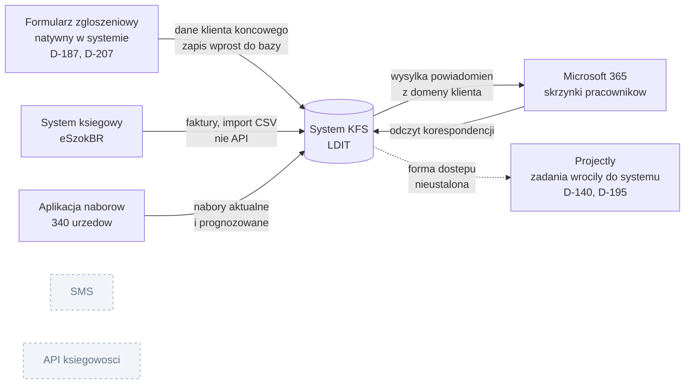

# 09. Integracje i architektura

## Mapa integracji



Szare pozycje zostały świadomie wykluczone z etapu I. SMS jako kanał powiadomień [D-04],
API systemu księgowego z powodu kosztu i bezpieczeństwa. SMS pozostaje wykluczony także dla uczestników [D-196, wstępna].

| Integracja | Zakres | Mechanizm | Status |
|---|---|---|---|
| **Microsoft 365, wysyłka** | Powiadomienia z domeny klienta | Aplikacja z uprawnieniem Send Mail | Ustalone |
| **Microsoft 365, odczyt** | Historia korespondencji przy kliencie | Ta sama aplikacja, uprawnienie do odczytu | Ustalone, jawna lista skrzynek przed konfiguracją [D-198, wstępna] |
| **Formularze zgłoszeniowe** | Dane klienta końcowego | **Formularz natywny w systemie**, per instytucja, bez synchronizacji zewnętrznej [D-187, D-207] | Ustalone (wymaga zgody klienta na odejście od Google Forms z D-147) |
| **System księgowy** | Faktury LDIT | **Import CSV**, nie API [D-25, D-163] | Wstępnie ustalone: wykonawca przyjął, że eksport istnieje, do potwierdzenia u księgowej |
| **Aplikacja naborów** | Nabory aktualne i prognozowane | Osadzenie w systemie | Ustalone |
| **Projectly** | Zadania. **Moduł wrócił do systemu** [D-140], zadania i powiadomienia to dwa moduły [D-195], więc integracja przestaje być potrzebna | Brak | Przesądzone, do formalnego zamknięcia [P-37] |
| ~~SMS~~ | ~~Powiadomienia~~ | Odrzucone w etapie I | Wykluczone |
| ~~API systemu księgowego~~ | ~~Faktury~~ | Odrzucone (koszt i bezpieczeństwo) | Wykluczone |

---

## Integracja poczty Microsoft 365

Jedna warstwa technologiczna dla wysyłki i odczytu.

> **Paweł (1:35:39):** "integrujemy skrzynki, tutaj będziemy mieli integrację też przez aplikację Microsoftu, czyli to jest ta sama technologia co wysyłka."

### Model skrzynek: indywidualne, nie wspólna [D-45, TWARDA]

Każdy pracownik zachowuje własną, imienną skrzynkę. **Brak skrzynki ogólnej.**

> **Bartek (1:29:50):** "Nie, nie, nie, to muszą być odrębne. Każdy z nas musi mieć swoją skrzynkę, z którą będzie się porozumiewał z instytucją. Żeby nie była ogólna, raczej bym tak nie chciał."

Powód: klienci i instytucje mają przypisane opiekunki (Łucja, Martyna). Instytucja ma wiedzieć, że rozmawia z konkretną osobą.

**Konsekwencja architektoniczna:** system nie może wysyłać korespondencji obsługowej z jednego adresu ogólnego. Alias `powiadomienia@` służy wyłącznie powiadomieniom systemowym.

### Zakres integrowanych skrzynek

**Skrzynka właściciela firmy wyłączona z pełnej integracji** ze względu na prywatność.

> **Bartek (1:34:58):** "Nie chciałbym, żeby wszystkie to były maile, bo moje szkolenia wyglądają inaczej. Maile pracowników, czasami sprawy z nimi porozmawiam. Nie chcę, żeby każdy miał do tego wgląd."

> **[P-20] Wypowiedź klienta jest niepełna.** Wykonawca rozstrzygnął wstępnie: jawna lista skrzynek objętych integracją, ustalona przed konfiguracją aplikacji [D-198, do potwierdzenia przez klienta]. Bartek (1:35:32): "zróbmy tak, zrobimy klientów wszystkie skrzynki, a [instytucji] szkoleniowych tylko [wybrane]." Najbardziej prawdopodobna interpretacja: korespondencja z **klientami** zaciągana ze wszystkich skrzynek pracowniczych, korespondencja z **instytucjami** tylko z wybranych. Wymaga potwierdzenia.

### Priorytet: korespondencja z klientami

> **Bartek (1:34:25):** "z klientami jest najważniejsze, bo to tak naprawdę głównie z nimi rozmawiamy, a nie z instytucjami szkoleniowymi. Z instytucjami przeważnie przez telefon, od czasu do czasu maila. Głównym odbiorcą naszych maili są jednak klienci."

### Filtrowanie zaciąganych maili

Do systemu trafiają **tylko maile z wybranymi kontaktami**, nie cała zawartość skrzynki. Wzorzec: Zoho CRM, który wykonawca demonstrował na warsztacie.

**Maile z pola DW są również zaciągane** (zweryfikowane na żywo podczas dema).

### Powiązanie maila z klientem [P-21, rozstrzygnięte D-178]

**Rozstrzygnięcie wykonawcy [D-178, TWARDA]:** mail jest dopasowywany do klienta po adresie e-mail (klienta i wniosku), temat służy jako uzupełnienie, możliwe jest ręczne przypięcie. Poniżej stan z warsztatu, zachowany jako źródło.

Przyjęto **obejście procesowe**: nazwa klienta w temacie maila.

> **Bartek (1:40:13):** "my zawsze w mailu w temacie musimy pisać nazwę klienta i do tego musimy się nauczyć i tyle. I tak będzie najprościej to rozróżniać."

Przykład konwencji: `pielesiak - zapytanie`.

**Na warsztacie było to zależność od dyscypliny ludzi, nie mechanizm systemowy.** Jeden zapomniany prefiks oznacza, że mail nie trafi do rekordu. Skaluje się źle przy 130 wnioskach w dwa tygodnie.

Wykonawca zasygnalizował potrzebę identyfikatora klienta:
> **Paweł (1:35:52):** "skąd będziemy widzieli, jakiego klienta mail dotyczył? Czy zrobimy jakiś identyfikator klienta?" i odpowiedział sam: "No zobaczę czy będzie [możliwe]."

**Rekomendacja, przyjęta w D-178:** dopasowanie po adresie e-mail nadawcy lub odbiorcy jako mechanizm podstawowy, konwencja tematu jako uzupełnienie dla przypadków niejednoznacznych (mail od instytucji dotyczący konkretnego klienta).

### Miejsca prezentacji korespondencji

| Miejsce | Zawartość |
|---|---|
| Karta klienta | Pełna korespondencja z tym klientem, wspólna dla wszystkich jego wniosków |
| Karta wniosku | Spis maili w sprawie tego konkretnego wniosku |
| Panel instytucji | Korespondencja z instytucją, obok danych i katalogu szkoleń |

**Wyszukiwarka korespondencji po tytule i treści** [D-51]. Scenariusz: 400 maili, cofanie się pół roku wstecz.

### Notatki z rozmów telefonicznych

Kontakt z instytucjami odbywa się głównie telefonicznie, więc notatka jest jedynym śladem ustaleń.

**Załączniki z maili** można powiązać z rekordem. Nie ustalono, czy automatycznie, czy przez ręczne przeciągnięcie [P-22].

---

## Formularze zgłoszeniowe

### Decyzja: osobny formularz per instytucja [D-70]

Zamiast jednego wspólnego formularza dla wszystkich instytucji, **każda dostaje własną kopię** (ok. 20 na start).

> **Bartek (2:10:51):** "klient jak dostanie linka, to uzupełnia tylko jeden formularz, widzi ogólny, nie wiadomo do jakiej instytucji szkoleniowej właściwie należy."

**Zakaz mieszania danych** [D-71, TWARDA co do zasady]:

> **Paweł (2:20:00):** "Żeby nie było tak, że ja mam swój formularz, Forteca też ma ten sam mój formularz i odpowiedzi spływają do jednego excela. To jest złe pod kątem Security, jeden plik, a dane zmiksowane."
> **Bartek (2:20:11):** "To niebezpieczne, wiem o co chodzi."

### Przebieg

```
handlowiec IS wysyła klientowi LINK do formularza
            |
KLIENT KOŃCOWY wypełnia formularz (nie handlowiec)
            |
handlowiec widzi w systemie tylko STATUS wypełnienia
            |
dane trafiają do systemu automatycznie (synchronizacja cykliczna)
            |
zgłoszenie czeka na akceptację administratora
```

> **Paweł (2:16:26):** "wolałbym, żeby to klient wypełniał. Mirka tylko wyśle linka do formularza i w systemie zobaczę, czy został już wypełniony, czy nie."

**Efekt biznesowy:** skrócenie opóźnienia z **2-3 dni do pół godziny**.

**Ryzyko oporu:** handlowcy dziś tylko przekierowują maile z Excelem.
> **Bartek (2:16:07):** "Obawiam się, że będą trochę stękać, bo handlowcy standardowo tylko przekierowują ten formularz. A jak wymienić, tam to pisać, to im będzie robota."

Kontrargument: część klientów końcowych nie ma Excela, więc link do formularza jest dla nich prostszy.

### Zawartość formularza

Pola z obecnego formularza Excel:
- dane kontaktowe
- NIP
- PESEL uczestników
- adres e-mail
- rodzaj rozliczania
- informacja o osobach (uczestnikach)
- **liczba zatrudnionych na umowę o pracę** (wyznacza wielkość przedsiębiorstwa i wskaźnik dofinansowania)

**Lista szkoleń do wyboru zamiast pola tekstowego** [D-82]. Wraz z kwotą widoczną dla wypełniającego.

> **Paweł (2:29:20):** "żeby ktoś nie musiał wypełniać tej nazwy szkolenia, żebyśmy to mieli spójne, więc byłaby lista w formularzu szkoleń do wyboru."
> **Bartek (2:29:04):** "Ręcznej robótki sporo odejdzie."

**Przypisanie uczestnika do konkretnego szkolenia** (odpowiednik obecnego arkusza `Rozpis szkoleń`), bo jeden wniosek może obejmować kilka szkoleń.

**[P-23] rozstrzygnięte D-188:** lista szkoleń pochodzi z katalogu w systemie. Wykonawca: "albo zrobimy im listę, albo się to będzie pobierało od nas z systemu, już mniejsza."

### Technologia: formularz natywny [P-24, rozstrzygnięte D-187, potwierdzone D-207]

Niżej opis sporu z warsztatu (2:08 i dalej). Wykonawca zdecydował: **formularz natywny w systemie**. Odwraca to preferencję klienta z D-147 (Google Forms), więc wymaga rozmowy.

Wykonawca zaproponował Google Forms z arkuszem pod spodem, po czym sam się z tego wycofał:

> **Paweł (2:08:02):** "To nawet zwykłe Google Sheets, w sensie formularz od Google'a. Pod formularzem od Google'a jest excel, czyli spreadsheet, który się aktualizuje."
> **Paweł (2:08:41):** "Znaczy, to nie będzie realnie Google Sheet, tylko zwykły formularz."

**Decyzja [D-187, D-207]:** formularz natywny w systemie, nie Google Forms. Argumenty:
- Google Forms wymusza przechowywanie danych osobowych (PESEL) poza infrastrukturą systemu, co komplikuje zgodność z RODO
- 20 osobnych kopii formularza Google to koszt utrzymania i ryzyko rozjazdu wersji
- lista szkoleń do wyboru musi pochodzić z katalogu w systemie, co Google Forms utrudnia
- formularz natywny może od razu rejestrować datę wpłynięcia w bazie systemu

Synchronizacja cykliczna (np. co godzinę) była proponowana tylko dlatego, że źródło miało być zewnętrzne. Formularz natywny eliminuje ten problem (dotyczy też P-38).

**Zabezpieczenie publicznego formularza [D-187]:** limit zgłoszeń i bramka akceptacji administratora [D-105]. Zgłoszenie czeka w tabeli `formularze_oczekujace`, pole `wypelnil` mówi, czy wypełnił klient czy handlowiec [D-181, wstępna], a `handlowiec_id` przypisuje zgłoszenie do konta handlowca [D-210], który widzi tylko swoje.

**Dostęp instytucji do własnego formularza:** IS widzi, ile osób wypełniło, i może wykonać zgłoszenie testowe.

---

## Import faktur z systemu księgowego

**Import CSV, nie integracja API** [D-25, TWARDA].

| Opcja | Nakład | Decyzja |
|---|---|---|
| Import pliku CSV z parsowaniem i przypisaniem | ok. 1 godzina | **WYBRANE** |
| Integracja API z systemem księgowym | 10-15 godzin + ryzyko klucza API | Odrzucone |

Częstotliwość importu: raz w tygodniu jest wystarczająca.

> **[P-09] rozstrzygnięte wstępnie przez wykonawcę [D-163, wstępna]:** eksport CSV istnieje, robimy import (format kolumn, dopasowanie faktury do wniosku, import wielokrotny tego samego pliku). Faktury korygujące należą do okresu wystawienia [D-161]. Pierwotnie: nie potwierdzono, czy system księgowy klienta udostępnia eksport CSV. Klient miał to sprawdzić u księgowej w przerwie warsztatu, odpowiedź nie padła w transkrypcji. **Cały moduł faktur opiera się na tym założeniu, które klient (księgowa) musi jeszcze potwierdzić.** Nazwa systemu: **eSzokBR** (z dokumentu klienta).

---

## Integracja aplikacji naborów

Istniejąca aplikacja do przewidywania naborów ma być **osadzona w systemie**, nie dostępna pod osobnym linkiem [D-109].

System jest **odbiorcą** prognoz, nie liczy ich samodzielnie.

Zakres danych: nabory aktualne, prognozowane i zakończone, przypisane do urzędu pracy (340 w bazie), z rodzajem naboru jako osobnym wymiarem.

**Zależność czasowa z dokumentacji przedwarsztatowej:** w ramach automatyzacji KFS powstaje osobny arkusz naborów do udostępniania instytucjom. Jest potrzebny od zaraz, systemu nie będzie przed styczniem. To rozwiązanie pomostowe.

---

## Architektura danych: separacja vs widok zbiorczy

**Rozstrzygnięte [D-177, TWARDA]: jedna baza z separacją na wierszach, egzekwowana dwa razy [D-179]: polityki RLS w PostgreSQL plus filtr organizacji w serwerze.** Poniżej rozumowanie, które do tego doprowadziło. Audyt separacji jest osobnym krokiem przed wdrożeniem [D-177], a zewnętrzny audyt bezpieczeństwa po etapie I [D-201, wstępna].

### Sygnały wykonawcy w stronę osobnych baz

> **Paweł (2:20:19):** "Prawdopodobnie dane klientów u ciebie, dane instytucji szkoleniowych będą w bazie podzielone na osobne bazy. Albo na osobne instancje bazy. To jeszcze do przemyślenia, jak to zaprojektować."
>
> **Paweł (3:12:16):** "wydaje mi się, że powinienem zrobić tutaj osobne bazy."

### Wymagania stojące w sprzeczności z osobnymi bazami

| Wymaganie | Konflikt |
|---|---|
| Zbiorcze zestawienie wszystkich instytucji w jednej tabeli | Wymaga agregacji między bazami |
| **Ciągła numeracja klientów w roku** (numer trafia na fakturę) | Wymaga jednej sekwencji globalnej |
| Dashboard z przekrojem przez wszystkie instytucje | Wymaga agregacji |
| Zestawienia roczne na żądanie | Wymaga agregacji |
| Wyszukiwarka globalna | Wymaga przeszukania wszystkich baz |
| Ten sam klient obsługiwany przez różne instytucje | Wymaga wspólnej encji klienta |

### Rekomendacja

**Jedna baza z egzekwowaną separacją na poziomie wierszy** (Row Level Security lub równoważny mechanizm w warstwie dostępu do danych).

Argumenty:
1. Wszystkie wymagania zbiorcze są spełnialne bez warstwy agregacji
2. Numeracja klientów wymaga jednej sekwencji
3. Osobne bazy i tak wymagałyby warstwy łączącej dane, która staje się nowym punktem ryzyka wycieku
4. Separacja per wiersz jest testowalna automatycznie (test: użytkownik IS-A próbuje odczytać rekord IS-B)

**Warunek konieczny:** separacja musi być egzekwowana **na poziomie danych, nie interfejsu**, i obowiązywać identycznie w widokach, wyszukiwarce, eksportach i formularzach.

Klient sam sygnalizował ryzyko wycieku przez wyszukiwarkę:
> **Bartek (3:06:43):** "żeby nie zdarzyło się, że wpiszą przypadkowo jakiegoś klienta i im się to wyświetli. Więc tutaj też na to trzeba będzie uważać."

**Decyzja podjęta [D-177]. Uwaga: Open Mercato filtruje organizacje w aplikacji, a RLS trzeba dołożyć samemu, bo framework go nie ma [D-179].**

---

## Wymagania niefunkcjonalne

| Wymaganie | Wartość | Źródło |
|---|---|---|
| Praca współbieżna | Wiele instytucji dodaje szkolenia i terminy równolegle, bez konfliktów | dok. przedwarsztatowa |
| Tryb mobilny | Interfejs użyteczny na telefonie | dok. przedwarsztatowa |
| Edycja inline | Bez przeładowań i przekierowań, jak w Excelu | 3:12:03 |
| Wydajność wyszukiwania | 400 maili, horyzont pół roku | 1:40:43 |
| Generowanie wsadowe PDF | Minimum 50 dokumentów w jednej operacji | 2:57:48 |
| Przechowywanie plików | ok. 300 PDF faktur rocznie | 1:05:10 |
| Horyzont życia systemu | **3 do 5 lat** (założenie projektowe dla elastyczności modelu) | 48:41 |
| Wąskie gardło | Wydajność serwera aplikacyjnego, nie baza | 4:20 |

### Koszt utrzymania jako kryterium decyzyjne

Klient wielokrotnie warunkował zgodę na rozszerzenia zakresu (panel klienta, szkolenia komercyjne IS) wpływem na koszt hostingu.

> **Bartek (4:12):** "nie znam się kompletnie na tym, musisz mi takie pierdoły tłumaczyć."

**Zadanie otwarte:** przygotować kalkulację kosztów hostingu w wariantach skali. Wykonawca odroczył to na warsztacie.

---

## Stos technologiczny

**Stos docelowy [D-176, TWARDA]:** framework **Open Mercato** (TypeScript, Next.js, PostgreSQL, MikroORM, Zod). Z frameworka: uwierzytelnianie, role, uprawnienia jako features `modul.akcja`, organizacje, log akcji. Dobudowujemy sami: uprawnienia per pole, RLS w PostgreSQL [D-179], silnik prowizji, import CSV, integrację M365. Ryzyko: wersja v0.8.0, przed 1.0, patrz [15](15-ryzyka.md) i [18](18-od-makiety-do-aplikacji.md).

| Element | Ustalenie |
|---|---|
| Framework i baza | Open Mercato, PostgreSQL, jedna baza [D-176, D-177] |
| Separacja | RLS plus filtr organizacji w serwerze [D-179] |
| Uprawnienia | Features `modul.akcja` z wildcardem `modul.*`, tabele `funkcje` i `role_funkcje` w makiecie [D-211] |
| Walidacja | Na granicy zapisu, Zod w aplikacji, `assets/walidacja.js` w makiecie [D-211] |
| Format błędów API | `{ data, error: { code, message } }` [D-211] |
| Współbieżność zapisu | Blokada wersji (optimistic locking) w trybie serwera [D-211] |
| Typy kwot | `NUMERIC(12,2)` w bazie docelowej [D-184] |
| Integracja poczty | Microsoft Graph (aplikacja M365), jawna lista skrzynek [D-198] |
| Generowanie dokumentów | PDF po stronie serwera z szablonu graficznego |
| Archiwizacja | ZIP generowany po stronie serwera, PDF faktury z importu [D-183] |
| Import danych | CSV [D-163] |
| Prototypy i makiety | HTML na SQLite w przeglądarce |

### Lokalny serwer makiety

`node tools/serwer.mjs` uruchamia lokalny serwer z bazą w pliku `makieta/db/kfs.sqlite`, nasłuch wyłącznie na 127.0.0.1. API zwraca `{ data, error: { code, message } }`, zapis całej bazy wymaga aktualnego nagłówka wersji (konflikt kończy się 409) [D-211]. To nadal makieta: separacja i uprawnienia działają w przeglądarce [D-179], więc nie są zabezpieczeniem. Szczegóły w [18](18-od-makiety-do-aplikacji.md).

Kalkulacja kosztów hostingu w wariantach skali pozostaje zadaniem otwartym [P-48].
