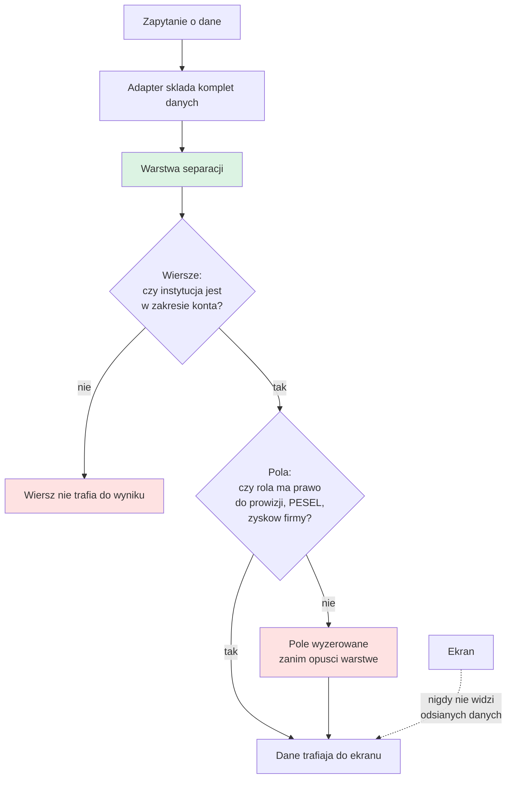

# 10. Bezpieczeństwo i RODO

## Dlaczego to jest warunek brzegowy, nie opcja

System przechowuje **dane osobowe uczestników szkoleń**, w tym numery PESEL. Klient ma umowy z dużymi podmiotami, po których stronie stoją zespoły prawne.

Dodatkowo: instytucje szkoleniowe są wobec siebie **konkurencyjne**. Wyciek danych do niewłaściwego katalogu to scenariusz krytyczny, nie tylko techniczny incydent.

Panel klienta końcowego (jeśli wejdzie) podnosi stawkę jeszcze wyżej, bo wpuszcza do systemu osoby spoza obu organizacji.

---

## Wymagania bezpieczeństwa

| # | Wymaganie | Priorytet | Źródło |
|---|---|---|---|
| 1 | Dwuskładnikowe uwierzytelnianie (2FA) | MUST | 3:14:42 |
| 2 | Reset haseł | MUST | 3:14:42 |
| 3 | Automatyczne wylogowanie po bezczynności | MUST | 3:15:16 |
| 4 | Blokada konta byłego pracownika z panelu admina | MUST | 3:15:04 |
| 5 | Rejestr aktywności: zmiany danych (wartość przed i po), akcje (kliknięcia) i wysyłki powiadomień | MUST | 3:13:36, D-122 |
| 6 | Log logowań (kto, kiedy, IP, wynik) | MUST | 3:14:25 |
| 7 | Kopie zapasowe | MUST | 3:15:16 |
| 8 | Twarda separacja danych między instytucjami | MUST | 2:20:00, 3:06:43 |
| 9 | Ukrycie danych finansowych przed pracownikami | MUST | 57:52 |
| 10 | Ukrycie stawek prowizji przed instytucjami | MUST | 14:28 |
| 11 | Bramka akceptacji zgłoszeń z publicznego formularza (anty-spam) | MUST | 3:01:38 |
| 12 | Ograniczenie wyszukiwarki IS do własnych klientów | MUST | 3:06:43 |

---

## Rejestr aktywności: pełne logowanie akcji [D-116, D-122]

Na warsztacie wykonawca doprecyzował rozdzielenie na dwa niezależne rejestry (zmiany danych + logowania). **2026-09-04 klient rozszerzył zakres [D-122]:** logowane mają być **wszystkie akcje** użytkownika, tak by administrator mógł odtworzyć, co każdy pracownik zrobił i kiedy. Ponieważ każdy działa na własnym koncie [D-121], każde zdarzenie jest przypisane do osoby.

Cztery strumienie zdarzeń, prezentowane w zakładce Rejestr aktywności:

### Rejestr zmian danych

Co ma być logowane:
- kto zmienił status wniosku
- kto zmienił kwotę (przyznaną, koszt całkowity, dopłatę)
- kto usunął dokument
- kto dodał lub zmienił notatkę
- **wartość przed zmianą i po zmianie**

**Szczególny nacisk na wartości wpisywane ręcznie.**

> **Paweł (3:14:02):** "No szczególnie przy tych wartościach z ręki wpisywanych."

Uzasadnienie z dokumentu klienta: "Przy wielu pracownikach to będzie bardzo ważne."

### Log akcji (kliknięcia) [D-122]

Istotne działania w interfejsie, także te, które nie zmieniają danych: otwarcie karty klienta lub wniosku, uruchomienie eksportu, kliknięcie przycisku akcji, wejście w moduł finansowy. Cel: odtworzenie ścieżki pracy i wykrycie nietypowego dostępu (np. masowe otwieranie kart tuż przed odejściem pracownika).

**Uwaga projektowa.** "Wszystkie kliknięcia" należy rozumieć jako **istotne akcje**, nie każdy ruch myszy. Logowanie dosłownie każdego kliknięcia generuje ogromny wolumen i szum. Zakres zdarzeń do zalogowania wymaga doprecyzowania listą, patrz [14. Pytania otwarte](14-pytania-otwarte.md).

### Log wysyłek [D-122]

Każda wysyłka powiadomienia lub maila z systemu: kto wysłał, do kogo, jaki szablon, kiedy, z jakiego wyzwalacza (automatyczny czy ręczny). Domyka wymóg potwierdzenia przed wysyłką [D-106] dowodem, że wysyłka faktycznie nastąpiła.

### Log logowań

Kto i o której godzinie zalogował się do systemu, adres IP, urządzenie, wynik próby.

> **Bartek (3:14:25):** "Na przykład twoje konto się zalogowało o czternastej 30. Żeby w razie, jakby był jakiś wyciek czegokolwiek, żeby było też wiadomo, z jakiego powodu mogło to wyniknąć."

Cel: materiał dowodowy przy wyjaśnianiu incydentów bezpieczeństwa.

---

## Separacja danych: trzy warstwy

Opisane szczegółowo w [02. Aktorzy i uprawnienia](02-aktorzy-i-uprawnienia.md#separacja-danych). Podsumowanie z perspektywy bezpieczeństwa:

### Warstwa 1: instytucja nie widzi cudzych klientów

Musi być egzekwowana **na poziomie danych, nie interfejsu**, i obowiązywać identycznie w:
- widokach i listach
- wyszukiwarce globalnej i lokalnej
- eksportach do Excela
- formularzach zgłoszeniowych
- ewentualnym panelu klienta końcowego

**Test akceptacyjny:** użytkownik instytucji A próbuje odczytać rekord należący do instytucji B poprzez każdy z powyższych kanałów. Każda próba musi zakończyć się odmową.

### Warstwa 2: instytucja nie widzi stawek prowizji

Ani swojej, ani cudzej. Konfigurator warunków prowizyjnych widoczny wyłącznie dla administratora.

To ryzyko **biznesowe**, nie techniczne, ale ma twarde konsekwencje dla modelu uprawnień. Ujawnienie różnic w stawkach między instytucjami może zniszczyć relacje handlowe.

### Warstwa 3: pracownik nie widzi danych finansowych firmy

Zyski firmy, marżowość, stawki prowizyjne instytucji i faktury wyłącznie dla administratora.

Stan obecny do wyeliminowania: w Excelu każdy pracownik widzi wszystko.

---

## Jak te trzy warstwy zostały zrealizowane w makiecie

Makieta v2 egzekwuje separację w warstwie dostępu do danych, a nie w interfejsie [D-148].
Kod: `makieta/assets/zakres.js`. To jest wzorzec do przeniesienia, nie gotowe rozwiązanie
produkcyjne, bo w makiecie baza leży po stronie przeglądarki.

**Dlaczego to jest ważne przy przenoszeniu do aplikacji.** W makiecie warstwa działa po stronie
przeglądarki, bo tam jest cała baza. W aplikacji dokładnie to samo rozwiązanie byłoby dziurą:
wystarczyłoby zapytanie z pominięciem warstwy. Docelowo ograniczenie musi siedzieć w bazie,
w politykach na wierszach, i obowiązywać niezależnie od tego, kto pyta. Wątek otwarty jako
[P-59].

**Co pokazała pierwsza próba.** Przed tą rundą osiemnaście ekranów makiety pokazywało wszystkim
rolom to samo. Warstwa 2 i warstwa 3 nie działały w ogóle, mimo że były opisane w dokumentacji.
To jest dokładnie ten scenariusz, przed którym ostrzega [R-01]: separacja traktowana jako sprawa
wyglądu, a nie dostępu. Szczegóły w [13. Rejestr decyzji](13-rejestr-decyzji.md), sekcja decyzji
wykonawczych.

**Test akceptacyjny, który teraz przechodzi automatycznie.** `tools/test-uprawnienia.mjs`
sprawdza między innymi, czy po zalogowaniu na konto pracownika LDIT warunki prowizyjne są
`null`, a nie tylko ukryte, i czy w liście klientów instytucji nie ma ani jednego rekordu
obcej instytucji.

---

## Zabezpieczenia makiety (stan 2026-09-29)

Po rundzie decyzji makieta dostała mechanizmy, które odwzorowują reguły bezpieczeństwa
aplikacji. Testy: `node tools/test-bezpieczenstwo.mjs`, `node tools/test-uprawnienia.mjs`, `node tools/test-walidacja.mjs`.

| Mechanizm | Jak działa | Plik |
|---|---|---|
| Hasło jako skrót z solą | W bazie nie ma jawnego hasła, są `haslo_skrot` i `haslo_sol` zamiast dawnego `haslo_demo` | `makieta/assets/haslo.js` |
| Blokada po nieudanych próbach | 5 nieudanych prób blokuje konto na 15 minut (`nieudane_proby`, `zablokowane_do`) | `makieta/assets/auth.js` |
| Ogólny komunikat błędu logowania | Komunikat nie zdradza, czy login istnieje | `makieta/assets/auth.js` |
| Sesja jako token w bazie | Przeglądarka trzyma wyłącznie token z tabeli `sesje`, a rola i zakres są czytane z bazy przy każdym odczycie, więc edycja pamięci przeglądarki nie podnosi uprawnień | `makieta/assets/auth.js` |
| Wygasanie sesji | Po 30 minutach bezczynności i po 8 godzinach od utworzenia | `makieta/assets/auth.js` |
| Strażnik zapisów | Każdy zapis przechodzi kontrolę trzech poziomów: moduł, wiersz, pole [D-149]. Rejestr aktywności jest tylko do dopisywania | `makieta/assets/straznik.js` |
| Ochrona przed XSS | Wszystkie wartości z bazy trafiają do HTML przez `esc()` | `makieta/assets/html.js` |
| Log logowań | Tabela `logowania`, każda próba z wynikiem | `makieta/db/schema.sql` |
| Features zamiast macierzy uprawnień | Tabele `funkcje` i `role_funkcje` (moduł i pole jako feature `modul.akcja`, wildcard `modul.*`) [D-211] | `makieta/assets/funkcje.js`, `auth.js` |
| Filtr handlowca | Konto instytucji bez feature `zakres.cala_instytucja` widzi tylko swoich klientów i wnioski (`handlowiec_id`), handlowiec bez statystyk [D-209, D-210] | `makieta/assets/zakres.js` |
| Walidacja na granicy zapisu | E-mail, telefon, NIP i PESEL z cyfrą kontrolną, URL, daty, kwoty nieujemne, pola wymagane, `data_do >= data_od`. Przy edycji sprawdzane tylko zmieniane pola. Błąd to `StraznikError` z kodem `walidacja`. Odpowiednik Zod | `makieta/assets/walidacja.js` |
| Tryb systemowy nieupubliczniony | `Store.odbierzTrybSystemowy` oddaje tryb jednorazowo dla `auth.js`, eksport całej bazy tylko dla `ustaw.manage` | `makieta/assets/store.js` |

### Uczciwe ograniczenie makiety

**To jest demonstracja reguł, nie ochrona.** Cała baza SQLite leży w przeglądarce (albo w pliku
`makieta/db/kfs.sqlite` przy trybie lokalnego serwera, patrz [18](18-od-makiety-do-aplikacji.md)).
Osoba z narzędziami deweloperskimi może odczytać plik bazy, wywołać funkcje wprost i pominąć
strażnika. Skrót hasła z solą, blokada i sesje pokazują, jak mechanizm ma działać, ale nie
chronią niczego, bo kod egzekwujący działa po stronie użytkownika. Ochrona realna to serwer
i polityki w bazie [D-179]. Test akceptacyjny dla aplikacji jest inny niż dla makiety: musi
przejść z konta z ograniczeniami, także przy zapytaniu bezpośrednio do API i do bazy.

---

## Docelowy model bezpieczeństwa: Open Mercato [D-176, D-179]

Stos docelowy to framework Open Mercato (wersja v0.8.0, przed 1.0, patrz
[18. Od makiety do aplikacji](18-od-makiety-do-aplikacji.md)). Co dostajemy z frameworka i czego brakuje:

| Obszar | Z frameworka | Do dobudowania |
|---|---|---|
| Uwierzytelnianie | Sesje JWT, `bcryptjs` (koszt co najmniej 10), błąd logowania nie zdradza, czy e-mail istnieje, tabele `users`, `roles`, `sessions`, `password_resets`. MFA w warstwie enterprise | Weryfikacja, czy MFA jest dostępne w naszej licencji (wymaganie 2FA jest MUST) |
| Uprawnienia | Features `modul.akcja` w `acl.ts`, przypisanie do ról w `setup.ts`, `role_acls` i `user_acls`, wildcardy `modul.*`, sprawdzanie przez `requireFeatures` | **Uprawnienia per pole** (features rodzaju `pole` w `funkcje` już działają w makiecie): framework ich nie ma [D-149]. Odwzorowane w makiecie: features i wildcardy (`funkcje`, `role_funkcje`), walidacja na granicy zapisu, filtr handlowca, rejestr tylko do dopisywania [D-211] |
| Separacja instytucji | Tenant (LDIT) i organizacje (instytucja szkoleniowa), `organization_id` w każdej encji, obowiązkowy filtr w zapytaniach | **RLS w PostgreSQL** jako druga bariera. Framework filtruje organizacje w aplikacji, więc jedno zapomniane zapytanie bez filtra to wyciek |
| Rejestr zmian | Moduł `audit_logs`, tabela `action_logs` (aktor, zasób, `snapshot_before`, `snapshot_after`, `changes_json`, cofnij/ponów) | Lista zdarzeń wg D-189, ograniczenie features `audit_logs.*` |
| Szyfrowanie | AES-GCM z kluczem per tenant, mapy szyfrowania per pole | Włączenie dla PESEL (kandydat) |

**Separacja egzekwowana dwa razy [D-179].** Polityki na wierszach w bazie (RLS) plus filtr
organizacji w serwerze. Dwie niezależne bariery: błąd w jednej nie powoduje wycieku. Koszt to
podwójne utrzymanie i trudniejsza diagnoza, gdy warstwy się rozjadą. Kontekst zalogowanego
użytkownika musi dotrzeć do bazy przy każdym zapytaniu. Jedna baza, nie osobne bazy per
instytucja [D-177], stąd audyt separacji jako osobny krok przed wdrożeniem.

**Ryzyko: log akcji sam zawiera dane wrażliwe.** `action_logs` przechowuje migawki przed i po,
więc może zawierać stawki prowizji i dane innych organizacji. Należy ograniczyć features
`audit_logs.view_*` do administratora, filtrować log po organizacji i szyfrować pola
wrażliwe w migawkach. Bez tego log stałby się obejściem separacji.

**Ryzyko: PESEL.** Kandydat do szyfrowania per pole kluczem tenanta (AES-GCM). Widoczność
per rola przez feature `klient.pesel` (w aplikacji dobudowany mechanizm pól), szyfrowanie chroni dodatkowo przed odczytem kopii
zapasowej i bezpośrednim dostępem do bazy.

**Retencja [D-186].** Kolumny `utworzono` przy klientach i uczestnikach wyznaczają początek
biegu retencji. Wymaga procesu czyszczenia, który ktoś zaplanuje i uruchamia.

**Audyt zewnętrzny [D-201].** Po etapie I, przed wpuszczeniem instytucji do systemu.

---

## Prywatność skrzynek pocztowych

**Skrzynka właściciela firmy wyłączona z pełnej integracji** [D-48].

> **Bartek (1:34:58):** "Nie chciałbym, żeby wszystkie to były maile, bo moje szkolenia wyglądają inaczej. Maile pracowników, czasami sprawy z nimi porozmawiam. Nie chcę, żeby każdy miał do tego wgląd."

**Ryzyko RODO:** bezrefleksyjna integracja skrzynki właściciela ujawniłaby zespołowi:
- korespondencję dotyczącą spraw pracowniczych (dane osobowe pracowników, potencjalnie dane wrażliwe)
- korespondencję niezwiązaną z procesem

**Wymaganie:** selektywność na poziomie **źródła danych**, nie tylko widoku. Nie wystarczy ukryć maili w interfejsie, nie mogą one w ogóle trafić do bazy.

**[P-20] Dokładny zakres integrowanych skrzynek wymaga potwierdzenia** przed konfiguracją aplikacji Microsoft 365.

---

## Zakres uprawnień aplikacji Microsoft 365

Aplikacja potrzebuje dwóch odrębnych uprawnień:

| Uprawnienie | Cel | Ryzyko |
|---|---|---|
| **Send Mail** | Wysyłka powiadomień z domeny klienta | Niskie, ograniczone do jednego konta |
| **Odczyt poczty** | Historia korespondencji przy kliencie | **Wysokie**, dostęp do treści maili |

**Rekomendacja:** uprawnienie odczytu powinno być ograniczone do konkretnych skrzynek (Application Access Policy w Exchange Online), a nie nadane na cały tenant. Bez tego aplikacja może odczytać każdą skrzynkę w organizacji, w tym skrzynkę właściciela, która ma być wyłączona.

### Dostęp wykonawcy do konta administracyjnego

Klient rozważał przekazanie dostępu do konta admina M365 na 2-3 dni. Ostatecznie skłonił się do **wspólnej sesji konfiguracyjnej (ok. 2 godziny)**.

**To jest właściwy wybór.** Konto administracyjne tenanta to bieżące konto biznesowe klienta, nie osobne konto techniczne. Przekazanie go wykonawcy byłoby naruszeniem zasady minimalnych uprawnień i mogłoby naruszać umowy z klientami korporacyjnymi.

---

## Odrzucenie integracji API z systemem księgowym

Jednym z argumentów za importem CSV zamiast API było bezpieczeństwo.

> **Paweł (1:04:38):** "tam będzie trzeba przechowywać na pewno klucz API do twojego systemu fakturowego. Więc to już jest kolejna rzecz, o którą trzeba zadbać, jeżeli chodzi o bezpieczeństwo."

**Ryzyko wraca**, jeśli integracja zostanie odblokowana w kolejnym etapie. Wtedy konieczne: przechowywanie klucza w sejfie sekretów, rotacja, ograniczenie zakresu uprawnień klucza.

---

## Ochrona przed nadużyciem publicznego formularza

Formularz zgłoszeniowy jest publicznie dostępny pod linkiem. Bramka ręcznej akceptacji chroni bazę przed spamem [D-105].

**Rekomendacja uzupełniająca:** obok bramki akceptacji warto rozważyć podstawowe zabezpieczenia techniczne (rate limiting per adres IP, honeypot), bo bramka chroni bazę, ale nie chroni przed zalaniem kolejki oczekujących.

---

## Dane osobowe: zakres i retencja

### Jakie dane osobowe system przechowuje

| Kategoria | Dane | Podstawa |
|---|---|---|
| Uczestnicy szkoleń | imię, nazwisko, **PESEL** | Wymóg wniosku KFS |
| Reprezentanci klientów | imię, nazwisko, telefon, e-mail | Kontakt operacyjny |
| Korespondencja | treść maili z klientami | Historia ustaleń |
| Pracownicy LDIT i IS | dane kont użytkowników | Dostęp do systemu |

PESEL to dana wymagająca szczególnej ochrony. Pojawia się w formularzu zgłoszeniowym.

### Retencja: rozstrzygnięta wstępnie [P-26, D-186]

> **Stan 2026-09-29.** Wybrano jawne okresy retencji per kategoria danych [D-186, WSTĘPNA, do potwierdzenia przez klienta]. Konkretne okresy nadal do ustalenia. Poniżej stan sprzed rozstrzygnięcia.

Pytanie z dokumentacji przedwarsztatowej pozostało bez odpowiedzi: **jak długo przechowujemy korespondencję zaimportowaną do kart uczestników**.

Nie ustalono również:
- co dzieje się z danymi uczestników po zakończeniu i rozliczeniu szkolenia
- czy potrzebna jest archiwizacja per rocznik z ograniczeniem dostępu
- kiedy dane podlegają usunięciu

**To musi zostać domknięte przed wdrożeniem produkcyjnym**, bo wpływa na model danych (soft delete, archiwizacja, anonimizacja).

### Archiwizacja per rocznik

Baza dzielona na roczniki, ale nie ustalono, czy starsze roczniki mają być archiwizowane z ograniczeniem dostępu, czy pozostają w pełni dostępne.

---

## Audyt bezpieczeństwa

Dokumentacja przedwarsztatowa wskazuje: **rozważane jest zlecenie zewnętrznego audytu bezpieczeństwa firmie, która przejmuje część odpowiedzialności. Temat do domknięcia przed startem prac.**

**Warsztat nie wrócił do tego tematu.** [P-27] **Rozstrzygnięte wstępnie 2026-09-29 [D-201]:** audyt zewnętrzny po etapie I, przed wpuszczeniem instytucji (do potwierdzenia przez klienta).

Rekomendacja: audyt jest szczególnie uzasadniony, jeśli:
- wejdzie panel klienta końcowego (osoby spoza obu organizacji)
- system będzie przechowywał PESEL uczestników
- klient ma umowy z podmiotami, których zespoły prawne mogą tego wymagać

---

## Checklist przed wdrożeniem produkcyjnym

- [ ] Separacja danych przetestowana automatycznie dla każdego kanału dostępu
- [ ] Uprawnienie odczytu poczty ograniczone do wskazanych skrzynek (Application Access Policy)
- [ ] Skrzynka właściciela potwierdzona jako wyłączona ze źródła danych
- [ ] 2FA wymuszone dla wszystkich kont, nie opcjonalne
- [ ] Polityka retencji danych osobowych ustalona i zaimplementowana
- [ ] Kopie zapasowe skonfigurowane i **odtworzenie przetestowane**
- [ ] Rejestr zmian obejmuje wszystkie pola kwotowe i statusy
- [ ] Log akcji i log wysyłek obejmują uzgodnioną listę zdarzeń [D-122]
- [ ] Log logowań działa i jest dostępny dla administratora
- [ ] Blokada konta byłego pracownika przetestowana (czy sesja wygasa natychmiast)
- [ ] Rate limiting na publicznym formularzu zgłoszeniowym
- [ ] Audyt zewnętrzny po etapie I wykonany, przed wpuszczeniem instytucji [D-201]
- [ ] Audyt separacji jako osobny krok przed wdrożeniem [D-177]
- [ ] RLS w PostgreSQL włączone i przetestowane obok filtra organizacji [D-179]
- [ ] Uprawnienia per pole dobudowane i przetestowane [D-176]
- [ ] Log akcji ograniczony features i pozbawiony danych wrażliwych w migawkach
- [ ] Jeśli wchodzi panel klienta: osobny cykl testów separacji przed udostępnieniem
