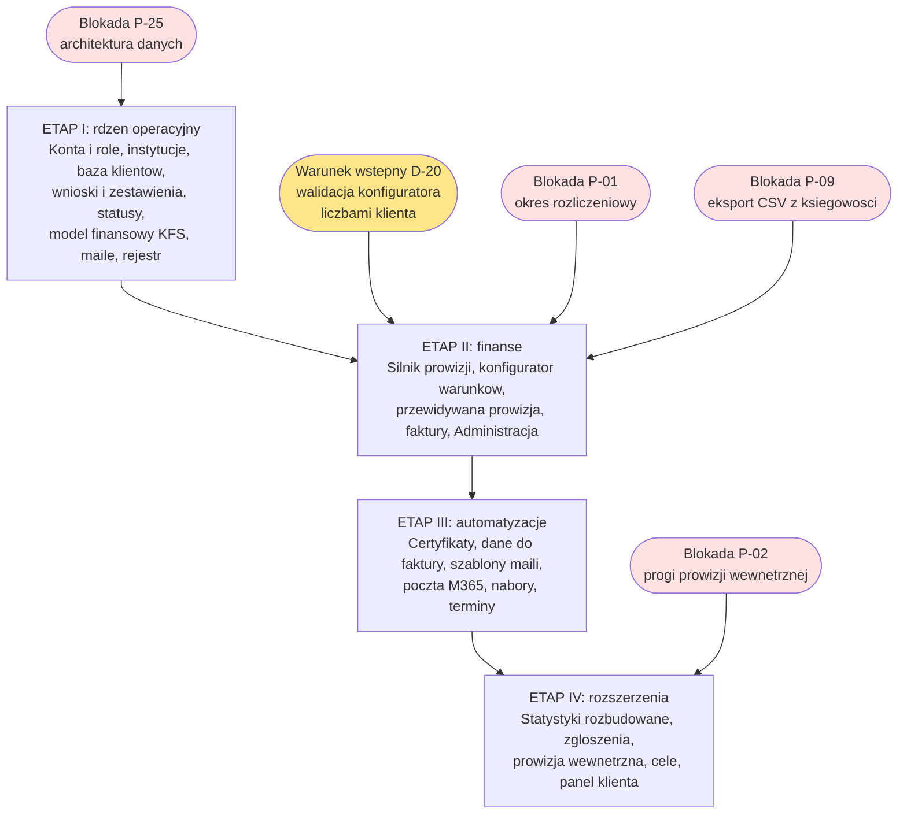

# 12. Zakres i etapowanie

> **Aktualizacja po warsztacie 2026-09-04.** **Moduł zadań i powiadomień wraca do zakresu** [D-140], odwracając wykluczenie D-118 (zadania nie idą już do Projectly). Ma być ostatnim modułem w kolejności prac. Szczegóły i pozostałe zmiany: [17. Warsztat doprecyzowujący](17-warsztat-2026-09-04.md).

> **Aktualizacja po rundzie 2026-09-29 (D-161 - D-212).** Wszystkie cztery blokady projektowe mają rozstrzygnięcie wykonawcy: P-25 ostatecznie [D-177], P-01, P-02 i P-09 wstępnie [D-164, D-162, D-163], do potwierdzenia przez klienta. Stos: Open Mercato [D-176]. Zadania i powiadomienia to dwa osobne moduły [D-195, wstępna]. Mapa zakładek i ograniczenie ich liczby: [D-212, wstępna], `docs/19-mapa-zakladek.md`.

## Stan po warsztacie

| | |
|---|---|
| **Wycena wstępna** | 12-18 tys. PLN, podana "na rzut oka" |
| **Oczekiwanie klienta** | nieprzekroczenie 15 tys. |
| **Termin realizacji** | ok. 2 miesiące od 25.08.2026, czyli do ok. 25.10.2026 |
| **Twardy deadline biznesowy** | gotowe przed styczniem 2027 (start nowych naborów) |
| **Nakład pracy wykonawcy** | ok. 6 tygodni |
| **Status wyceny** | niewiążąca, do potwierdzenia po makiecie v2 |

> **Paweł (3:18:19):** "celuję raczej w ten rząd widełek jak koło. Myślę 12, 18. Tak na teraz, tak po dzisiaj, szybko."
>
> **Bartek (3:18:41):** "Myślę, że teraz to piętnastej nie przekroczyli, to byłoby gitara."

> **[P-28] Jednostka i waluta nie padły wprost w transkrypcji.** Interpretacja "tysiące PLN" wynika z kontekstu. Interpretacja wypowiedzi klienta ("piętnastej nie przekroczyli") jako kwoty 15 tys. jest prawdopodobna, ale alternatywna interpretacja (data 15. dnia miesiąca) nie została wykluczona. **Wymaga potwierdzenia.**

---

## Następne kroki

| # | Krok | Kto | Termin | Produkt |
|---|---|---|---|---|
| 1 | Podsumowanie warsztatu | Wykonawca | 25-26.08.2026 | Ostateczny zakres projektu |
| 2 | **Prototyp konfiguratora prowizji (HTML)** | Wykonawca | przed implementacją | Walidacja logiki obliczeń |
| 3 | Makieta v2 wyglądająca jak aplikacja | Wykonawca | tydzień 25-31.08 | Makieta z modułami na kolorowo, 2-3 h pracy |
| 4 | Spotkanie: przegląd makiety | Obie strony | po makiecie | Akceptacja lub korekty |
| 5 | Wycena z podziałem na zakres | Wykonawca | po spotkaniu | Wersja I + opcje dodatkowe, "co ile kosztuje" |
| 6 | Checklista pokrycia dokumentu Word | Klient | równolegle | Weryfikacja kompletności wymagań |
| 7 | **Progi prowizji wewnętrznej** | Klient | "w najbliższych dniach" | Blokada modułu prowizji pracowniczych |
| 8 | **Potwierdzenie eksportu CSV z systemu księgowego** | Klient | pilne | Blokada modułu faktur |
| 9 | Szablony maili | Klient | po postawieniu szkieletu | Biblioteka treści |

**Kroki 7 i 8 były blokadami projektowymi.** Wykonawca rozstrzygnął je wstępnie 29.09: progi wewnętrzne startują na stałej stawce, progi później [D-162], import CSV robimy [D-163]. Klient musi obie decyzje potwierdzić, zanim moduł prowizji wewnętrznej i moduł faktur wejdą do implementacji. Blokady P-01 i P-25 rozstrzygnięte przez D-164 (wstępnie) i D-177.

---

## Propozycja etapowania

Klient wątpi, czy podział na moduły jest wykonalny. Wykonawca deklaruje, że będzie.

> **Bartek (3:17:44):** "tu są takie rzeczy, rozpisałem, co możemy i tak, i tak zrobimy na pewno, no bo to wszystko razem ze sobą będzie współgrało. Więc nie wiem czy będzie to możliwe [rozdzielenie] na moduły. To już jak będziesz nad tym siedział, to ewentualnie spróbuj to jakoś podzielić. W ratach."
>
> **Paweł (3:18:07):** "Dobra, no, moduły na pewno."

Czerwone to blokady z [14. Pytania otwarte](14-pytania-otwarte.md) (po 29.09 wszystkie rozstrzygnięte przez wykonawcę, trzy z nich wstępnie, do potwierdzenia przez klienta), żółte to warunek wstępny
ustalony na warsztacie [D-20]. Etap, do którego prowadzi strzałka z blokady, nie może ruszyć
przed jej domknięciem.

### Etap I: rdzeń operacyjny (MUST)

Cel: zastąpić Excel w codziennej pracy.

| Moduł | Uzasadnienie kolejności |
|---|---|
| Konta, role i uprawnienia | Fundament wszystkiego, wpływa na każdy widok |
| Instytucje szkoleniowe + katalog szkoleń | Nadrzędne wobec klientów i wniosków |
| Baza klientów (formularz natywny + akceptacja) | Wejście do procesu, formularz w systemie [D-187, D-207] |
| Wnioski / Zestawienia z rocznikami | Główne miejsce pracy |
| Statusy, kolory, filtry, wyszukiwarka | Bez tego nie da się pracować operacyjnie |
| Model finansowy KFS (kwoty, kwalifikacja) | Rdzeń merytoryczny |
| Podstawowe powiadomienia mailowe | Realizuje priorytet klienta |
| Rejestr aktywności i log logowań | Wymóg bezpieczeństwa, tanio dodać od początku. Log istotnych zdarzeń, nie każdego kliknięcia [D-189, D-208] |

**Po etapie I, przed wpuszczeniem instytucji:** zewnętrzny audyt bezpieczeństwa [D-201, wstępna] i audyt separacji [D-177].

**Zakres uprawnień w etapie I:** features `modul.akcja` [D-211] i filtr handlowca [D-210].

**Priorytet wskazany przez klienta w dokumentacji przedwarsztatowej:** informowanie instytucji o statusach, żeby przestały dopytywać i przestały potrzebować własnych systemów.

### Etap II: finanse i rozliczenia

| Moduł | Zależność |
|---|---|
| **Silnik prowizji** (po walidacji prototypem) | Wymaga danych z etapu I |
| Konfigurator warunków prowizyjnych | |
| Przewidywana prowizja | |
| Moduł faktur (import CSV, podgląd PDF) | Zależy od potwierdzenia eksportu CSV [D-163], korekty w okresie wystawienia [D-161] |
| Administracja (prowizje szczegółowe) | |

> **Uwaga:** silnik prowizji to najtrudniejszy element projektu. Warto rozważyć przesunięcie prototypu konfiguratora przed etap I, bo jego walidacja może zmienić model danych.

### Etap III: automatyzacje i integracje

| Moduł | Wartość |
|---|---|
| **Certyfikaty** (generowanie wsadowe, ZIP) | Wysoka, eliminuje ręczną pracę przy 50 uczestnikach |
| **Dane do faktury** (przycisk generujący mail) | Wysoka, powtarzalna czynność |
| Biblioteka szablonów maili | |
| Integracja poczty Microsoft 365 (odczyt) | Jawna lista skrzynek [D-198] |
| Nabory (osadzenie aplikacji) | |
| Terminy i kalendarz szkoleń | |

### Etap IV: rozszerzenia

| Moduł | Status |
|---|---|
| Statystyki i dashboardy rozbudowane | IS widzi statystyki własnych klientów bez rozbicia per handlowiec [D-209] (koryguje D-193, wstępna); każda agregacja prowadzi do szczegółów [D-212] |
| Zgłoszenia (incydenty) | SHOULD |
| Prowizja wewnętrzna dla pracowników | Stała stawka, progi później [D-162, wstępna], do potwierdzenia przez klienta |
| Cele i premie | Brak zdefiniowanej metryki |
| Panel klienta końcowego | Etap IV, minimalny zakres [D-192, wstępna], osobny cykl testów separacji przed udostępnieniem |
| Wersja premium dla IS | Odłożone "docelowo w przyszłości" |
| Eksport do Excela | |

---

## Wykluczone z zakresu

| Element | Decyzja | Gdzie trafia |
|---|---|---|
| ~~**Zadania pracowników**~~ | **Wróciły do zakresu** [D-140], odwraca [D-118]. Ostatni moduł w kolejności prac. Zadania i powiadomienia to dwa osobne moduły [D-195, wstępna], zadania automatyczne tylko z daty i statusu [D-185] | w systemie, etap IV |
| **Integracja kalendarza Outlook** | Wykluczone [D-118] | poza systemem |
| **SMS** | Odrzucone [D-04], także dla uczestników [D-196, wstępna] | Wyłącznie mail |
| **API systemu księgowego** | Odrzucone (10-15 h vs 1 h) [D-39] | Import CSV |
| **Foldery i pliki klientów** | Poza zakresem [D-41] | Eksplorator Windows, OneDrive |
| **Wewnętrzny komunikator** | Odrzucone [D-33] | Integracja maili |
| **Dowolne formuły w konfiguratorze prowizji** | Odrzucone [D-15] | Szablony parametryczne |
| **Wysyłka powiadomień przez IS** | Zakazane [D-87] | Szablon otwierany w Outlooku |
| **Informacja o naborach dla handlowca IS** | Odrzucone [D-91] | - |
| **Statystyki per handlowiec dla instytucji** | Odrzucone [D-209] | - |
| **Google Forms** | Zastąpione formularzem natywnym [D-187, D-207] | formularz w systemie |
| **Log każdego kliknięcia** | Zawężone do istotnych zdarzeń [D-189, D-208] | log akcji |

---

## Otwarte pozycje zakresu

| Element | Blokada |
|---|---|
| **Panel klienta końcowego** | Wstępnie etap IV [D-192], klient wątpi w użyteczność, koszt utrzymania nierozstrzygnięty |
| **Zakres statystyk dla IS** | Klient odroczył decyzję wprost (2:54:45), wykonawca wstępnie: bez rozbicia per handlowiec [D-209], do potwierdzenia |
| **Mapa zakładek** | Ustalana z klientem pytaniami Z-01 i dalszymi [D-212, wstępna] |
| **Wersja premium dla IS** | Kierunek zaakceptowany, warunki nieustalone |
| **Kalendarz terminów w systemie** | Zamknięte [P-10, 2026-09-04], terminy zostają w systemie |
| **MCP** | Przewidziane w dokumentacji przedwarsztatowej, warsztat nie potwierdził |
| **Szkolenia komercyjne IS w systemie** | Zamknięte słowami "bez decyzji" |

---

## Tryb współpracy w trakcie realizacji

**Odbiór iteracyjny modułami** [D-30].

> **Bartek (1:33:36):** "robisz jeden moduł czy tam kilka modułów i na spotkaniach przedstawiasz. Akceptujemy, zmieniamy, i wtedy wrzucamy w system. Może w ten sposób, niż wszystko."

Klient deklaruje **pełną dostępność telefoniczną**:

> **Bartek (3:20:21):** "chciałbym uczestniczyć w każdym etapie powstawania tego systemu. Więc nawet jeżeli byś miał o dwunastej 30 pytanie, to dzwoń, i jak się okaże, za 10 minut masz kolejne, to nie ma problemu. Chcę, żeby było wszystko dopracowane idealnie. No bo u nas w styczniu nie będzie takiej opcji."

Płatność: klient sugeruje **raty**.

---

## Kontekst biznesowy terminu

Sezon szkoleniowy jest silnie cykliczny:

| Miesiąc | Sytuacja klienta |
|---|---|
| Październik | Termin ukończenia systemu |
| Listopad-grudzień | Ostatnie testy i poprawki |
| **Styczeń** | Start nowych naborów. **Brak możliwości spotkań** |
| **Luty** | Szczyt. Klient przepracował ok. **400 godzin** |

> **Paweł (3:19:30):** "to jest 3,5 godziny zainwestowane, ale ja już nie będę musiał ciebie zwalniać na jakieś półgodzinne dzwonki później. Jeżeli nie zostanie to dobrze ustalone, to potem w trakcie projektu ja będę pracował 6 tygodni już nad tym i później powiesz, że jednak nie o to chodziło."

### Warunek uruchomienia marketingu przez klienta

Klient nie uruchomi marketingu, dopóki nie będzie pewien przepustowości operacyjnej.

> **Bartek (3:21:31):** "marketing możemy uruchomić dopiero wtedy, jeżeli będę wiedział, że wyrobimy tą ilość wniosków. Mam tutaj 2 opcje: albo ten bot, albo nowy pracownik. Bo inaczej to jest niemożliwe, żeby więcej osób obsłużyć."
>
> **Bartek (3:21:50):** "Przez co prawdopodobnie część współprac pójdzie do wiatru."

**To jest realna wartość biznesowa systemu:** deklarowana oszczędność "kilkadziesiąt albo kilkaset godzin roboty" miesięcznie.

---

## Brak ustaleń formalnych [P-29]

**Warsztat nie poruszył w ogóle:**
- formy umowy
- warunków płatności (poza sugestią rat)
- gwarancji
- utrzymania i wsparcia po wdrożeniu
- SLA
- własności kodu
- migracji danych historycznych z Excela

Ostatni punkt jest szczególnie istotny. Rozdzielenie encji Klient od Wniosku oznacza, że dane z Excela nie przeniosą się mechanicznie.

> **Paweł (1:45:35):** "ja muszę tę bazę na nowo potem zaprojektować."
