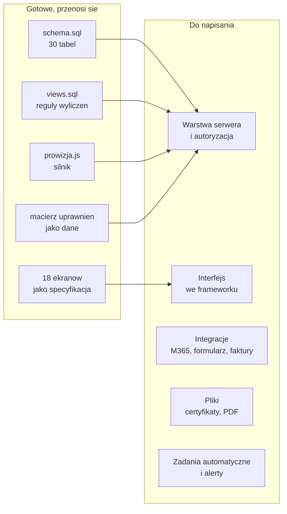
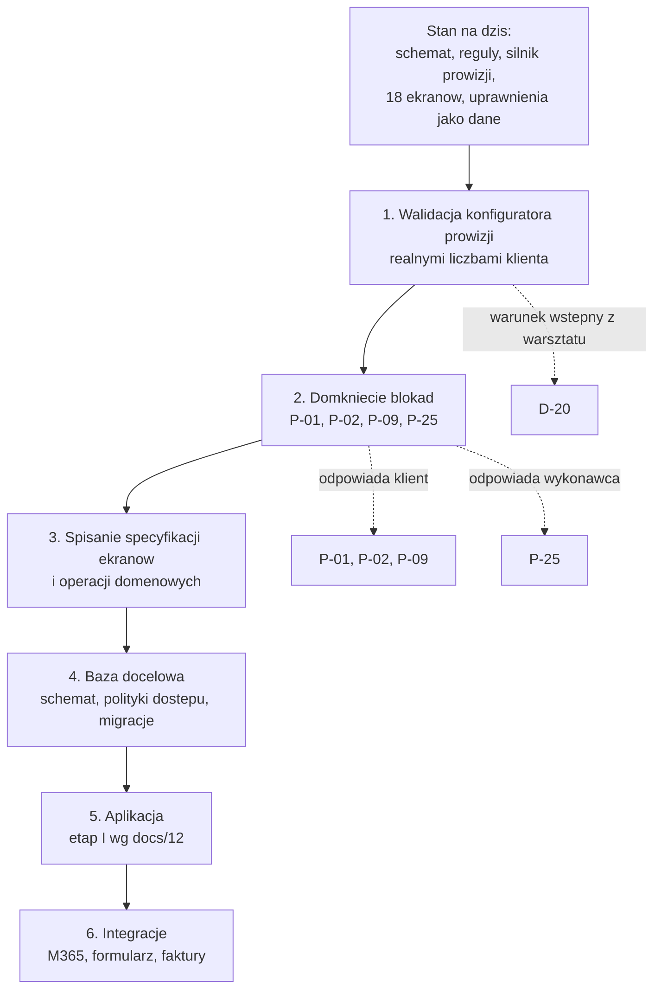

# 18. Od makiety do działającej aplikacji

> Ta sekcja odpowiada na pytanie postawione wprost przez wykonawcę: **jak trudne będzie przepisanie tego, co widać w makiecie, na aplikację z prawdziwą bazą pod spodem? Jeden prompt czy znacznie więcej?**

---

## Krótka odpowiedź

Nie jeden prompt. Ale po rundzie z 23.09.2026 to już nie jest pisanie systemu od zera, tylko **podmiana czterech warstw wokół modelu danych, który jest gotowy, wykonywalny i przetestowany**.

Różnica jest konkretna. Przed tą rundą makieta była rysunkiem: dane w jednym pliku JSON, uprawnienia opisane w tekście, role przełączane listą w rogu ekranu. Model, który miał powstać w aplikacji, istniał wyłącznie w dokumentacji, więc pierwszy kontakt z bazą oznaczałby projektowanie go od nowa. Po tej rundzie model jest plikiem `schema.sql`, który uruchamia się na prawdziwym silniku, ma klucze obce, ograniczenia słownikowe i przechodzi testy.

To przesuwa najdroższą część pracy, czyli **rozstrzyganie, jak dane mają wyglądać**, z etapu implementacji na etap, który właśnie się skończył.

---

## Co jest już przenośne bez przepisywania

| Element | Gdzie leży | Co się z nim dzieje przy przenosinach |
|---|---|---|
| Struktura danych, 30 tabel | `makieta/db/schema.sql` | Zmiana typów `TEXT` na `text`/`varchar` i `REAL` na `numeric`. Klucze obce, `CHECK` i indeksy przechodzą bez zmian |
| Reguły pól wyliczanych | `makieta/db/views.sql` | Widoki przenoszą się wprost, stają się warstwą domenową |
| Silnik prowizji | `makieta/assets/prowizja.js` | Czysta funkcja bez zależności. Przenosi się jako moduł albo jako funkcja w bazie |
| Macierz uprawnień | tabele `role`, `moduly`, `uprawnienia`, `uprawnienia_pol` | Przenosi się jako dane, nie jako kod |
| Zakres widzialności per konto | tabela `uzytkownik_instytucja`, widok `v_zakres_uzytkownika` | Staje się podstawą polityk bezpieczeństwa na wierszach |
| Osiemnaście ekranów | `makieta/strony/` | Specyfikacja układu, kolejności kolumn, zachowania filtrów i akcji |
| Dane w realnych wolumenach | `makieta/db/seed.sql` | Zestaw do testów wydajnościowych i do pokazania klientowi |
| Przypadki testowe prowizji | `docs/07-silnik-prowizji.md` | Gotowe testy jednostkowe |

To jest dokładnie ta część, w której najłatwiej o błąd nie do wykrycia, a najtrudniej o poprawkę po wdrożeniu.

---

## Co trzeba napisać od nowa

| Warstwa | Trudność | Dlaczego tyle |
|---|---|---|
| Warstwa serwera i autoryzacja | **wysoka** | W makiecie separacja działa w przeglądarce, bo cała baza jest po stronie klienta. W aplikacji musi działać w bazie i na serwerze, inaczej nie jest zabezpieczeniem. To nie jest przepisanie `zakres.js`, to napisanie polityk na wierszach od nowa |
| Interfejs | **średnia** | Osiemnaście ekranów istnieje, z układem i zachowaniem. Praca polega na przełożeniu ich na komponenty, nie na wymyślaniu, jak mają wyglądać |
| Integracje | **wysoka** | Microsoft 365, formularz zgłoszeniowy, import faktur. Każda ma własne tryby awarii, uwierzytelnianie i limity. Żadnej nie da się przetestować bez dostępu do systemu po drugiej stronie |
| Pliki | **średnia** | Certyfikaty z szablonu per instytucja [D-98], podgląd faktur PDF [D-24], paczka ZIP |
| Zadania automatyczne | **średnia** | Zadania przypięte do statusów i dat [D-140], [D-145]. Wymaga procesu działającego w tle, którego w makiecie nie ma |

---

## Pięć powodów, dla których to nie jest jeden prompt

**1. Autoryzacja zmienia model myślenia.**
W makiecie warstwa `zakres.js` odsiewa dane po ich wczytaniu, bo baza i tak leży w przeglądarce. W aplikacji to samo rozwiązanie byłoby dziurą: wystarczyłoby zapytanie z pominięciem warstwy. Docelowo ograniczenie musi siedzieć w bazie, w politykach na wierszach, i obowiązywać niezależnie od tego, kto i jak pyta. Makieta mówi **co** ograniczyć, nie **jak**.

**2. Prowizja ma pułapkę okresową.**
W modelach A i B przekroczenie progu podnosi stawkę dla całego obrotu okresu, także dla faktur już wystawionych. Rozliczenie nie może więc liczyć wiersza po wierszu, tylko musi przeliczyć okres w jednej transakcji i zapisać wynik spójnie. To jest miejsce, w którym naiwna implementacja zaniża prowizję i nikt tego nie zauważa, dopóki nie porówna z Excelem.

**3. Pola wyliczane niosą historię.**
Zasada z [D-19] wymaga, żeby ręczna edycja kasowała regułę, ale żeby dało się do niej wrócić. To znaczy, że wartość z reguły musi być liczona i przechowywana także wtedy, gdy nie obowiązuje. W makiecie robi to widok SQL. W aplikacji trzeba do tego dołożyć rejestr zmian i migracje, bo wartości historycznych nie wolno przeliczać wstecz [D-23].

**4. Integracje nie mają wersji makietowej.**
Wysyłki maila z domeny klienta, zaciągania formularza ani importu faktur nie da się zasymulować tak, żeby cokolwiek z tego wynikało. Te trzy rzeczy trzeba zbudować i przetestować na żywym połączeniu.

**5. Cztery blokady nadal stoją.**
[P-01], [P-02], [P-09] i [P-25] nie są domknięte. Dopóki stoją, silnik prowizji, moduł prowizji wewnętrznej, moduł faktur i architektura danych nie mają kompletu wejścia. Szczegóły w [14. Pytania otwarte](14-pytania-otwarte.md).

---

## Czego jeszcze brakuje, żeby model bez kontekstu zbudował z tego aplikację

To jest odpowiedź na drugie pytanie wykonawcy: *czy gdybym oddał tę dokumentację nowemu modelowi bez kontekstu, zbudowałby z niej tę aplikację?* Dziś: **nie w całości**. Zbudowałby bazę i silnik prowizji, ale nie odtworzyłby ekranów ani reguł walidacji, bo ich nie ma spisanych.

Lista braków, w kolejności od najbardziej kosztownych:

| # | Czego brakuje | Dlaczego blokuje | Ile pracy |
|---|---|---|---|
| 1 | **Specyfikacja ekranów pole po polu.** Dla każdego z 18 widoków: jakie pola, które są edytowalne, jakie mają walidacje, jakie akcje, co widzi która rola | Bez tego model odtworzy układ z makiety, ale zgadnie zachowanie | duża, ale mechaniczna, bo makieta jest wzorem |
| 2 | **Lista operacji domenowych.** Co system potrafi zrobić z danymi: dodaj wniosek, przejdź do następnego etapu, przelicz okres prowizyjny, przywróć regułę. Z warunkami wstępnymi i skutkami | Bez tego każdy ekran wymyśla własny sposób zapisu | średnia |
| 3 | **Reguły walidacji.** NIP z sumą kontrolną, PESEL, zakresy dat, kwoty nieujemne, kolejność etapów | Dziś walidacje są tylko tam, gdzie wymusza je schemat bazy | mała |
| 4 | **Polityka dostępu do wierszy w bazie.** Formalny zapis tego, co dziś robi `zakres.js`, w formie nadającej się do wdrożenia po stronie serwera | To jest punkt, w którym najłatwiej o wyciek | średnia, wysokie ryzyko |
| 5 | **Scenariusz importu starej bazy** [D-147]. Jakie kolumny, jak mapowane, co z duplikatami i brakami | Klient ma realne dane do przeniesienia | średnia, zależna od klienta |
| 6 | **Treści szablonów maili** [D-106] i **wzór certyfikatu** [D-98] | Dziś są nazwy szablonów, nie ma treści | mała, zależna od klienta |
| 7 | **Definicja gotowości.** Co znaczy, że moduł działa: jakie przypadki muszą przejść, jakie liczby muszą się zgodzić z Excelem klienta | Bez tego nie ma jak zamknąć etapu | mała, wysoka wartość |

Punkty 1, 2 i 4 to jest ta część, która realnie decyduje, czy nowy model odtworzy system, czy zbuduje coś podobnego.

---

## Realistyczna kolejność prac

Krok 1 nie jest formalnością. Na warsztacie ustalono go jako **warunek wstępny kodowania** [D-20]:

> „żebyśmy nie kodowali aplikacji, zanim nie zostanie to ustalone. Taki prosty konfigurator w HTML, będziesz wpisywał cyferki i mi powiesz czy to się dobrze liczy czy nie.”

Konfigurator jest gotowy i działa (`makieta/strony/15-konfigurator-prowizji.html`). Brakuje jednej rzeczy: **klient nie wpisał w niego jeszcze własnych liczb**.

---

## Jak to przekłada się na sposób pracy z modelem

Nie w godzinach, bo to zależy od tego, ile razy zmieni się zdanie. W jednostkach roboczych:

| Etap | Realny kształt pracy |
|---|---|
| Baza docelowa | jedna sesja, bo `schema.sql` już istnieje i jest sprawdzony |
| Warstwa dostępu i polityki | kilka sesji, z osobnym audytem separacji na końcu |
| Jeden ekran wraz z zapisem | jedna sesja na ekran, przy gotowej specyfikacji pole po polu |
| Silnik prowizji | jedna sesja na implementację, druga na testy z przypadkami z `docs/07` |
| Integracje | osobno, każda z własnym cyklem prób |

Wniosek praktyczny: **im więcej z listy braków zostanie spisane przed startem, tym bardziej praca zamienia się w wykonywanie specyfikacji zamiast w podejmowanie decyzji w trakcie kodowania.** Decyzja podjęta w kodzie kosztuje najwięcej, bo nikt jej potem nie znajduje.

---

## Czego makieta celowo nie rozstrzyga

Żeby nie było złudzenia, że wszystko jest ustalone:

- **Framework i stos technologiczny.** Makieta jest czystym HTML, żeby nie przesądzać wyboru. Kierunek z [D-143] to framework z gotowym modułem uprawnień, ale konkret nie jest wybrany.
- **Architektura danych.** [P-25] i [P-56]: osobne bazy per instytucja kontra jedna baza z separacją wierszy. Makieta pokazuje drugi wariant, bo tylko on daje widoki zbiorcze, ale to nie jest rozstrzygnięcie.
- **Hosting, kopie zapasowe, utrzymanie.** Poza zakresem makiety.
- **Zakres panelu klienta końcowego.** [P-33] otwarte. Makieta pokazuje minimalny wariant, żeby było o czym rozmawiać.

---

## Powiązane sekcje

- [03. Model danych](03-model-danych.md), schemat i encje
- [07. Silnik prowizji](07-silnik-prowizji.md), najtrudniejszy element z przypadkami testowymi
- [12. Zakres i etapowanie](12-zakres-i-etapowanie.md), kolejność modułów
- [14. Pytania otwarte](14-pytania-otwarte.md), cztery blokady
- [`makieta/DANE.md`](../makieta/DANE.md), warstwa danych makiety w szczegółach
