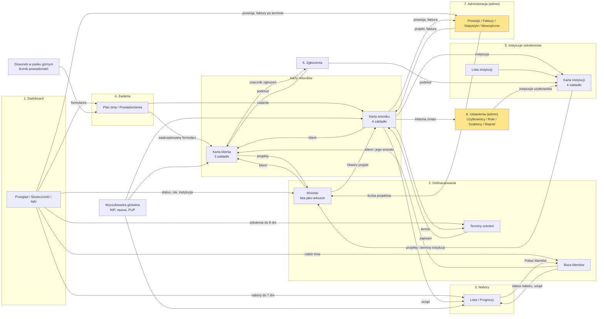
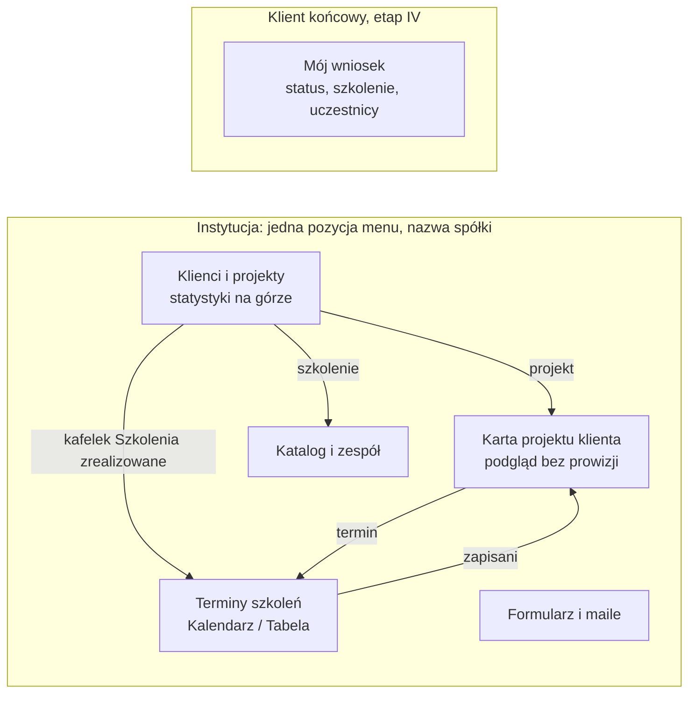

# 19. Mapa zakładek

Mapa zakładek systemu do ustalenia z klientem, zanim wykonawca zrobi screeny każdej zakładki do Miro. Dokument inwentaryzuje to, co jest w makiecie v2, wskazuje duplikaty i agregacje, które nie prowadzą do szczegółów (drill through), proponuje docelową mapę z połączeniami między zakładkami i zbiera 38 pytań do klienta (Z-01 do Z-38). Klient odpowiada na nie w panelu decyzyjnym (sekcja 17) i pobiera podsumowanie.

> **Wymaganie wykonawcy.** "Zastanowiłbym się nad liczbą zakładek i zakładek pomocniczych, bo wszystko co wyświetlamy w agregacji powinno nas też przekierowywać do szczegółów, takie drill through, teraz tego nie mam na makiecie, a powinno być. Pytania o zakładki bardzo szczegółowe, nie może być ich za dużo, powinny się łączyć między sobą, powinny przekierowywać jedna do drugiej."

> **Uwaga o nazewnictwie.** Nazwy dla użytkownika są ustalone i nienegocjowalne [D-55]: Zestawienia, Nabory, Projekt, Baza klientów, Administracja. Dwa pytania w tym dokumencie (Z-06 i Z-07) dotyczą miejsc, w których dokumentacja i makieta same się rozjeżdżają. Nazw nie zmieniamy bez decyzji klienta.

## Skrót

| Miara | Dziś (makieta v2) | Propozycja |
|---|---|---|
| Elementy nawigacji (menu, paski, zakładki wewnętrzne, lata) | 51 | 45 |
| Pozycje menu administratora LDIT | 10 | 8 |
| Poziomy zakładek | 3 (menu, pasek modułu, zakładki wewnętrzne) | 2 (menu, zakładka) plus karta rekordu |
| Miejsca ze statystykami | 4 | 2, połączone linkami |
| Agregacje, z których da się przejść do szczegółów | 3 działa i 18 częściowo z 90 | wszystkie 90 |
| Pytania do klienta | | 38 |

## Stan obecny

Inwentaryzacja makiety v2 (18 ekranów w `makieta/strony/`, menu z tabeli `moduly` w `tools/sqlite-migracja.mjs`). Stan z 29.09.2026.

### Liczby

| Element | Liczba | Uwagi |
|---|---|---|
| Pozycje menu (tabela `moduly`) | 12 | administrator widzi 10, pracownik LDIT 7, instytucja 4, handlowiec instytucji 1, klient 1 |
| Podmenu Dofinansowań | "Wszystkie instytucje" plus po jednej pozycji na instytucję | u administratora do ok. 20 pozycji |
| Ekrany z paskiem zakładek modułu | 11 ekranów w 5 grupach | 11 różnych zakładek oraz 2 nazwy zastępcze na ekranie Terminów |
| Zakładki wewnętrzne | 25 w 7 ekranach | Instytucje 5, Konfigurator 4, Administracja 4, Konta 4, Komunikacja 3, Rejestr 3, Terminy 2 |
| Zakładki lat | 3 | 2025, 2026, 2027 oraz "Nieprzypisane", gdy są wnioski bez roku |
| Razem elementów nawigacji | 51 | 12 + 11 + 25 + 3 |
| Ekrany (pliki) | 18 | sześć z nich nie ma pozycji w menu i jest osiągalnych tylko z zakładek lub z rekordu |
| Widoki do przejścia w Miro | 38 | 13 ekranów bez zakładek wewnętrznych (z trzema latami) plus 25 zakładek wewnętrznych |

### Pozycje menu (12)

| # | Etykieta w menu | Ekran | Kto widzi | Pasek zakładek modułu | Zakładki wewnętrzne | Co pokazuje |
|---|---|---|---|---|---|---|
| 1 | Dashboard | 01-dashboard | administrator i pracownik (edycja), instytucja (podgląd) | Przegląd; Skuteczność i lejki | brak | 4 kafelki operacyjne, 3 finansowe (admin), tabela "Wymaga działania" (5 kolejek), statusy wniosków |
| 2 | Dofinansowania (rozwija instytucje) | 02-zestawienia | administrator, pracownik | Baza danych; Wnioski (n); Terminy szkoleń | lata: 2025; 2026; 2027; Nieprzypisane | tabela wniosków (14 kolumn), statusy kolorami, masowa zmiana statusów |
| 3 | Nabory | 05-nabory | administrator, pracownik, instytucja (podgląd) | brak | brak | 4 kafelki, tabela urzędów, 2 wykresy prognoz, oś 14 dni |
| 4 | Zadania i powiadomienia | 18-zadania | administrator, pracownik | brak | brak (dwie sekcje na ekranie) | plan dnia, formularze do akceptacji |
| 5 | Instytucje szkoleniowe | 06-instytucje | administrator (edycja), pracownik (podgląd) | Przegląd instytucji; Konfigurator warunków (admin) | Dane firmy; Katalog szkoleń; Szkoleniowcy; Osoby i konta; Korespondencja | kafelki instytucji, karta instytucji |
| 6 | Komunikacja | 09-wysylka-maili | administrator, pracownik | brak | Biblioteka szablonów; Wysyłka; Automatyzacje i alerty | szablony, wysyłka z potwierdzeniem, reguły automatyczne |
| 7 | Administracja | 08-administracja | administrator | Prowizje i faktury; Kalkulator prowizji (prototyp) | Prowizje; Faktury; Statystyki; Prowizje wewnętrzne | 4 bloki prowizji, faktury, statystyki per instytucja, prowizje pracownicze i cele |
| 8 | Zgłoszenia | 10-zgloszenia | administrator, pracownik | brak | brak | 4 kafelki, lista incydentów |
| 9 | Ustawienia | 11-konta-uprawnienia | administrator | Konta i role; Rejestr aktywności | Użytkownicy; Konfigurator ról; Macierz uprawnień; Przypisanie do instytucji | konta, role, uprawnienia |
| 10 | Nazwa własnej spółki (w makiecie "Moja instytucja") | 16-panel-is | instytucja (edycja), handlowiec instytucji (podgląd) | brak | brak (filtr chipami) | 4 kafelki, klienci i projekty, terminy, katalog, szkoleniowcy, szablony, formularz |
| 11 | Terminy szkoleń | 13-terminy | administrator, instytucja | Projekty; Oczekujące na nabór; Terminy szkoleń | Kalendarz; Lista terminów | 4 kafelki, kalendarz, lista z uczestnikami |
| 12 | Mój wniosek | 17-panel-klienta | klient (podgląd) | brak | brak | status, szkolenie, uczestnicy (etap IV) |

Ekrany bez własnej pozycji w menu: karta projektu (03), Baza danych (04), Konfigurator warunków (07), Rejestr aktywności (12), Skuteczność i lejki (14), Kalkulator prowizji (15).

### Zakładki pomocnicze: paski modułu

| Grupa | Ekrany | Zakładki na pasku | Uwagi |
|---|---|---|---|
| Dashboard | 01, 14 | Przegląd; Skuteczność i lejki | dwa ekrany pod jedną pozycją menu |
| Dofinansowania | 02, 04 | Baza danych; Wnioski (n); Terminy szkoleń | licznik "Wnioski (n)" liczy tylko rok bieżący |
| Dofinansowania (ekran Terminów) | 13 | Projekty (n); Oczekujące na nabór; Terminy szkoleń | te same trzy cele, ale pod innymi nazwami: "Projekty" to Wnioski, "Oczekujące na nabór" to Baza danych |
| Instytucje | 06, 07 | Przegląd instytucji; Konfigurator warunków (admin) | Konfigurator ma własne 4 zakładki wewnętrzne |
| Administracja | 08, 15 | Prowizje i faktury; Kalkulator prowizji (prototyp) | prototyp do walidacji stoi w stałym pasku |
| Ustawienia | 11, 12 | Konta i role; Rejestr aktywności | dwa ekrany, razem 7 zakładek wewnętrznych |

### Zakładki wewnętrzne (25)

| Ekran | Zakładki | Co pokazują |
|---|---|---|
| Instytucje (06) | Dane firmy; Katalog szkoleń; Szkoleniowcy; Osoby i konta; Korespondencja | dane i siedziba, szablony szkoleń z ceną, 2 do 4 szkoleniowców, osoby kontaktowe i konta, maile instytucji |
| Konfigurator (07) | Warunki prowizyjne; Wzór certyfikatu; Dane do faktury; Formularz zgłoszeniowy | progi i modele prowizji (admin), szablon certyfikatu, dane do faktury, formularz instytucji |
| Administracja (08) | Prowizje; Faktury; Statystyki; Prowizje wewnętrzne | podstawa fakturowania, lista i import faktur, statystyki per instytucja, prowizje pracownicze z celami |
| Komunikacja (09) | Biblioteka szablonów; Wysyłka; Automatyzacje i alerty | szablony maili, wysyłka, reguły automatyczne |
| Konta (11) | Użytkownicy; Konfigurator ról; Macierz uprawnień; Przypisanie do instytucji | konta, role z checkboxami, ta sama macierz do odczytu, przydział instytucji |
| Rejestr (12) | Rejestr zmian danych; Istotne zdarzenia; Log logowań | kto, co, kiedy zmienił; zdarzenia; logowania |
| Terminy (13) | Kalendarz; Lista terminów | ta sama lista terminów w dwóch formach |
| Wnioski (02), lata | 2025; 2026; 2027; Nieprzypisane | ten sam układ tabeli, inny rok |

### Duplikaty i zakładki, które pokazują to samo w innej formie

| # | Temat | Gdzie występuje | Problem |
|---|---|---|---|
| 1 | Jeden ekran, cztery nazwy | menu "Dofinansowania"; tytuł "Zestawienie 2026"; zakładka "Wnioski"; pasek Terminów "Projekty" | zespół nie wie, czy to to samo miejsce [D-55] |
| 2 | Dwa różne paski dla tych samych celów | ekrany 02 i 04 kontra 13 | "Oczekujące na nabór" to Baza danych; różne etykiety, różna kolejność |
| 3 | Statystyki w czterech miejscach | Dashboard/Przegląd, Dashboard/Skuteczność, Administracja/Statystyki, panel instytucji | każde miejsce liczy definicję osobno |
| 4 | Skuteczność i złożone wnioski w pięciu miejscach | Dashboard (2 razy), Administracja/Statystyki, panel instytucji, "widok instytucji" w ekranie Skuteczność | ten sam procent w kilku miejscach, brak linków między nimi |
| 5 | Prowizja w pięciu miejscach | Administracja/Prowizje (4 bloki), Kalkulator, Konfigurator/Warunki, karta wniosku, kafelki na obu dashboardach | jedna liczba prowizji, wiele wejść |
| 6 | Terminy w trzech wejściach | pozycja menu, zakładka pod Dofinansowaniami, przycisk w panelu instytucji | pracownik ma zakładkę bez uprawnień do modułu |
| 7 | Wnioski w trzech formach | tabela Wnioski, rozwinięcie w Bazie danych, "Moi klienci i ich projekty" w panelu instytucji | brak przejść między formami |
| 8 | "Klienci z otwartym naborem" w trzech miejscach | Dashboard ("do obdzwonienia"), Baza danych, Nabory ("do obsłużenia") | trzy definicje jednej liczby |
| 9 | Uprawnienia: konfigurator i macierz | Konta: Konfigurator ról oraz Macierz uprawnień | dwie zakładki tej samej macierzy, jedna do edycji, druga do odczytu |
| 10 | Przydział pracownik i instytucja | Konta/Przypisanie do instytucji; Administracja/Prowizje wewnętrzne ("Przypisane instytucje"); Instytucje/Osoby i konta | trzy miejsca jednego powiązania |
| 11 | Korespondencja w trzech miejscach | karta wniosku, karta instytucji [D-52], Komunikacja/Wysyłka | brak jednego miejsca na historię klienta (400 maili) |
| 12 | Alerty i zadania automatyczne | Komunikacja/Automatyzacje i alerty oraz Zadania i powiadomienia | ten sam mechanizm w dwóch modułach [D-140] |
| 13 | Katalog szkoleń | Instytucje/Katalog, panel instytucji "Katalog moich szkoleń", "Moje szkolenia" w statystykach | trzy widoki jednej listy |
| 14 | Formularz zgłoszeniowy | Konfigurator/Formularz, panel instytucji "Mój formularz", Zadania/Powiadomienia (kolejka) | trzy miejsca tej samej rzeczy |
| 15 | Cele i premie | Administracja/Prowizje wewnętrzne | dokumentacja umieszcza cele na dashboardzie, a pracownik ich w makiecie nie widzi [D-23] |

### Rozjazdy z dokumentacją i słownikiem

1. **"Komunikacja"** w menu makiety, **"Wysyłka maili"** w docs/11.
2. **"Ustawienia"** w makiecie, w docs/11 dwie pozycje: "Konta i uprawnienia" i "Rejestr aktywności".
3. **Dofinansowania i Zestawienia:** docs/11 ma dwie pozycje menu, makieta jedną.
4. **"Nabory"**: słownik i docs/11 zapisują "Wnioski = Nabory (główne okno robocze)", a makieta nazywa "Nabory" listę urzędów [D-109].
5. **"Baza klientów"** w słowniku, **"Baza danych"** w [D-128] i makiecie.
6. **Zadania i powiadomienia:** [D-195] mówi o dwóch modułach, makieta ma jedną pozycję.
7. **Instytucja:** [D-76] mówi o jednej zakładce z nazwą spółki, makieta daje instytucji 4 pozycje menu (Dashboard, nazwa spółki, Terminy szkoleń, Nabory).
8. **Nabory dla instytucji:** macierz uprawnień daje instytucji podgląd Naborów, a strona pisze, że moduł jest tylko dla ról LDIT (P-34, [D-91]).
9. **Cele zespołu:** docs/05 zapisuje je na dashboardzie, makieta w Administracji (tylko admin).
10. **Karta klienta:** [D-52] i [D-54] zakładają kartę klienta, makieta jej nie ma.

### Usterki nawigacji do poprawy niezależnie od odpowiedzi klienta

1. Nabory, przycisk "Pokaż klientów": link do Bazy z parametrem `pup`, którego Baza nie czyta, więc pokazuje wszystkich klientów.
2. Wyszukiwarka globalna: przekazuje `q` do Bazy, która go nie czyta (czyta go tylko lista Wnioski).
3. Linki wewnątrz ekranów zmieniają zawartość ramki, ale nie zaznaczenie w menu ani okruszek w pasku górnym.
4. Pracownik LDIT ma na pasku Dofinansowań zakładkę "Terminy szkoleń", ale moduł Terminy nie jest mu przypisany w macierzy uprawnień.
5. Instytucja ma dostęp do Naborów mimo opisu strony (tylko role LDIT).
6. Dashboard: "Faktury po terminie" otwiera Prowizje, nie Faktury.
7. Karta wniosku: okruszek "Zestawienia" wraca do domyślnego roku bez filtrów i pozycji na liście.
8. Licznik "Wnioski (n)" w pasku zakładek liczy tylko rok bieżący i nie reaguje na filtry.
9. Kalkulator prowizji (prototyp) stoi w produkcyjnym pasku Administracji.
10. Administracja: przycisk "Nadpisz" przy projekcie, choć [D-138] przenosi nadpisanie na kartę wniosku.
11. Licznik wniosków do akceptacji ("kółko w prawym górnym rogu" z [D-105] i [D-140]) nie istnieje w powłoce makiety.
12. Zgłoszenia: przycisk "Otwórz kartę podmiotu" nie ma celu.

## Mapa agregacji i drill through

Zasada wykonawcy: **każda liczba, wykres i kafelek prowadzi do rekordów, z których się składa**. Tabela wymienia wszystkie agregacje makiety v2 (dashboard, statystyki, Administracja, panel instytucji, liczniki w zakładkach i w menu), miejsce docelowe i filtr. Nazwy parametrów filtrów: patrz słownik w sekcji o zasadach nawigacji. Klik ma otwierać listę **poza dashboardem**, bo dashboard nie zawiera rozpisek klientów [D-114], a licznik na liście musi zgadzać się z liczbą z kafelka.

Stan: **działa** (klik prowadzi tam, gdzie trzeba), **częściowo** (link jest, ale bez filtra albo z utratą stanu), **brak** (donikąd).

| # | Ekran | Agregacja | Dziś | Dokąd powinien prowadzić (ekran i filtr) | Stan |
|---|---|---|---|---|---|
| 1 | Dashboard/Przegląd | Kafelek "Klienci do obdzwonienia" | Nie jest klikalny | Baza klientów: nabor=ogloszony, sortowanie po końcu naboru rosnąco | brak |
| 2 | Dashboard/Przegląd | Kafelek "Wnioski złożone" i różnica rok do roku | Nie jest klikalny | Wnioski: rok=bieżący, status złożone (czekamy, pozytywna, negatywna); różnica prowadzi do Skuteczność i lejki, porównanie lat | brak |
| 3 | Dashboard/Przegląd | Kafelek "Decyzje pozytywne" i procent skuteczności | Nie jest klikalny | Wnioski: status=pozytywna; procent prowadzi do Skuteczność i lejki | brak |
| 4 | Dashboard/Przegląd | Kafelek "Oczekuje na rozpatrzenie" i kwota | Nie jest klikalny | Wnioski: status=czekamy | brak |
| 5 | Dashboard/Przegląd | Kafelek "Wartość wniosków" (admin) | Nie jest klikalny | Wnioski: rok=bieżący, sortowanie po wartości malejąco | brak |
| 6 | Dashboard/Przegląd | Kafelek "Przyznane dofinansowania" (admin) | Nie jest klikalny | Wnioski: status=pozytywna, sortowanie po kolumnie Przyznano | brak |
| 7 | Dashboard/Przegląd | Kafelek "Prowizja" (admin) | Link do Administracji, bez okresu | Administracja/Prowizje: okres=bieżący rok | częściowo |
| 8 | Dashboard/Przegląd | Wymaga działania: formularze do akceptacji | Przycisk Otwórz otwiera Zadania bez zawężenia | Zadania/Powiadomienia (zakładka), oraz dzwonek w pasku górnym | częściowo |
| 9 | Dashboard/Przegląd | Wymaga działania: nabory kończące się w tygodniu | Przycisk Otwórz otwiera Nabory bez filtra | Nabory/Lista: nabor=ogloszony, dni=7 | częściowo |
| 10 | Dashboard/Przegląd | Wymaga działania: szkolenia w ciągu 8 dni | Przycisk Otwórz otwiera Terminy bez filtra | Terminy: termin=zaplanowany, dni=8 | częściowo |
| 11 | Dashboard/Przegląd | Wymaga działania: faktury po terminie | Przycisk Otwórz otwiera pierwszą zakładkę Administracji (Prowizje), nie Faktury | Administracja/Faktury: status=po terminie | częściowo |
| 12 | Dashboard/Przegląd | Wymaga działania: projekty pozytywne nierozliczone | Przycisk Otwórz otwiera Wnioski bez filtra | Wnioski: status=pozytywna, rozl=oczekuje | częściowo |
| 13 | Dashboard/Przegląd | Statusy wniosków (sześć wierszy z licznikami) | Nie są klikalne | Wnioski: status=pozytywna, negatywna, czekamy, niezlozony, nw, rezygnacja | brak |
| 14 | Dashboard/Skuteczność | Kafelek "Projekty" (w tym złożone) | Nie jest klikalny | Wnioski: rok, is (z filtra ekranu) | brak |
| 15 | Dashboard/Skuteczność | Kafelek "Skuteczność" (pozytywne, negatywne) | Nie jest klikalny | Wnioski: status=pozytywna albo negatywna, is | brak |
| 16 | Dashboard/Skuteczność | Kafelek "Przyznane dofinansowania" | Nie jest klikalny | Wnioski: status=pozytywna, sortowanie po kolumnie Przyznano | brak |
| 17 | Dashboard/Skuteczność | Kafelek "Prowizja naliczona" (admin) | Link do Administracji, bez okresu i instytucji | Administracja/Prowizje: okres, is | częściowo |
| 18 | Dashboard/Skuteczność | Wykres "Wnioski w kolejnych miesiącach" (słupki wg decyzji) | Słupki nie są klikalne | Wnioski: mies=RRRR-MM i status zgodny z kolorem słupka | brak |
| 19 | Dashboard/Skuteczność | Lejek osób w projektach (leady, BUR, wnioski, szkolenia) | Etapy nie są klikalne | Etap leadów: Baza klientów; wnioski: Wnioski; szkolenia: Terminy termin=odbyty | brak |
| 20 | Dashboard/Skuteczność | Skuteczność wg wielkości firmy | Nie jest klikalna | Wnioski: wielkosc=mikro, maly, sredni, duzy, inny | brak |
| 21 | Dashboard/Skuteczność | Najczęstsze urzędy (liczba wniosków, skuteczność) | Nie jest klikalne | Wnioski: pup=... (scenariusz masowej zmiany statusów); nazwa urzędu prowadzi do Nabory | brak |
| 22 | Dashboard/Skuteczność | Kontrola kompletności danych (liczniki braków) | Nie jest klikalna | Wnioski albo Baza klientów: brak=pole (np. brak NIP, brak urzędu) | brak |
| 23 | Dashboard/Skuteczność | Najpopularniejsze szkolenia (projekty, uczestnicy, wartość) | Nie jest klikalne | Wnioski: szkolenie=...; nazwa instytucji prowadzi do karty instytucji | brak |
| 24 | Dashboard/Skuteczność | Widok instytucji: "Szkolenia zrealizowane", "Łączna wartość", "Skuteczność moich klientów" | Nie są klikalne | Terminy: termin=odbyty; Wnioski: status (zakres tylko własne wiersze) | brak |
| 25 | Dashboard/Skuteczność | Widok instytucji: tabela "Moje szkolenia" | Nie jest klikalna | Wnioski (własne): szkolenie=... | brak |
| 26 | Dofinansowania/Wnioski | Zakładki lat z licznikami i "Nieprzypisane" | Przełączają rok w tym samym ekranie | Bez zmian, rok zapisany w adresie (rok=RRRR) | działa |
| 27 | Dofinansowania/Wnioski | Podmenu instytucji pod "Dofinansowania" | Filtruje ekran do jednej instytucji (parametr is) | Bez zmian, plus zapamiętanie przy powrocie | działa |
| 28 | Dofinansowania/Wnioski | Nazwy w wierszu: klient, instytucja, urząd, szkolenie | Zwykły tekst | Klient: karta klienta; instytucja: karta instytucji (LDIT); urząd: Nabory; szkolenie: Terminy z filtrem | brak |
| 29 | Dofinansowania/Wnioski | Kolumna "Osób" (zakwalifikowani / zgłoszeni) | Zwykły tekst | Karta wniosku, zakładka Uczestnicy | brak |
| 30 | Dofinansowania/Wnioski | Kolumna "Rozliczenie" (Zafakturowany, Rozliczone) | Znacznik bez linku | Administracja/Faktury: faktura=numer | brak |
| 31 | Dofinansowania/Wnioski | Przycisk "Otwórz" (karta wniosku) | Otwiera kartę; powrót z karty gubi filtry i rok | Karta wniosku i powrót z zachowaniem filtra, sortowania, roku i pozycji | częściowo |
| 32 | Dofinansowania/Baza klientów | Kafelek "Klienci z otwartym naborem" | Nie jest klikalny (jest osobny filtr Nabór w pasku) | Ten ekran: nabor=ogloszony | brak |
| 33 | Dofinansowania/Baza klientów | Kafelek "Czekają na nabór prognozowany" | Nie jest klikalny | Ten ekran: nabor=kontakt albo brak | brak |
| 34 | Dofinansowania/Baza klientów | Kafelek "Bez naboru w tym momencie" | Nie jest klikalny | Ten ekran: nabor=po albo brak danych | brak |
| 35 | Dofinansowania/Baza klientów | Kafelek "Klienci w bazie łącznie" | Nie jest klikalny | Ten ekran bez filtrów | brak |
| 36 | Dofinansowania/Baza klientów | Kolumna "Wnioski" (liczba) i plus | Plus rozwija wnioski w wierszu, otwórz prowadzi do karty | Bez zmian, plus link do Wnioski: klient=... | częściowo |
| 37 | Dofinansowania/Baza klientów | Kolumny "Status naboru", "Koniec naboru", "Urząd pracy" | Zwykły tekst | Nabory/Lista: wiersz urzędu klienta | brak |
| 38 | Dofinansowania/Baza klientów | Kolumny "Klient" i "Instytucja" | Zwykły tekst (Edytuj otwiera formularz) | Karta klienta; karta instytucji (LDIT) | brak |
| 39 | Dofinansowania/Baza klientów | Licznik "Wnioski (n)" w pasku zakładek | Jest zakładką, liczy tylko bieżący rok, nie reaguje na filtry | Wnioski z tymi samymi filtrami co lista klientów | częściowo |
| 40 | Dofinansowania/Terminy | Kafelki "Terminy w miesiącu", "Terminy wolne", "Uczestnicy przypisani", "Terminy w bazie" | Nie są klikalne | Terminy: mies=, termin=wolny, is= | brak |
| 41 | Dofinansowania/Terminy | Termin w kalendarzu i kolumna "Zapisani" | Pokazują listę uczestników; uczestnik bez linku | Uczestnik prowadzi do karty wniosku (zakładka Uczestnicy) | częściowo |
| 42 | Karta wniosku | Okruszek "Zestawienia, Projekt" | Wraca do listy bez filtrów, roku i pozycji | Lista Wnioski w poprzednim stanie (filtry, sortowanie, rok, pozycja) | częściowo |
| 43 | Karta wniosku | Dane projektu: klient, instytucja, urząd, szkolenie | Zwykły tekst | Karta klienta; karta instytucji (LDIT); Nabory (urząd); Terminy (szkolenie) | brak |
| 44 | Karta wniosku | Blok "Prowizja LDIT" (admin) | Bez linku | Administracja/Prowizje: wiersz tego projektu | brak |
| 45 | Karta wniosku | Blok "Przebieg" (oś etapów) | Bez linku | Rejestr aktywności: filtr rekordu (admin) | brak |
| 46 | Karta wniosku | Blok "Korespondencja i notatki" | Bez linku | Karta klienta, zakładka Korespondencja; akcja "Wyślij z szablonu" | brak |
| 47 | Nabory | Kafelek "Nabory ogłoszone teraz" i "klientów do obsłużenia" | Nie jest klikalny | Nabory/Lista: status=ogloszony; liczba klientów prowadzi do Baza klientów: nabor=ogloszony | brak |
| 48 | Nabory | Kafelek "Urzędy w trakcie kontaktu" | Nie jest klikalny | Nabory/Lista: status=kontakt | brak |
| 49 | Nabory | Kafelek "Nabory prognozowane" | Nie jest klikalny | Nabory/Lista: status=kontakt albo brak, sortowanie po prognozie | brak |
| 50 | Nabory | Kafelek "Klientów przypisanych do urzędów" | Nie jest klikalny | Baza klientów: urzędy z naborem | brak |
| 51 | Nabory | Kolumna "Klientów czeka" i przycisk "Pokaż klientów" | Link do Bazy z parametrem pup, którego Baza nie czyta: pokazuje wszystkich klientów | Baza klientów: pup=... | częściowo |
| 52 | Nabory | Wykres "Prognozy na kolejne miesiące" | Słupki nie są klikalne | Nabory/Lista: prognoza=RRRR-MM | brak |
| 53 | Nabory | Wykres "Klienci czekający wg miesiąca" | Słupki nie są klikalne | Baza klientów: urzędy z prognozą w danym miesiącu | brak |
| 54 | Nabory | Oś czasu naborów kończących się w 14 dni | Tekst bez linków | Nabory/Lista: wiersz urzędu; Baza klientów: pup=... | brak |
| 55 | Instytucje | Kolumna "Realizacje 2026" w katalogu szkoleń | Zwykły tekst | Wnioski: szkolenie=..., rok=2026, is=... | brak |
| 56 | Instytucje | Kafelek instytucji | Otwiera szczegół pod listą | Bez zmian; docelowo karta instytucji z zakładkami | działa |
| 57 | Zadania | Kafelki "Zadania na dziś" i "Zaległe" | Nie są klikalne | Ten ekran: lista zadań z filtrem termin=dzis albo zalegle | brak |
| 58 | Zadania | Kafelek "Wnioski do akceptacji" | Nie jest klikalny | Zakładka Powiadomienia (formularze oczekujące) | brak |
| 59 | Zadania | Zadanie i powiadomienie w wierszu | Opis wniosku jako tekst | Zadanie: karta wniosku; zaakceptowany formularz: karta klienta | brak |
| 60 | Zgłoszenia | Kafelki "Zgłoszenia otwarte", "O wysokiej wadze", "Dotyczące instytucji", "Dotyczące klientów" | Nie są klikalne | Ten ekran: waga=wysoka, podmiot=instytucja albo klient | brak |
| 61 | Zgłoszenia | Przycisk "Otwórz kartę podmiotu" | Przycisk bez celu (nie ma karty klienta) | Karta klienta albo karta instytucji | brak |
| 62 | Komunikacja | "Użyć" przy szablonie | Nie jest klikalne | Historia wysyłek: szablon=... | brak |
| 63 | Administracja/Prowizje | Kafelek "Obrót objęty prowizją" | Nie jest klikalny | Wnioski: status=pozytywna, okres=... | brak |
| 64 | Administracja/Prowizje | Kafelek "Prowizja naliczona" | Nie jest klikalny | Tabela per instytucja na tym ekranie | brak |
| 65 | Administracja/Prowizje | Kafelek "Prowizja rozliczona" | Nie jest klikalny | Wnioski: rozl=rozliczone, okres=... | brak |
| 66 | Administracja/Prowizje | Kafelek "Do zafakturowania" | Nie jest klikalny | Wnioski: status=pozytywna, rozl=oczekuje, okres=... | brak |
| 67 | Administracja/Prowizje | Wiersz instytucji w tabeli prowizji | Przycisk otwiera rozwinięcie projektów na tym ekranie | Bez zmian; nazwa prowadzi do karty instytucji, model do zakładki Warunki | częściowo |
| 68 | Administracja/Prowizje | Kolumna "Projekty" (liczba) w tabeli prowizji | Zwykły tekst | Wnioski: is=..., status=pozytywna, okres=... | brak |
| 69 | Administracja/Prowizje | Komórka miesiąc x instytucja w dashboardzie prowizji | Nie jest klikalna | Rozwinięcie projektów: is=..., mies=... | brak |
| 70 | Administracja/Prowizje | Wiersz projektu w rozwinięciu instytucji | Bez linku do karty (jest przycisk "Nadpisz") | Karta wniosku, zakładka Finanse i dane | brak |
| 71 | Administracja/Prowizje | Kolumny "Terminy" i "Osoby" w Przewidywanej prowizji | Zwykły tekst | Terminy: is=..., okres=..., termin=zaplanowany | brak |
| 72 | Administracja/Faktury | Kafelki "Wystawione", "Opłacone", "Oczekujące", "Po terminie" | Nie są klikalne (jest osobny filtr statusu) | Ten ekran: status=oplacona, oczekuje, po terminie | brak |
| 73 | Administracja/Faktury | Numer faktury, "Projekty" (liczba), instytucja | Zwykły tekst | Podgląd PDF; Wnioski: faktura=numer; karta instytucji | brak |
| 74 | Administracja/Statystyki | Kafelki "Wnioski złożone", "Skuteczność zbiorcza", "Obrót", "Przychód LDIT" | Nie są klikalne | Wnioski z filtrem; Administracja/Prowizje | brak |
| 75 | Administracja/Statystyki | Komórki "Złożone", "Pozytywne", "Odrzucone", "Rezygnacje" per instytucja | Nie są klikalne | Wnioski: is=..., status=... | brak |
| 76 | Administracja/Prowizje wewnętrzne | Wnioski złożone i wartość per pracownik | Nie są klikalne | Wnioski: opiekun=..., status złożone | brak |
| 77 | Administracja/Prowizje wewnętrzne | Kolumna "Przypisane instytucje" | Zwykły tekst | Ustawienia/Użytkownicy: instytucje pracownika | brak |
| 78 | Administracja/Prowizje wewnętrzne | Pasek postępu w Celach i premiach | Nie jest klikalny | Wnioski z filtrem odpowiadającym definicji celu | brak |
| 79 | Panel instytucji | Kafelek "Moi klienci" | Nie jest klikalny | Zakładka Klienci i projekty (ta sama tabela) | brak |
| 80 | Panel instytucji | Kafelki "Wnioski złożone" i "Decyzje pozytywne" | Nie są klikalne (jest osobny filtr chipami) | Ta sama tabela z ustawionym chipem statusu | brak |
| 81 | Panel instytucji | Kafelek "Szkolenia zrealizowane" | Nie jest klikalny | Terminy: termin=odbyty (tylko własne) | brak |
| 82 | Panel instytucji | Tabela klientów: klient i termin szkolenia | Zwykły tekst, bez przycisku Otwórz | Karta projektu (podgląd bez prowizji); Terminy: wiersz terminu | brak |
| 83 | Panel instytucji | "Moje terminy" i przyciski "Terminy szkoleń" | Link do Terminów bez filtra | Terminy: termin=zaplanowany | częściowo |
| 84 | Panel instytucji | Kolumna "Projekty" w katalogu szkoleń | Zwykły tekst | Tabela klientów z filtrem szkolenie=... | brak |
| 85 | Ustawienia/Użytkownicy | Kolumny "Instytucja" i "Ostatnie logowanie" | Zwykły tekst | Karta instytucji; Rejestr: log logowań, użytkownik=... | brak |
| 86 | Ustawienia/Użytkownicy | Przycisk "Historia zmian w rejestrze aktywności" | Otwiera Rejestr bez filtra | Rejestr aktywności: użytkownik=... | częściowo |
| 87 | Ustawienia/Rejestr aktywności | Wpis rejestru (rekord, którego dotyczy zmiana) | Zwykły tekst | Karta wniosku albo karta klienta | brak |
| 88 | Powłoka | Licznik wniosków do akceptacji (dzwonek w prawym górnym rogu) | Nie istnieje w powłoce makiety | Zadania/Powiadomienia | brak |
| 89 | Powłoka | Wyszukiwarka globalna (Enter) | Otwiera Bazę klientów z parametrem q, którego Baza nie czyta | Ekran wyników: klienci, projekty, urzędy, instytucje | częściowo |
| 90 | Powłoka | Okruszek w pasku górnym | Pokazuje nazwę modułu; nie zmienia się po linkach w ekranie | Moduł, zakładka, rekord, klikalne | częściowo |

Podsumowanie: z 90 agregacji **69 nie prowadzi donikąd**, 18 prowadzi częściowo (link bez filtra albo z utratą stanu), a tylko 3 działają jak trzeba.

## Propozycja mapy docelowej

Założenia: LDIT do 8 pozycji menu (pracownik do 6), instytucja jedna pozycja z czterema zakładkami [D-76], w module jeden pasek zakładek nie dłuższy niż 4, karta rekordu do 4 zakładek. Nazwy bez zmian [D-55]. Propozycja zależy od odpowiedzi klienta na pytania z części "Pytania do klienta": rekomendowane warianty są tu przyjęte jako założenie robocze.

### Menu i zakładki

| # | Pozycja menu | Zakładki (max 4) | Kto | Zastępuje |
|---|---|---|---|---|
| 1 | Dashboard | Przegląd; Skuteczność i lejki | administrator, pracownik (wariant bez finansów) | ekrany 01 i 14 |
| 2 | Dofinansowania (rozwija: Wszystkie instytucje i lista) | Wnioski (lata jako arkusze); Baza klientów; Terminy szkoleń | administrator, pracownik | ekrany 02, 04, 13 |
| 3 | Nabory | Lista; Prognozy | administrator, pracownik | ekran 05 |
| 4 | Zadania | Plan dnia; Powiadomienia | administrator, pracownik | ekran 18 oraz dzwonek w pasku górnym |
| 5 | Instytucje szkoleniowe | lista instytucji; karta instytucji: Dane i osoby; Katalog i szkoleniowcy; Korespondencja; Warunki (tylko admin) | administrator (edycja), pracownik (podgląd, bez Warunków) | ekrany 06 i 07, Kalkulator jako podgląd w Warunkach |
| 6 | Zgłoszenia | brak | administrator, pracownik | ekran 10 |
| 7 | Administracja | Prowizje; Faktury; Statystyki; Prowizje wewnętrzne i cele | administrator | ekran 08 |
| 8 | Ustawienia | Użytkownicy; Role i uprawnienia; Szablony maili; Rejestr aktywności | administrator | ekrany 11, 12 i szablony z 09 |
| IS | Nazwa własnej spółki | Klienci i projekty; Terminy szkoleń; Katalog i zespół; Formularz i maile | instytucja (edycja), handlowiec instytucji (odczyt klientów bez kwot [D-75]) | ekrany 16 i 13 |
| K | Mój wniosek | brak | klient (etap IV) | ekran 17 |

Karty rekordów są osobnymi ekranami, nie pozycjami menu: **karta wniosku** (Finanse i dane; Uczestnicy; Korespondencja i notatki; Przebieg i zadania), **karta klienta** (Dane i kontakty; Projekty; Korespondencja i notatki, nowa) oraz **ekran wyników wyszukiwania** (nowy). W tym wariancie "Wysyłka maili" nie jest osobną pozycją w menu. Jeśli klient wybierze inaczej (pytanie o Wysyłkę maili), pozycji jest 9.

### Liczby przed i po

| Miara | Dziś | Propozycja |
|---|---|---|
| Pozycje menu administratora | 10 | 8 |
| Pozycje menu pracownika | 7 | 6 |
| Pozycje menu instytucji | 4 | 1 i 4 zakładki |
| Ekrany z paskiem zakładek | 11 (w 5 grupach) | 6 modułów z jednym paskiem: Dashboard, Dofinansowania, Nabory, Zadania, Administracja, Ustawienia |
| Zakładki wewnętrzne | 25 | 11, wyłącznie w kartach rekordów (wniosku 4, klienta 3, instytucji 4) |
| Największa liczba zakładek w module | 9 (Instytucje) | 4 |
| Poziomy zakładek | 3 | 2 plus karta rekordu |
| Elementy nawigacji razem | 51 | 45 (LDIT 39, instytucja 5, klient 1) |
| Widoki do przejścia w Miro | 38 | 37 (LDIT 32, instytucja 4, klient 1) |
| Miejsca ze statystykami | 4 | 2 (ilościowe w Dashboardzie, kwotowe w Administracji), linki między nimi |
| Miejsca, w których liczy się prowizję | 5 | 3 (Administracja/Prowizje, karta wniosku, Warunki instytucji); kafelki tylko jako linki |
| Agregacje z drill through | 3 z 90 | wszystkie |

Liczba widoków nie spada radykalnie, bo w miejsce zakładek wewnętrznych w Instytucjach i długich ekranów pojawiają się karty klienta i wniosku z zakładkami. Zmienia się to, że każdy widok ma jedno miejsce w mapie, a liczby prowadzą do szczegółów.

### Diagram nawigacji LDIT

Strzałki to drill through: kliknięcie w liczbę, nazwę albo przycisk na ekranie źródłowym otwiera ekran docelowy z ustawionym filtrem.

Żółte pozycje widzi wyłącznie administrator.

### Diagram nawigacji instytucji i klienta

Każdy widok instytucji jest ograniczony do jej własnych danych na poziomie danych, nie interfejsu [D-148]. Link do ekranu, do którego rola nie ma dostępu, nie jest pokazywany.

### Trzy scenariusze pracy przez połączone zakładki

1. **Po ogłoszeniu wyników.** Dashboard, kafelek "Oczekuje na rozpatrzenie: 47" prowadzi do Wnioski z filtrem `status=czekamy`. Dokładam filtr `pup=Warszawa`, zaznaczam wiersze, "Oznacz pozytywne". Klik w numer klienta otwiera kartę wniosku, "Wróć do listy" przywraca filtr i pozycję.
2. **Początek dnia.** Dzwonek pokazuje 3 powiadomienia. Akceptuję formularz, system otwiera nowego klienta w Bazie klientów. Z karty klienta dodaję zadanie "kontakt za 4 dni", które ląduje w Zadaniach.
3. **Koniec miesiąca (administrator).** Administracja/Prowizje, kafelek "Do zafakturowania" prowadzi do Wnioski z filtrem `status=pozytywna&rozl=oczekuje&okres=2026-09`. Otwieram projekt, sprawdzam zakładkę Finanse i dane, wracam do listy, filtr zostaje.

### Zasady nawigacji

1. **Każda liczba jest linkiem.** Kafelek, słupek wykresu, komórka agregatu, licznik w zakładce prowadzą do listy rekordów, z których się składają. Licznik na liście zgadza się z liczbą, która do niej prowadziła. Nie wolno mieć dwóch definicji jednej liczby.
2. **Dashboard nie zawiera list.** Klik prowadzi poza dashboard, do listy operacyjnej [D-114].
3. **Filtry w adresie.** Każdy filtr i sortowanie są w adresie (słownik poniżej), więc link do listy można skopiować, wysłać koledze i zapisać w zakładkach przeglądarki. Filtry z drill through są widoczne jako chipy z krzyżykiem ("PUP: Warszawa", "status: czekamy"), żeby było wiadomo, dlaczego lista jest krótka.
4. **Okruszki.** Moduł, zakładka, rekord, każdy element klikalny. Głębokość nie większa niż menu, zakładka, rekord.
5. **Powrót zachowuje stan.** "Wróć do listy" i przycisk Wstecz przeglądarki przywracają filtry, sortowanie, rok, zaznaczenie i pozycję przewinięcia. Przy pracy seryjnej (130 wniosków w dwa tygodnie) karta wniosku ma przyciski Poprzedni i Następny w kolejności listy.
6. **Link do rekordu z każdego miejsca, w którym rekord jest wymieniony.** Klient, instytucja, urząd, projekt, szkolenie, termin, faktura to linki wszędzie: w tabelach, na kartach, w powiadomieniach, w rejestrze, w wynikach wyszukiwania.
7. **Uprawnienia w linkach.** Link do miejsca, do którego rola nie ma dostępu, nie jest pokazywany (tekst zamiast linku). Filtr i zakres wynikają z konta na poziomie danych [D-148], a nie z parametru w adresie.
8. **Jeden pasek zakładek na moduł**, najwyżej 4 zakładki, bez zakładek w zakładkach. Karta rekordu ma własne zakładki, najwyżej 4.
9. **Menu i pasek zawsze zgodne z ekranem.** Klik w link wewnątrz ekranu zmienia zaznaczenie w menu, zakładkę i okruszek (dziś zmienia tylko zawartość ramki).
10. **Ta sama zakładka, jedna nazwa.** Nazwy wg słownika [D-55], bez wariantów typu "Projekty" i "Wnioski" dla tej samej listy.
11. **Filtr instytucji z menu i z drill through jest tym samym filtrem.** Wybór "Dofinansowania, Metal Maniak" ustawia `is=` w adresie i jest zachowany przy przejściach.
12. **Eksport bierze aktualny filtr.** "Eksport do Excela" na liście eksportuje dokładnie to, co widać.

### Słownik parametrów adresu

| Parametr | Wartości | Gdzie działa |
|---|---|---|
| `rok` | RRRR | Wnioski, Baza klientów (licznik), Administracja |
| `is` | identyfikator instytucji | wszystkie listy, zakres konta zawęża dodatkowo [D-148] |
| `pup` | identyfikator urzędu | Wnioski, Baza klientów, Nabory |
| `status` | czekamy, pozytywna, negatywna, rezygnacja, niezlozony, nw | Wnioski, Baza klientów (wnioski klienta) |
| `rozl` | oczekuje, zafakturowany, rozliczone | Wnioski |
| `nabor` | ogloszony, kontakt, brak, po | Baza klientów, Nabory |
| `prognoza` | RRRR-MM | Nabory |
| `dni` | liczba dni do końca naboru albo do terminu | Nabory, Terminy |
| `termin` | wolny, zaplanowany, odbyty | Terminy |
| `szkolenie` | identyfikator szkolenia z katalogu | Wnioski, Terminy |
| `mies` | RRRR-MM (miesiąc złożenia wniosku albo terminu) | Wnioski, Terminy, Prowizje |
| `wielkosc` | mikro, maly, sredni, duzy, inny | Wnioski |
| `klient` | identyfikator klienta | Wnioski, Zgłoszenia, Rejestr |
| `opiekun` | użytkownik LDIT | Wnioski |
| `faktura` | numer faktury | Wnioski, Faktury |
| `okres` | RRRR albo RRRR-MM | Administracja |
| `brak` | nazwa pola | Wnioski, Baza klientów |
| `q` | tekst (NIP, nazwa, PUP) | wszystkie listy i ekran wyników |
| `sort` | kolumna i kierunek | wszystkie listy |

## Pytania do klienta

Pytania mają ustalić mapę zakładek. Każde ma numer Z-xx, treść, 2 do 4 wariantów z konsekwencjami, rekomendację wykonawcy i powiązane decyzje. Klient odpowiada w panelu decyzyjnym (sekcja 17, obszar "Mapa zakładek"): wybiera wariant, a panel składa podsumowanie do pobrania. Waga: **wysoka** zmienia strukturę menu albo liczbę ekranów, **średnia** zmienia układ ekranu lub przejścia, **niska** jest szczegółem. Typy konsekwencji: zysk (co daje), koszt (czym za to płacimy), wymusza (co trzeba dołożyć), ryzyko (co może pójść źle).

| Nr | Obszar | Pytanie | Waga | Rekomendacja |
|---|---|---|---|---|
| Z-01 | Dashboard | Co zostaje z sekcji "Wymaga działania" na dashboardzie | średnia | wariant B |
| Z-02 | Dashboard | Statystyki są w czterech miejscach. Jaki podział przyjmujemy | średnia | wariant A |
| Z-03 | Dashboard | Gdzie są Cele i premie i kto je widzi | średnia | wariant A |
| Z-04 | Dofinansowania, Zestawienia, Baza klientów, Wnioski | Jak nazywa się i jak jest ułożone menu dla Dofinansowań i Zestawień | wysoka | wariant A |
| Z-05 | Dofinansowania, Zestawienia, Baza klientów, Wnioski | Lista instytucji w menu przy ok. 20 instytucjach | niska | wariant B |
| Z-06 | Dofinansowania, Zestawienia, Baza klientów, Wnioski | Co oznacza nazwa "Nabory" | wysoka | wariant A |
| Z-07 | Dofinansowania, Zestawienia, Baza klientów, Wnioski | Nazwa zakładki z klientami: "Baza klientów" czy "Baza danych" | średnia | wariant A |
| Z-08 | Dofinansowania, Zestawienia, Baza klientów, Wnioski | Lata jako zakładki: czy potrzebny jest też widok "Wszystkie lata" | średnia | wariant A |
| Z-09 | Dofinansowania, Zestawienia, Baza klientów, Wnioski | Czy klient ma własną kartę (osobny ekran) | wysoka | wariant A |
| Z-10 | Dofinansowania, Zestawienia, Baza klientów, Wnioski | Jakie filtry musi mieć lista Wnioski | średnia | wariant A |
| Z-11 | Karta wniosku | Karta wniosku: jedna długa strona czy zakładki | wysoka | wariant B |
| Z-12 | Instytucje i katalog | Struktura modułu Instytucje szkoleniowe | wysoka | wariant B |
| Z-13 | Terminy | Gdzie w menu są Terminy szkoleń i kto je widzi | średnia | wariant A |
| Z-14 | Terminy | Kalendarz i Lista terminów: dwie zakładki czy przełącznik widoku | niska | wariant B |
| Z-15 | Terminy | Jak przypisywać projekt do terminu | średnia | wariant A |
| Z-16 | Nabory | Nabory: osobna pozycja menu czy zakładka w Dofinansowaniach | średnia | wariant A |
| Z-17 | Nabory | Ekran Nabory: ile bloków naraz | niska | wariant B |
| Z-18 | Nabory | Czy instytucja widzi nabory | średnia | wariant A |
| Z-19 | Komunikacja | Wysyłka maili: pozycja w menu czy funkcja przy rekordach | wysoka | wariant B |
| Z-20 | Zadania i powiadomienia | Zadania i powiadomienia: jedna pozycja, dwie czy dzwonek | średnia | wariant C |
| Z-21 | Administracja i prowizje | Administracja: ile zakładek | średnia | wariant A |
| Z-22 | Administracja i prowizje | Zakładka Prowizje: cztery bloki naraz | średnia | wariant B |
| Z-23 | Administracja i prowizje | Co dzieje się z Kalkulatorem prowizji po walidacji | niska | wariant C |
| Z-24 | Ustawienia i konta | Ustawienia: konta, uprawnienia i rejestr | średnia | wariant B |
| Z-25 | Panel instytucji | Struktura panelu instytucji szkoleniowej | wysoka | wariant A |
| Z-26 | Panel instytucji | Czy instytucja może otworzyć kartę projektu swojego klienta | średnia | wariant A |
| Z-27 | Panel klienta | Panel klienta: nawigacja w minimalnym zakresie | niska | wariant A |
| Z-28 | Nawigacja ogólna | Limit zakładek i zasada jednego paska | wysoka | wariant A |
| Z-29 | Nawigacja ogólna | Wyszukiwarka globalna: co pokazuje wynik | średnia | wariant A |
| Z-30 | Nawigacja ogólna | Okruszki i powrót z drill through | wysoka | wariant A |
| Z-31 | Nawigacja ogólna | Telefon: co z zakładek jest dostępne | średnia | wariant A |
| Z-32 | Drill through | Dokąd prowadzi kliknięcie w liczbę, wykres lub kafelek | wysoka | wariant A |
| Z-33 | Drill through | Jak przechodzić między Bazą klientów a Wnioskami | średnia | wariant A |
| Z-34 | Drill through | Które nazwy na karcie wniosku i w listach są linkami | średnia | wariant A |
| Z-35 | Drill through | Skąd projekt i faktura w Administracji prowadzą dalej | średnia | wariant A |
| Z-36 | Drill through | Historia rekordu: skąd wejść do Rejestru aktywności | niska | wariant A |
| Z-37 | Drill through | Ostrzeżenie o zgłoszeniach na kartach klienta, instytucji i wniosku | średnia | wariant A |
| Z-38 | Drill through | Filtry w adresie i zapisane widoki | średnia | wariant A |

### Dashboard

#### Z-01. Co zostaje z sekcji "Wymaga działania" na dashboardzie

**Waga:** średnia. **Blokuje:** screen Dashboard/Przegląd. **Powiązane decyzje:** D-105, D-114, D-140, D-185.

**Stan dziś i kontekst.** Dashboard zawiera tabelę pięciu kolejek: formularze do akceptacji, nabory kończące się w tygodniu, szkolenia w ciągu 8 dni, faktury po terminie, projekty pozytywne nierozliczone. W kolumnie Kontekst są wypisane nazwy urzędów. Klient chciał samych statystyk [D-114], a ta sekcja jest listą spraw i dubluje moduł Zadania i powiadomienia [D-140].

**A. Zostaje jak dziś: tabela z kontekstem (nazwy urzędów, terminy)**

- **zysk:** Jedno miejsce na start dnia, wszystko widać bez klikania
- **ryzyko:** Lista spraw na dashboardzie kłóci się z [D-114] i z modułem Zadań [D-140]

**B. Zostaje pięć liczników, każdy klikalny (bez nazw urzędów i kontekstu), klik prowadzi do listy z filtrem** (rekomendowany)

- **zysk:** Jest statystyka i szybki dostęp, ale bez rozpiski
- **koszt:** Znika informacja, który urząd kończy nabór, trzeba ją sprawdzić na liście
- **wymusza:** Licznik formularzy do akceptacji pokazany także jako dzwonek w pasku górnym [D-105]

**C. Sekcja przenosi się w całości do Zadań i powiadomień, dashboard jest czysto statystyczny**

- **zysk:** Dashboard w pełni jak portfel kryptowalut (analogia klienta), bez żadnych spraw do zrobienia
- **koszt:** Pierwszy ekran po zalogowaniu nie mówi, co jest pilne
- **wymusza:** Zadanie automatyczne dla każdej z pięciu kolejek [D-185]

> **Rekomendacja wykonawcy:** Wariant B: liczniki zostają jako skrót, a lista spraw żyje w Zadaniach.

#### Z-02. Statystyki są w czterech miejscach. Jaki podział przyjmujemy

**Waga:** średnia. **Blokuje:** screeny Dashboard/Skuteczność, Administracja/Statystyki. **Powiązane decyzje:** D-30, D-34, D-114, D-141.

**Stan dziś i kontekst.** Skuteczność, liczbę złożonych i pozytywnych wniosków oraz przyznane kwoty pokazują: Dashboard/Przegląd, Dashboard/Skuteczność i lejki, Administracja/Statystyki (z przychodem i VAT) oraz panel instytucji. Każde miejsce liczy definicję osobno. Decyzja [D-141] mówi, że statystyki per instytucja są w Administracji, a [D-114], że dashboard jest czysto statystyczny.

**A. Podział wg rodzaju: Dashboard to statystyki ilościowe i lejki (filtr instytucji), Administracja/Statystyki to kwotowe (obrót, przychód LDIT, VAT); linki "Zobacz kwoty" i "Zobacz skuteczność" między nimi** (rekomendowany)

- **zysk:** Zgodne z [D-114] i [D-141], niewiele zmian w makiecie
- **wymusza:** Jedna definicja każdej liczby i linki między dwiema stronami
- **koszt:** Nadal dwa miejsca ze statystykami

**B. Jedno miejsce: Dashboard/Skuteczność (dla admina także z kwotami), zakładka Statystyki w Administracji znika**

- **zysk:** Jedna zakładka mniej i jedna prawda o liczbach
- **ryzyko:** Odwraca [D-141], statystyki miały być w Administracji
- **koszt:** Dashboard admina robi się gęstszy, a klient prosił o prostotę

**C. Wszystkie statystyki w Administracji, dashboard tylko kafelki**

- **zysk:** Dashboard najprostszy z możliwych
- **koszt:** Pracownik nie widzi statystyk, bo Administracja jest tylko dla admina [D-34]
- **wymusza:** Osobny widok statystyk dla pracownika poza Administracją [D-30]

> **Rekomendacja wykonawcy:** Wariant A: dwa miejsca, ale o rozłącznych rolach i połączone linkami.

#### Z-03. Gdzie są Cele i premie i kto je widzi

**Waga:** średnia. **Blokuje:** screeny Dashboard i Administracja/Prowizje wewnętrzne. **Powiązane decyzje:** D-23, D-34, D-114.

**Stan dziś i kontekst.** Dokumentacja opisuje cele zespołu i postęp ich realizacji jako część dashboardu [docs/05] oraz cele widoczne dla pracowników [D-23]. W makiecie Cele i premie są na dole zakładki Prowizje wewnętrzne w Administracji, więc widzi je tylko administrator, a dashboard pracownika ich nie ma.

**A. Kafelek postępu celu na dashboardzie (admin i pracownik), edycja celów i premii w Administracji** (rekomendowany)

- **zysk:** Pracownik widzi cel i swój postęp, zgodnie z [D-23]
- **wymusza:** Kafelek celu bez kwot premii dla pracownika [D-34]
- **koszt:** Cel liczony w dwóch miejscach, trzeba jedno źródło

**B. Tylko w Administracji (jak dziś)**

- **zysk:** Bez zmian, kwoty premii pod kontrolą admina
- **ryzyko:** Cele nie motywują, jeśli zespół ich nie widzi, a [D-23] zakładał widoczność

**C. Osobna zakładka "Cele" w module Zadania**

- **zysk:** Cele obok planu dnia, blisko codziennej pracy
- **koszt:** Nowa zakładka i nowy zakres widoczności, cele nie są zadaniami

> **Rekomendacja wykonawcy:** Wariant A: kafelek na dashboardzie, edycja w Administracji.

### Dofinansowania, Zestawienia, Baza klientów, Wnioski

#### Z-04. Jak nazywa się i jak jest ułożone menu dla Dofinansowań i Zestawień

**Waga:** wysoka. **Blokuje:** mapa menu, screeny Dofinansowań. **Powiązane decyzje:** D-55, D-112, D-127, D-129, D-159.

**Stan dziś i kontekst.** Dokumentacja [docs/11] ma dwie pozycje menu: Dofinansowania (rozwija instytucje) i Zestawienia (drzewo lat). Makieta scala je w jedną pozycję "Dofinansowania", a lata są paskami nad tabelą. Ten sam ekran nazywa się w makiecie czterema sposobami: "Dofinansowania" w menu, "Zestawienie 2026" w tytule, "Wnioski" na zakładce i "Projekty" na pasku ekranu Terminów. Klient żąda zachowania nazw z Excela [D-55].

**A. Jedna pozycja "Dofinansowania" (rozwija: Wszystkie instytucje i lista instytucji), w środku zakładki Wnioski, Baza klientów, Terminy szkoleń; lata jako arkusze nad tabelą; tytuł "Zestawienie 2026"** (rekomendowany)

- **zysk:** Najmniej pozycji w menu, całe miejsce pracy operacyjnej w jednym
- **koszt:** Nazwa "Zestawienia" znika z menu i zostaje w tytule i na paskach lat

**B. Dwie pozycje jak w docs/11: Dofinansowania (lista instytucji) i Zestawienia (2025 / 2026 / 2027)**

- **zysk:** Dokładnie jak w słowach klienta i w Excelu
- **koszt:** Pozycji o jedną więcej, a instytucja i rok to dwa niezależne wybory do połączenia
- **ryzyko:** Niejasne, czym różni się "Zestawienia" od "Dofinansowań", skoro to ta sama tabela z innym filtrem

**C. Jedna pozycja "Zestawienia" (lata), instytucja tylko jako filtr w tabeli, bez listy w menu**

- **zysk:** Bardzo proste menu
- **ryzyko:** Odwraca [D-112] i [D-127], klient chciał listy instytucji w menu

> **Rekomendacja wykonawcy:** Wariant A, z jednoznaczną nazwą "Wnioski" na zakładce i "Zestawienie [rok]" w tytule wszędzie.

#### Z-05. Lista instytucji w menu przy ok. 20 instytucjach

**Waga:** niska. **Blokuje:** menu administratora. **Powiązane decyzje:** D-70, D-112, D-113, D-127.

**Stan dziś i kontekst.** Pod "Dofinansowaniami" menu pokazuje "Wszystkie instytucje" i jedną pozycję na każdą instytucję z konta [D-127]. Pracownik ma od 1 do 3 instytucji [D-113], administrator ok. 20 (tyle kopii formularza [D-70]), więc lista administratora ma ponad 20 pozycji w lewym menu i wypycha pozostałe pozycje poza ekran.

**A. Wszystkie instytucje jako pozycje menu, menu przewijane**

- **zysk:** Dokładnie jak ustalono [D-127]
- **koszt:** Administrator przewija długą listę, a kolejne pozycje menu uciekają poza ekran

**B. Lista z polem szukania, przy więcej niż ośmiu pozycjach zwinięta do "ostatnio używane" plus "Wszystkie instytucje"** (rekomendowany)

- **zysk:** Krótkie menu, nadal zgodne z [D-127]
- **koszt:** Prosty mechanizm "ostatnio używane" do zbudowania

**C. Lista w menu tylko dla pracownika, administrator używa filtra Instytucja w tabeli**

- **zysk:** Krótkie menu administratora
- **ryzyko:** Dwa różne menu dla dwóch ról, odstępstwo od [D-112]

> **Rekomendacja wykonawcy:** Wariant B.

#### Z-06. Co oznacza nazwa "Nabory"

**Waga:** wysoka. **Blokuje:** nazwy w menu i na wszystkich screenach. **Powiązane decyzje:** D-55, D-109, D-128.

**Stan dziś i kontekst.** Słownik i docs/11 mówią: "Wnioski" to "Nabory" (główne okno robocze), czyli lista wniosków w Excelu klienta. Jednocześnie [D-109] wprowadza moduł z naborami urzędów pracy z aplikacji prognozującej. Makieta nazwała "Nabory" listę urzędów, a listę wniosków "Wnioski", co łamie zapis słownika [D-55].

**A. "Nabory" zostają listą naborów urzędów pracy (jak makieta), lista wniosków to "Wnioski" i "Zestawienie [rok]"; poprawiamy słownik** (rekomendowany)

- **zysk:** Nazwa odpowiada temu, co ekran robi, nie ma pomyłek nabór/wniosek
- **wymusza:** Klient potwierdza, że zespół nie nazywa wniosków "naborami"; poprawka słownika i docs/11

**B. "Nabory" to lista wniosków (jak w Excelu), lista urzędów dostaje nową nazwę (np. "Kalendarz naborów" albo "Urzędy")**

- **zysk:** Zgodne ze słowami klienta z Excela [D-55]
- **koszt:** Trzeba zmienić nazwę modułu z [D-109] i wszystkich ekranów makiety
- **ryzyko:** Nabór (okno urzędu) i wniosek to różne rzeczy, nazwa myli nowych pracowników

**C. Obie nazwy współistnieją: "Nabory" (urzędy) w menu i "Wnioski" na zakładce, w słowniku opis różnicy**

- **zysk:** Nic nie zmieniamy w makiecie
- **ryzyko:** Rozjazd, który wykonawca zgłaszał już na warsztacie ("mieszają mi się nazwy")

> **Rekomendacja wykonawcy:** Wariant A, o ile klient potwierdzi, że w zespole "nabór" oznacza okno urzędu, a nie wniosek.

#### Z-07. Nazwa zakładki z klientami: "Baza klientów" czy "Baza danych"

**Waga:** średnia. **Blokuje:** etykieta zakładki. **Powiązane decyzje:** D-43, D-55, D-128.

**Stan dziś i kontekst.** Słownik i docs/11 używają nazwy "Baza klientów" (w Excelu "Niezłożone"), a decyzja [D-128] i makieta "Baza danych". Ta sama zakładka ma w dokumentacji dwie nazwy.

**A. "Baza klientów"** (rekomendowany)

- **zysk:** Nazwa mówi, co jest w środku, słownik bez zmian
- **koszt:** Zmiana etykiety w makiecie i w opisie [D-128]

**B. "Baza danych"**

- **zysk:** Zgodne z [D-128] i ostatnim słowem klienta z 04.09
- **ryzyko:** Nazwa techniczna, nie mówi, czy to klienci, czy wnioski

**C. Inna nazwa podana przez klienta (np. z jego Excela)**

- **zysk:** Zgodność z przyzwyczajeniami zespołu [D-55]
- **koszt:** Wymaga ustalenia i zmiany słownika

> **Rekomendacja wykonawcy:** Wariant A.

#### Z-08. Lata jako zakładki: czy potrzebny jest też widok "Wszystkie lata"

**Waga:** średnia. **Blokuje:** zakładki lat na ekranie Wnioski. **Powiązane decyzje:** D-112, D-129, D-159, D-165.

**Stan dziś i kontekst.** Każdy rok to osobna zakładka jak arkusz Excela [D-129, D-159]: 2025 (pusta), 2026, 2027, plus "Nieprzypisane" (wnioski bez roku) i przycisk +. Numeracja klientów jest ciągła w roku i trafia na fakturę [D-112]. Wyszukiwarka i drill through z dashboardu (np. "wszystkie decyzje pozytywne") nie mają jednego roku.

**A. Same zakładki lat jak dziś; drill through i wyszukiwarka otwierają zakładkę właściwego roku** (rekomendowany)

- **zysk:** Numeracja zawsze jednoznaczna, jak w Excelu
- **koszt:** Filtr obejmujący dwa lata wymaga dwóch kliknięć

**B. Zakładki lat plus zakładka "Wszystkie lata" tylko do odczytu, z kolumną Rok**

- **zysk:** Jedna lista do szukania klienta wstecz i do porównań
- **koszt:** Kolejna zakładka, a numery klientów powtarzają się między latami

**C. Selektor roku (lista rozwijana) zamiast zakładek**

- **zysk:** Skalowalne na kolejne lata
- **ryzyko:** Odstępstwo od "arkuszy" Excela [D-129], zespół widzi rok jako zakładkę

> **Rekomendacja wykonawcy:** Wariant A, a globalna wyszukiwarka przeszukuje wszystkie lata.

#### Z-09. Czy klient ma własną kartę (osobny ekran)

**Waga:** wysoka. **Blokuje:** screeny Bazy klientów, karty klienta, mapa linków. **Powiązane decyzje:** D-52, D-54, D-133, D-178.

**Stan dziś i kontekst.** Dokumentacja mówi o "karcie klienta" z korespondencją [D-52] i danymi stałymi [D-54], ale makieta jej nie ma: przycisk Edytuj w Bazie otwiera formularz, a korespondencja jest tylko na karcie wniosku. Przy ok. 400 mailach na klienta i wielu wnioskach potrzeba miejsca, do którego prowadzą nazwa klienta na każdej liście i wynik wyszukiwania.

**A. Tak, ekran "Klient" z trzema zakładkami: Dane i kontakty, Projekty, Korespondencja i notatki** (rekomendowany)

- **zysk:** Jedno miejsce na historię klienta i cel każdego linku z nazwy klienta
- **koszt:** Nowy ekran do zaprojektowania i utrzymania
- **wymusza:** Korespondencja przypisana do klienta po adresie e-mail [D-178]

**B. Nie, klient to rozwinięty wiersz w Bazie, korespondencja tylko na karcie wniosku**

- **zysk:** Zero nowych ekranów
- **ryzyko:** Mail niedopasowany do wniosku nie ma gdzie leżeć, a 400 maili nie zmieści się w rozwinięciu wiersza

**C. Panel boczny wysuwany z listy z danymi klienta, skrótem projektów i maili**

- **zysk:** Nie opuszcza się listy, dobre przy pracy seryjnej
- **koszt:** Trzeci sposób pokazywania rekordu obok listy i karty

> **Rekomendacja wykonawcy:** Wariant A.

#### Z-10. Jakie filtry musi mieć lista Wnioski

**Waga:** średnia. **Blokuje:** filtry listy Wnioski, kolumna daty złożenia. **Powiązane decyzje:** D-110, D-115, D-128.

**Stan dziś i kontekst.** Filtry dziś: instytucja, urząd, status i wyszukiwanie tekstowe. Drill through z dashboardu i statystyk potrzebuje też: roku, rozliczenia, szkolenia, miesiąca złożenia, wielkości firmy, klienta, numeru faktury i opiekuna. Scenariusz z warsztatu: filtr po PUP i masowa zmiana statusów po ogłoszeniu wyników [D-110].

**A. Zestaw rozszerzony: rok, instytucja, urząd, status, rozliczenie, szkolenie, miesiąc złożenia, wielkość, klient, opiekun; aktywne filtry widoczne jako chipy z krzyżykiem** (rekomendowany)

- **zysk:** Każda liczba z dashboardu ma swoją listę
- **koszt:** Więcej pól w pasku filtrów, trzeba dbać o czytelność (chipy, zwijany pasek)
- **wymusza:** Kolumna daty złożenia wniosku, której dziś lista nie ma

**B. Minimalny zestaw (instytucja, urząd, status) plus wyszukiwarka**

- **zysk:** Prosty pasek, jak dziś
- **ryzyko:** Część wykresów (miesiąc, wielkość, szkolenie) nie ma dokąd prowadzić

**C. Zestaw rozszerzony plus zapisywane widoki (np. "Warszawa, czekamy")**

- **zysk:** Powtarzalna praca po ogłoszeniu wyników jednym kliknięciem
- **koszt:** Dodatkowa funkcja poza dotychczasowym zakresem

> **Rekomendacja wykonawcy:** Wariant A, zapisywane widoki jako ewentualne rozszerzenie później.

### Karta wniosku

#### Z-11. Karta wniosku: jedna długa strona czy zakładki

**Waga:** wysoka. **Blokuje:** screeny karty wniosku. **Powiązane decyzje:** D-53, D-115, D-133, D-145.

**Stan dziś i kontekst.** Karta ma dziś jedną stronę i siedem bloków naraz: model finansowy (dziewięć pól), uczestnicy (do 50), korespondencja, dane projektu, osoby kontaktowe, prowizja (admin), przebieg. Klient krytykował Excel za nadmiar informacji jednocześnie [docs/11]. Przy 130 wnioskach w dwa tygodnie karta jest najczęściej otwieranym ekranem.

> "za ciężko się skupić mi na czymś konkretnym, z bardzo dużo tych informacji jednocześnie wyskakuje" (Bartek, warsztat 25.08.2026, 1:32:18)

**A. Jedna strona jak dziś**

- **zysk:** Wszystko widać bez klikania
- **ryzyko:** To wada Excela, na którą skarży się klient

**B. Stały nagłówek (klient, status, kluczowe kwoty, przyciski Poprzedni i Następny) i cztery zakładki: Finanse i dane, Uczestnicy, Korespondencja i notatki, Przebieg i zadania** (rekomendowany)

- **zysk:** Skupienie na jednej rzeczy, nagłówek zawsze pod ręką
- **koszt:** Więcej kliknięć do uczestników i maili
- **wymusza:** Prowizja LDIT (tylko admin) jako sekcja zakładki Finanse i dane

**C. Jedna strona z sekcjami zwijanymi (akordeon)**

- **zysk:** Bez zakładek, użytkownik sam zwija zbędne
- **ryzyko:** Stan zwinięcia trzeba pamiętać, a strona bywa bardzo długa

> **Rekomendacja wykonawcy:** Wariant B.

### Instytucje i katalog

#### Z-12. Struktura modułu Instytucje szkoleniowe

**Waga:** wysoka. **Blokuje:** screeny Instytucji i Konfiguratora. **Powiązane decyzje:** D-07, D-42, D-52, D-98, D-166, D-167.

**Stan dziś i kontekst.** Moduł ma dziś dwa paski (Przegląd instytucji, Konfigurator warunków) oraz zakładki wewnętrzne: karta instytucji (Dane firmy, Katalog szkoleń, Szkoleniowcy, Osoby i konta, Korespondencja) i konfigurator (Warunki prowizyjne, Wzór certyfikatu, Dane do faktury, Formularz zgłoszeniowy). To dziewięć zakładek w jednym module, w tym cztery tylko dla administratora [D-07].

**A. Jak dziś: dwa paski oraz 5 + 4 zakładek wewnętrznych**

- **zysk:** Bez zmian w makiecie
- **ryzyko:** Dziewięć miejsc do przejścia, "wszystko naraz" w formie zakładek

**B. Lista instytucji (tabela jak w Excelu) i karta instytucji z czterema zakładkami: Dane i osoby, Katalog i szkoleniowcy, Korespondencja, Warunki (tylko admin: prowizja, certyfikat, faktura, formularz jako sekcje)** (rekomendowany)

- **zysk:** Cztery zakładki zamiast dziewięciu, warunki admina nie zaśmiecają widoku pracownika
- **koszt:** Zakładka Warunki jest długa i wymaga porządnych nagłówków sekcji

**C. Instytucje (Dane, Katalog, Zespół) w menu, a konfiguracja (warunki, certyfikat, faktura, formularz) w Ustawieniach**

- **zysk:** Instytucje dla wszystkich ról, konfiguracja w miejscu admina
- **ryzyko:** Warunki prowizyjne oddalone od instytucji, admin skacze między modułami

> **Rekomendacja wykonawcy:** Wariant B.

### Terminy

#### Z-13. Gdzie w menu są Terminy szkoleń i kto je widzi

**Waga:** średnia. **Blokuje:** mapa menu, uprawnienia do Terminów. **Powiązane decyzje:** D-36, D-76, D-142.

**Stan dziś i kontekst.** Terminy są w trzech miejscach: pozycja menu (widzą ją administrator i instytucja, nie pracownik LDIT), zakładka "Terminy szkoleń" pod Dofinansowaniami (widoczna dla pracownika, ale moduł Terminy nie jest mu przypisany w macierzy uprawnień) i przycisk w panelu instytucji. Pasek na ekranie Terminów nazywa te same ekrany inaczej ("Projekty", "Oczekujące na nabór").

**A. Zakładka "Terminy szkoleń" w Dofinansowaniach dla ról LDIT (pracownik z uprawnieniem) i osobna pozycja menu tylko dla instytucji; to ten sam ekran** (rekomendowany)

- **zysk:** LDIT ma terminy obok wniosków, instytucja we własnym menu
- **wymusza:** Nadanie pracownikowi uprawnienia do modułu Terminy [D-36]

**B. Osobna pozycja menu dla wszystkich ról**

- **zysk:** Jedna reguła, widoczne wszędzie
- **koszt:** Dodatkowa pozycja w menu LDIT

**C. Tylko zakładka w Dofinansowaniach, instytucja wchodzi przez swój panel**

- **zysk:** Najmniej pozycji
- **ryzyko:** Instytucja ma jedną zakładkę [D-76], a terminy to jej główny widok operacyjny

> **Rekomendacja wykonawcy:** Wariant A.

#### Z-14. Kalendarz i Lista terminów: dwie zakładki czy przełącznik widoku

**Waga:** niska. **Blokuje:** screeny Terminów. **Powiązane decyzje:** D-142.

**Stan dziś i kontekst.** Ekran Terminów ma dwie zakładki wewnętrzne, Kalendarz i Lista terminów. Każda ma własny filtr instytucji, więc po przełączeniu trzeba ustawić go drugi raz. Uczestnicy terminu rozwijają się w liście, a w kalendarzu po kliknięciu.

**A. Dwie zakładki jak dziś**

- **zysk:** Bez zmian
- **ryzyko:** Rozdzielone filtry, zakładka w zakładce

**B. Jeden ekran z przełącznikiem widoku Kalendarz / Tabela, wspólne filtry, zapamiętany wybór** (rekomendowany)

- **zysk:** Bez zakładek wewnętrznych, filtr ustawia się raz
- **koszt:** Niewielka przebudowa widoków

**C. Tylko tabela, kalendarz jako mały podgląd miesiąca obok**

- **zysk:** Bliżej Excela
- **ryzyko:** Odstępstwo od [D-142], klient chciał kalendarza i tabeli

> **Rekomendacja wykonawcy:** Wariant B.

#### Z-15. Jak przypisywać projekt do terminu

**Waga:** średnia. **Blokuje:** linki karta wniosku i Terminy. **Powiązane decyzje:** D-12, D-142.

**Stan dziś i kontekst.** Termin jest przypisany do wniosku [D-142]. Na karcie wniosku nie ma wyboru terminu, a z listy Terminów nie ma przejścia do projektu uczestnika: lista pokazuje klienta i projekt bez linku.

**A. Dwukierunkowo: na karcie wniosku wybór wolnego terminu instytucji, na liście Terminów lista zapisanych z linkami do projektów** (rekomendowany)

- **zysk:** Model A i B [D-12] obsłużone z obu stron, zmiana terminu widoczna w obu miejscach
- **wymusza:** Po zmianie terminu przypomnienie o piśmie do PUP [docs/05]

**B. Tylko z Terminów (dopisz projekt do terminu)**

- **zysk:** Jedno miejsce operacji
- **ryzyko:** W modelu B instytucja ustala termin telefonicznie, a wpisuje go LDIT z karty wniosku

**C. Tylko z karty wniosku**

- **zysk:** Jedno miejsce operacji
- **ryzyko:** Instytucja nie może dopisywać uczestników bez wchodzenia we wniosek

> **Rekomendacja wykonawcy:** Wariant A.

### Nabory

#### Z-16. Nabory: osobna pozycja menu czy zakładka w Dofinansowaniach

**Waga:** średnia. **Blokuje:** mapa menu. **Powiązane decyzje:** D-109, D-130.

**Stan dziś i kontekst.** Nabory (urzędy, prognozy, 340 urzędów) są osobną pozycją menu [D-109]. Praca na nich jest ściśle związana z Bazą klientów (priorytet po ostatnim dniu naboru [D-130]), więc użytkownik przełącza się między dwiema pozycjami menu.

**A. Osobna pozycja menu "Nabory" (jak makieta i struktura klienta)** (rekomendowany)

- **zysk:** Zgodne ze strukturą menu klienta i z "nabory w jednym miejscu" [D-109]
- **koszt:** Osobna pozycja obok Dofinansowań

**B. Zakładka "Nabory" obok Wnioski, Baza klientów, Terminy w Dofinansowaniach**

- **zysk:** Cała praca operacyjna w jednym miejscu i o pozycję mniej w menu
- **koszt:** Cztery zakładki w Dofinansowaniach, moduł traci własne miejsce w menu

> **Rekomendacja wykonawcy:** Wariant A.

#### Z-17. Ekran Nabory: ile bloków naraz

**Waga:** niska. **Blokuje:** screeny Naborów. **Powiązane decyzje:** D-90, D-109, D-114.

**Stan dziś i kontekst.** Nabory to jeden ekran z czterema kafelkami, tabelą urzędów, dwoma wykresami prognoz (urzędy i klienci wg miesiąca) i osią czasu 14 dni: pięć bloków jeden pod drugim. To ten sam wzorzec "wszystko naraz", którego klient nie lubi w Excelu.

**A. Jak dziś**

- **zysk:** Bez zmian
- **ryzyko:** Długi ekran, tabela ucieka pod wykresy

**B. Dwie zakładki: Lista (kafelki, tabela, oś 14 dni) i Prognozy (dwa wykresy miesięczne); klik w słupek prognozy filtruje listę na miesiąc** (rekomendowany)

- **zysk:** Codzienna praca na liście, analityka osobno
- **koszt:** Dodatkowa zakładka w module

**C. Tylko lista naborów, wykresy prognoz przeniesione do Dashboardu/Skuteczność**

- **zysk:** Nabory bez wykresów
- **ryzyko:** Prognozy służą do planowania kontaktu, a dashboard ma być statystyką [D-114]

> **Rekomendacja wykonawcy:** Wariant B.

#### Z-18. Czy instytucja widzi nabory

**Waga:** średnia. **Blokuje:** uprawnienia instytucji do Naborów. **Powiązane decyzje:** D-91, D-111.

**Stan dziś i kontekst.** Macierz uprawnień makiety daje roli instytucji podgląd Naborów, a strona sama pisze, że moduł jest wyłącznie dla ról LDIT. Klient nie potwierdził widoczności naborów dla instytucji [P-34] i wykluczył informowanie handlowca instytucji o naborach [D-91].

**A. Nie, Nabory tylko dla ról LDIT; instytucja dostaje informacje o swoich terminach** (rekomendowany)

- **zysk:** Zgodne z tym, co ustalono ([D-91]) i z opisem strony
- **koszt:** Instytucja nie widzi, kiedy urzędy otwierają nabory

**B. Instytucja widzi listę naborów urzędów, w których ma klientów, bez liczby klientów LDIT**

- **zysk:** Instytucja planuje pracę handlowców
- **ryzyko:** Zawęża kontakt LDIT z klientem wbrew [D-91], wymaga osobnej separacji per urząd

**C. Instytucja widzi całą listę naborów (jak w makiecie dziś)**

- **zysk:** Najprościej
- **ryzyko:** Ujawnia 340 urzędów i pośrednio wolumeny LDIT

> **Rekomendacja wykonawcy:** Wariant A.

### Komunikacja

#### Z-19. Wysyłka maili: pozycja w menu czy funkcja przy rekordach

**Waga:** wysoka. **Blokuje:** mapa menu, screeny Komunikacji. **Powiązane decyzje:** D-52, D-87, D-106, D-119, D-122, D-140.

**Stan dziś i kontekst.** Moduł nazywa się w makiecie "Komunikacja" (w docs "Wysyłka maili") i ma trzy zakładki: Biblioteka szablonów, Wysyłka, Automatyzacje i alerty. Karty wniosku i instytucji mają osobno sekcje Korespondencja [D-52], a lista wniosków nie ma akcji "wyślij mail do zaznaczonych". Automatyzacje i alerty dublują zadania automatyczne i alerty na datę z modułu Zadania [D-140].

**A. Pozycja "Wysyłka maili" w menu z dwiema zakładkami (Szablony, Historia wysyłek); wysyłka z rekordów i z zaznaczonych wierszy list; automatyzacje w Zadaniach**

- **zysk:** Zgodne z listą menu klienta, jedno miejsce szablonów i historii
- **koszt:** Pozycja menu, z której rzadko się startuje

**B. Bez pozycji w menu: szablony w Ustawieniach, wysyłka z kart i list, historia wysyłek w Rejestrze aktywności [D-122], automatyzacje w Zadaniach** (rekomendowany)

- **zysk:** Menu krótsze o jedną pozycję, mail tam, gdzie pracuje się z klientem
- **koszt:** Odstępstwo od struktury menu klienta (pozycja "Wysyłka maili"), wymaga jego zgody
- **wymusza:** Akcja zbiorcza "Wyślij z szablonu" na listach Wnioski i Baza klientów, z potwierdzeniem [D-106]

**C. Jak dziś: Komunikacja z trzema zakładkami**

- **zysk:** Bez zmian
- **ryzyko:** Automatyzacje w dwóch modułach, mail oderwany od rekordu

> **Rekomendacja wykonawcy:** Wariant B, a jeśli klient chce zachować pozycję w menu, wariant A.

### Zadania i powiadomienia

#### Z-20. Zadania i powiadomienia: jedna pozycja, dwie czy dzwonek

**Waga:** średnia. **Blokuje:** mapa menu, pasek górny. **Powiązane decyzje:** D-105, D-140, D-195.

**Stan dziś i kontekst.** Decyzja [D-195] mówi o dwóch modułach. Makieta ma jedną pozycję "Zadania i powiadomienia" z dwiema sekcjami na ekranie. Licznik wniosków do akceptacji z [D-105] i [D-140] ("kółko w prawym górnym rogu") nie istnieje w powłoce makiety, jest tylko kafelek na ekranie Zadań i wiersz na dashboardzie.

**A. Jedna pozycja menu z dwiema zakładkami: Plan dnia i Powiadomienia**

- **zysk:** Jedna pozycja menu
- **koszt:** Powiadomienia niewidoczne, dopóki nie wejdzie się w zakładkę

**B. Dwie pozycje menu: Zadania i Powiadomienia**

- **zysk:** Dosłownie zgodne z [D-195]
- **koszt:** Kolejna pozycja menu

**C. Dzwonek z licznikiem w pasku górnym otwiera listę powiadomień, pozycja menu "Zadania" zawiera plan dnia i pełną listę powiadomień jako zakładkę** (rekomendowany)

- **zysk:** Licznik zawsze widoczny (jak w [D-105]), a menu ma jedną pozycję
- **koszt:** Dzwonek to nowy element powłoki, poza listą menu

> **Rekomendacja wykonawcy:** Wariant C.

### Administracja i prowizje

#### Z-21. Administracja: ile zakładek

**Waga:** średnia. **Blokuje:** screeny Administracji. **Powiązane decyzje:** D-23, D-34, D-138, D-141.

**Stan dziś i kontekst.** Administracja ma pasek (Prowizje i faktury, Kalkulator prowizji [prototyp]) i cztery zakładki: Prowizje, Faktury, Statystyki, Prowizje wewnętrzne (razem z Celami i premiami). Kalkulator jest prototypem do walidacji z klientem, nie funkcją docelową.

**A. Cztery zakładki, bez Kalkulatora w pasku: Prowizje, Faktury, Statystyki, Prowizje wewnętrzne i cele** (rekomendowany)

- **zysk:** Zgodne z [D-141], każda zakładka ma jeden temat
- **koszt:** Cztery to górna granica proponowanego limitu

**B. Trzy zakładki: Prowizje, Faktury, Prowizje wewnętrzne i cele; statystyki kwotowe jako kolumny w Prowizjach**

- **zysk:** Mniej zakładek, jedna tabela per instytucja
- **ryzyko:** Odwraca część [D-141], tabela Prowizji rośnie o kolumny

**C. Jak dziś plus Kalkulator w stałym pasku**

- **zysk:** Kalkulator pod ręką
- **ryzyko:** Prototyp zostaje w produkcie

> **Rekomendacja wykonawcy:** Wariant A.

#### Z-22. Zakładka Prowizje: cztery bloki naraz

**Waga:** średnia. **Blokuje:** screen Administracja/Prowizje. **Powiązane decyzje:** D-137, D-138, D-164.

**Stan dziś i kontekst.** Prowizje to cztery bloki jeden pod drugim: tabela per instytucja (dziesięć kolumn), dashboard miesięczny, rozwinięcie instytucji (lista projektów) i Przewidywana prowizja, do tego dwa opisy blokad. To najcięższy ekran w systemie.

**A. Jak dziś**

- **ryzyko:** Wszystko naraz, dokładnie to, na co klient narzeka w Excelu

**B. Jedna tabela naraz: przełączniki Rzeczywista / Przewidywana [D-164] oraz Miesięcznie / Narastająco; klik w wiersz instytucji otwiera panel z projektami; opisy blokad w tooltipach** (rekomendowany)

- **zysk:** Skupienie, dwa widoki prowizji się nie mieszają [D-164]
- **koszt:** Przełączniki trzeba wyraźnie oznaczyć, żeby nikt nie zafakturował z prognozy

**C. Podział na zakładki: Rzeczywista, Przewidywana, Miesięczna**

- **zysk:** Każdy widok osobno
- **koszt:** Zakładek w Administracji robi się sześć, ponad limit

> **Rekomendacja wykonawcy:** Wariant B.

#### Z-23. Co dzieje się z Kalkulatorem prowizji po walidacji

**Waga:** niska. **Blokuje:** Konfigurator warunków, zakładka Kalkulator. **Powiązane decyzje:** D-138, D-168.

**Stan dziś i kontekst.** Kalkulator to prototyp wymagany przed kodowaniem silnika prowizji: klient wpisuje liczby i mówi, czy dobrze się liczy. Nie ustalono, czy po walidacji zostaje w systemie.

**A. Zostaje jako symulator "co jeśli" w Administracji**

- **zysk:** Test nowych warunków bez wpływu na dane
- **koszt:** Dodatkowa zakładka do utrzymania

**B. Znika po walidacji**

- **zysk:** Mniej zakładek i mniej kodu
- **koszt:** Brak narzędzia do ustalania warunków z instytucją

**C. Podgląd na żywo w Konfiguratorze warunków instytucji (Instytucje, zakładka Warunki), bez osobnej zakładki** (rekomendowany)

- **zysk:** Symulacja tam, gdzie ustawia się progi
- **wymusza:** Ten sam silnik liczy podgląd i prowizję, żeby była jedna liczba

> **Rekomendacja wykonawcy:** Wariant C.

### Ustawienia i konta

#### Z-24. Ustawienia: konta, uprawnienia i rejestr

**Waga:** średnia. **Blokuje:** mapa menu, screeny Ustawień. **Powiązane decyzje:** D-36, D-116, D-122, D-126, D-189.

**Stan dziś i kontekst.** Docs/11 ma dla admina dwie pozycje: Konta i uprawnienia oraz Rejestr aktywności. Makieta scala je w jedną pozycję "Ustawienia" z paskiem (Konta i role, Rejestr aktywności) i zakładkami: Użytkownicy, Konfigurator ról, Macierz uprawnień (to samo, co konfigurator, w widoku do odczytu), Przypisanie do instytucji; rejestr ma trzy zakładki. Razem siedem miejsc.

**A. Dwie pozycje menu jak w docs/11: Konta i uprawnienia oraz Rejestr aktywności**

- **zysk:** Zgodne ze strukturą klienta
- **koszt:** Dwie pozycje administratora więcej

**B. Jedna pozycja "Ustawienia", zakładki: Użytkownicy (z kolumną Instytucje), Role i uprawnienia (Konfigurator i Macierz w jednym), Rejestr aktywności (z filtrem typu zdarzenia); czwarta zakładka "Szablony maili", jeśli szablony przeniosą się z Komunikacji** (rekomendowany)

- **zysk:** Trzy do czterech zakładek zamiast siedmiu
- **koszt:** Rejestr zmienia znaczenie z pozycji menu na zakładkę

**C. Jak w makiecie: Konta (cztery zakładki) i Rejestr (trzy zakładki) pod jedną pozycją**

- **zysk:** Bez zmian
- **ryzyko:** Siedem miejsc, Konfigurator i Macierz dublują się

> **Rekomendacja wykonawcy:** Wariant B.

### Panel instytucji

#### Z-25. Struktura panelu instytucji szkoleniowej

**Waga:** wysoka. **Blokuje:** screeny panelu instytucji, menu instytucji. **Powiązane decyzje:** D-76, D-111, D-126, D-193, D-204.

**Stan dziś i kontekst.** Decyzja [D-76]: instytucja widzi jedną zakładkę opisaną nazwą swojej spółki. Makieta daje jej cztery pozycje menu: Dashboard (podgląd), "Nazwa spółki", Terminy szkoleń i Nabory (podgląd). Panel "Nazwa spółki" to ekran z ośmioma kartami: klienci i projekty, terminy, katalog, szkoleniowcy, szablony maili, formularz i inne.

**A. Jedna pozycja menu (nazwa spółki) i cztery zakładki: Klienci i projekty (ze statystykami na górze), Terminy szkoleń, Katalog i zespół, Formularz i maile** (rekomendowany)

- **zysk:** Zgodne z [D-76], osiem kart uporządkowane w cztery zakładki
- **koszt:** Dashboard instytucji staje się paskiem statystyk zamiast osobnej strony

**B. Trzy pozycje menu: Przegląd (statystyki [D-193]), Nazwa spółki (klienci, katalog, zespół, formularz), Terminy szkoleń**

- **zysk:** Terminy jako główny widok operacyjny osobno
- **ryzyko:** Odstępstwo od "jednej zakładki" z [D-76]

**C. Jak makieta: cztery pozycje menu**

- **zysk:** Bez zmian
- **ryzyko:** Nabory i Dashboard nie wynikają z [D-76], szersza powierzchnia separacji

> **Rekomendacja wykonawcy:** Wariant A.

#### Z-26. Czy instytucja może otworzyć kartę projektu swojego klienta

**Waga:** średnia. **Blokuje:** karta projektu w widoku instytucji. **Powiązane decyzje:** D-07, D-76, D-149.

**Stan dziś i kontekst.** W panelu instytucji tabela "Moi klienci i ich projekty" nie ma przycisku Otwórz, a rola instytucji nie ma dostępu do modułu Dofinansowania, w którym leży karta wniosku. Instytucja widzi kwoty wniosku, nie widzi prowizji [D-07].

**A. Tak: podgląd karty projektu (uczestnicy, kwoty wniosku, termin, przebieg), bez prowizji, korespondencji LDIT i notatek wewnętrznych** (rekomendowany)

- **zysk:** Instytucja sprawdza etap bez telefonu do LDIT
- **wymusza:** Osobny widok karty dla tej roli i testy separacji per pole [D-149]

**B. Nie, tylko wiersz z podstawowymi danymi (jak dziś)**

- **zysk:** Minimalne ryzyko wycieku
- **koszt:** Pytania "na jakim etapie" wracają telefonem do LDIT

**C. Tak, z edycją uczestników i terminu**

- **zysk:** Mniej pracy po stronie LDIT
- **ryzyko:** Instytucja modyfikuje dane wniosku, choć dane prowadzi LDIT

> **Rekomendacja wykonawcy:** Wariant A.

### Panel klienta

#### Z-27. Panel klienta: nawigacja w minimalnym zakresie

**Waga:** niska. **Blokuje:** screeny panelu klienta (etap IV). **Powiązane decyzje:** D-192.

**Stan dziś i kontekst.** Panel klienta jest w etapie IV w minimalnym zakresie [D-192]. Makieta ma jedną stronę "Mój wniosek" (status, szkolenie, uczestnicy, materiały). Klient może mieć kilka projektów w roku i w kolejnych latach.

**A. Jedna pozycja "Mój wniosek": przy jednym projekcie od razu widok statusu, przy kilku lista projektów z wyborem** (rekomendowany)

- **zysk:** Prosto, bez zakładek
- **koszt:** Wybór projektu musi być prosty (lista dwóch do czterech pozycji)

**B. Zawsze najpierw lista projektów, dopiero z niej karta**

- **zysk:** Jedna zasada dla wszystkich
- **koszt:** Dodatkowy klik przy jednym projekcie

**C. Decyzja o nawigacji panelu po zatwierdzeniu jego zakresu [P-33]**

- **zysk:** Bez pracy teraz
- **ryzyko:** Do Miro nie trafi ekran panelu klienta

> **Rekomendacja wykonawcy:** Wariant A.

### Nawigacja ogólna

#### Z-28. Limit zakładek i zasada jednego paska

**Waga:** wysoka. **Blokuje:** cała mapa zakładek i lista screenów do Miro. **Powiązane decyzje:** D-55, D-108.

**Stan dziś i kontekst.** Dziś istnieją trzy poziomy zakładek: menu (12 pozycji), pasek modułu (11 zakładek w 5 grupach) i zakładki wewnętrzne (25) plus lata (3). Razem 38 różnych widoków do przejścia. Wykonawca proponuje limit: LDIT do 8 pozycji menu, w module jeden pasek zakładek do 4, karta rekordu do 4 zakładek, nic głębiej niż menu, zakładka, rekord.

**A. Limit: LDIT do 8 pozycji menu, w module jeden pasek do 4 zakładek, karta rekordu do 4 zakładek, brak zakładek w zakładkach** (rekomendowany)

- **zysk:** Zwarta i przewidywalna mapa, łatwa do nauczenia
- **koszt:** Część treści trafia do sekcji zamiast do zakładek

**B. Limit luźniejszy: do 6 zakładek na moduł**

- **zysk:** Mniej scalania treści
- **ryzyko:** Zbliża się do dzisiejszej gęstości

**C. Bez limitu, jak dziś**

- **zysk:** Bez pracy
- **ryzyko:** Wada Excela ("wszystko naraz") w formie zakładek

> **Rekomendacja wykonawcy:** Wariant A.

#### Z-29. Wyszukiwarka globalna: co pokazuje wynik

**Waga:** średnia. **Blokuje:** wyszukiwarka w pasku górnym, ekran wyników. **Powiązane decyzje:** D-110, D-111, D-148.

**Stan dziś i kontekst.** Wyszukiwarka w pasku górnym po Enter otwiera Bazę klientów z parametrem q, którego Baza nie czyta (czyta go tylko lista Wnioski). Kryteria: NIP, nazwa klienta, PUP [D-110]. Dla instytucji tylko własni klienci [D-111].

**A. Ekran wyników pogrupowany: Klienci, Projekty, Urzędy (nabory), Instytucje (LDIT); każdy wynik jest linkiem do rekordu; podpowiedzi rozwijane pod polem** (rekomendowany)

- **zysk:** Jedno pole na NIP, nazwę i PUP, prowadzi wprost do rekordu
- **koszt:** Nowy ekran wyników, przeszukiwanie wszystkich lat
- **wymusza:** Wyniki tylko z zakresu konta [D-111, D-148]

**B. Zawsze Baza klientów z filtrem tekstu (jak dziś, ale działa)**

- **zysk:** Prosto
- **ryzyko:** Szukanie po PUP i po numerze projektu nie ma sensu w Bazie

**C. Wyszukiwanie ograniczone do bieżącej zakładki (filtr zamiast wyszukiwarki globalnej)**

- **zysk:** Bez nowego ekranu
- **ryzyko:** Sprzeczne z [D-110], wyszukiwarka miała być dostępna wszędzie

> **Rekomendacja wykonawcy:** Wariant A.

#### Z-30. Okruszki i powrót z drill through

**Waga:** wysoka. **Blokuje:** pasek górny, okruszki, przyciski powrotu. **Powiązane decyzje:** D-108, D-110.

**Stan dziś i kontekst.** Okruszek w pasku górnym pokazuje tylko nazwę modułu (np. "Dofinansowania"), nie zakładkę ani rekord. Linki wewnątrz ekranów zmieniają zawartość ramki, ale nie zaznaczenie w menu ani okruszek. Karta wniosku wraca do listy bez filtrów, roku i pozycji przewinięcia.

**A. Okruszki Moduł, Zakładka, Rekord (klikalne); "Wróć do listy" przywraca filtry, sortowanie, rok, zaznaczenie i pozycję; przycisk Wstecz przeglądarki działa tak samo** (rekomendowany)

- **zysk:** Praca seryjna (130 wniosków w dwa tygodnie) bez gubienia miejsca
- **koszt:** Stan listy musi być trzymany w adresie i w pamięci

**B. Same okruszki, powrót do listy od zera**

- **zysk:** Prościej
- **ryzyko:** Po każdym wejściu w projekt filtr PUP trzeba ustawiać od nowa

**C. Jak dziś**

- **zysk:** Bez pracy
- **ryzyko:** Zaznaczenie menu rozjeżdża się z ekranem, utrata miejsca na liście

> **Rekomendacja wykonawcy:** Wariant A.

#### Z-31. Telefon: co z zakładek jest dostępne

**Waga:** średnia. **Blokuje:** widoki mobilne.

**Stan dziś i kontekst.** Wymaganie przedwarsztatowe: interfejs użyteczny na telefonie. Warsztat go nie omawiał. Układ tabelaryczny na telefonie wymaga osobnych widoków, a osiem pozycji menu i pasek zakładek się nie mieszczą.

**A. Telefon to odczyt i szybkie akcje: Dashboard, wyszukiwarka, karta wniosku i klienta (odczyt, zmiana statusu), Zadania i powiadomienia; tabele jako karty; reszta tylko na komputerze** (rekomendowany)

- **zysk:** Realny zakres do wykonania i przetestowania
- **koszt:** Administracja i szerokie tabele bez telefonu

**B. Pełna funkcjonalność na telefonie**

- **zysk:** Wszystko wszędzie
- **koszt:** Osobny projekt widoków dla każdego ekranu, znacząco wyższa wycena

**C. Telefon poza etapem I, później**

- **zysk:** Tańszy etap I
- **ryzyko:** Wymaganie z dokumentacji przedwarsztatowej pozostaje niespełnione

> **Rekomendacja wykonawcy:** Wariant A.

### Drill through

#### Z-32. Dokąd prowadzi kliknięcie w liczbę, wykres lub kafelek

**Waga:** wysoka. **Blokuje:** wszystkie listy i dashboard, cała tabela drill through. **Powiązane decyzje:** D-110, D-114, D-194.

**Stan dziś i kontekst.** Dziś żaden kafelek KPI, słupek, wiersz statusów ani komórka agregatu nie jest klikalny. Działają tylko przyciski Otwórz w tabeli "Wymaga działania", ale bez filtra (otwierają ekran, nie listę tych rekordów), oraz kafelek Prowizja. Dashboard ma być wyłącznie statystyką [D-114], więc klik nie może rozwijać listy klientów na dashboardzie.

**A. Klik otwiera właściwą listę operacyjną (Wnioski, Baza klientów, Nabory, Terminy, Faktury) z ustawionym filtrem, a licznik na liście zgadza się z liczbą z kafelka** (rekomendowany)

- **zysk:** Dashboard zostaje czysto statystyczny, a każda liczba jest sprawdzalna jednym kliknięciem
- **wymusza:** Listy czytają filtry z adresu (status, urząd, instytucja, okres), dziś tego nie robią
- **koszt:** Jedna definicja każdej liczby (dziś "klienci z otwartym naborem" liczą trzy ekrany osobno)

**B. Klik otwiera okno szczegółów agregatu na dashboardzie (lista tylko do odczytu)**

- **zysk:** Nie opuszcza się dashboardu
- **ryzyko:** Wraca rozpiska klientów na dashboardzie, wbrew [D-114]
- **koszt:** Druga wersja list do utrzymania obok list operacyjnych

**C. Bez klikania, dashboard jak dziś**

- **zysk:** Zero prac
- **ryzyko:** Liczby są niesprawdzalne, a wykonawca wymaga, żeby agregacja prowadziła do szczegółów

> **Rekomendacja wykonawcy:** Wariant A.

#### Z-33. Jak przechodzić między Bazą klientów a Wnioskami

**Waga:** średnia. **Blokuje:** zakładki Baza klientów i Wnioski. **Powiązane decyzje:** D-128, D-130.

**Stan dziś i kontekst.** W Bazie klient jest jednym wierszem, a jego wnioski rozwijają się plusem [D-128]. Przycisk Otwórz prowadzi na kartę wniosku, ale nie ma przejścia do listy Wnioski z filtrem tego klienta ani z powrotem. Licznik "Wnioski (n)" w zakładce liczy tylko bieżący rok i nie reaguje na filtry.

**A. Plus rozwija wnioski w wierszu (jak dziś), a nazwa klienta i liczba wniosków są linkami: do karty klienta i do Wniosków z filtrem klient; na liście Wnioski nazwa klienta prowadzi do Bazy** (rekomendowany)

- **zysk:** Dwukierunkowo, obie tabele zsynchronizowane [D-128]
- **wymusza:** Filtr "klient" na liście Wnioski

**B. Tylko rozwijanie plusem, bez linków**

- **zysk:** Bez zmian
- **ryzyko:** Praca na dwóch tabelach wymaga ręcznego szukania tego samego klienta

**C. Link tylko z Bazy do Wniosków, w drugą stronę nie**

- **zysk:** Połowa pracy
- **ryzyko:** Asymetria, użytkownik nie wie, dlaczego działa w jedną stronę

> **Rekomendacja wykonawcy:** Wariant A.

#### Z-34. Które nazwy na karcie wniosku i w listach są linkami

**Waga:** średnia. **Blokuje:** karta wniosku, Nabory, Terminy, Faktury. **Powiązane decyzje:** D-138, D-139, D-142, D-148.

**Stan dziś i kontekst.** Na karcie nie ma żadnego linku poza okruszkiem "Zestawienia", który wraca do listy bez filtrów. Klient, instytucja, urząd, szkolenie, faktura i prowizja są zwykłym tekstem. Na listach Wnioski i Baza nazwa klienta, instytucji i urzędu też nie prowadzi nigdzie.

**A. Wszystkie powiązania: klient do karty klienta, instytucja do karty instytucji (tylko LDIT), urząd do Naborów, szkolenie do terminu, faktura do Faktur, prowizja do Administracji, przebieg do Rejestru aktywności; link znika, gdy rola nie ma dostępu** (rekomendowany)

- **zysk:** Rekord osiągalny z każdego miejsca, w którym jest wymieniony
- **koszt:** Każdy link trzeba przetestować per rola [D-148]

**B. Tylko klient, urząd i termin**

- **zysk:** Najczęstsze przejścia, mniej testów uprawnień
- **ryzyko:** Faktura i prowizja nadal wymagają ręcznego szukania

**C. Bez linków, jak dziś**

- **zysk:** Zero prac
- **ryzyko:** Drill through kończy się na karcie i nie idzie dalej

> **Rekomendacja wykonawcy:** Wariant A.

#### Z-35. Skąd projekt i faktura w Administracji prowadzą dalej

**Waga:** średnia. **Blokuje:** Administracja/Prowizje i Faktury, karta wniosku. **Powiązane decyzje:** D-16, D-138, D-139.

**Stan dziś i kontekst.** W rozwinięciu instytucji w Administracji są projekty z podstawą prowizji. Nie mają linku do karty wniosku, a przy projekcie jest przycisk "Nadpisz", chociaż [D-138] i opis strony mówią, że nadpisanie robi się na karcie wniosku. Faktura na liście nie prowadzi do projektów, których dotyczy, a karta wniosku nie pokazuje numeru faktury [D-139].

**A. Projekt w Administracji otwiera kartę wniosku (zakładka Finanse), nadpisanie tylko tam; numer faktury na karcie prowadzi do Faktur, a kolumna Projekty (n) w Fakturach do Wniosków z filtrem faktura** (rekomendowany)

- **zysk:** Zgodne z [D-138] i [D-139], przejścia w obie strony
- **koszt:** Filtr "faktura" na liście Wnioski i usunięcie przycisku Nadpisz z Administracji

**B. Nadpisanie także w Administracji (jak dziś)**

- **zysk:** Szybciej dla admina
- **ryzyko:** Dwa miejsca zmiany wartości finansowej, wbrew ochronie przed przypadkową zmianą [D-16]

**C. Administracja tylko do odczytu, bez linków**

- **zysk:** Prosto
- **ryzyko:** Zafakturowanie wymaga ręcznego szukania wniosku

> **Rekomendacja wykonawcy:** Wariant A.

#### Z-36. Historia rekordu: skąd wejść do Rejestru aktywności

**Waga:** niska. **Blokuje:** karta wniosku, Rejestr aktywności. **Powiązane decyzje:** D-34, D-116, D-122, D-189.

**Stan dziś i kontekst.** Rejestr aktywności jest osobnym ekranem admina. Karta wniosku ma "Przebieg" (oś etapów), ale nie ma przejścia do wpisów rejestru tego wniosku (kto zmienił kwotę, wartość przed i po) [D-116].

**A. Na karcie wniosku i klienta link "Historia zmian" otwiera Rejestr z filtrem rekordu (tylko admin), a wpis rejestru linkuje z powrotem do rekordu** (rekomendowany)

- **zysk:** Odpowiedź "kto zmienił kwotę" w dwóch kliknięciach
- **wymusza:** Rejestr czyta filtr rekordu z adresu

**B. Historia w panelu bocznym karty, bez opuszczania karty, także dla pracownika (bez wartości finansowych)**

- **zysk:** Bez zmiany ekranu
- **ryzyko:** Wartości finansowe w historii dostępne pracownikowi wbrew [D-34]

**C. Bez przejścia, szukanie w Rejestrze po numerze projektu**

- **zysk:** Bez zmian
- **ryzyko:** Wolne i podatne na pomyłkę

> **Rekomendacja wykonawcy:** Wariant A.

#### Z-37. Ostrzeżenie o zgłoszeniach na kartach klienta, instytucji i wniosku

**Waga:** średnia. **Blokuje:** karta klienta, instytucji i wniosku, Zgłoszenia. **Powiązane decyzje:** D-107, D-121, D-148.

**Stan dziś i kontekst.** Zgłoszenia to osobna pozycja menu [D-107], a przycisk "Otwórz kartę podmiotu" w ekranie Zgłoszeń nie ma dokąd prowadzić. Cel modułu to historia "ta firma już 2 razy coś takiego zrobiła", ale handlowiec nie wejdzie do Zgłoszeń przed rozmową z klientem.

**A. Znacznik "Zgłoszenia: n" na karcie klienta, instytucji i wniosku (role LDIT), klik otwiera Zgłoszenia z filtrem podmiotu** (rekomendowany)

- **zysk:** Ostrzeżenie w momencie pracy z klientem
- **wymusza:** Znacznik niewidoczny dla instytucji i klienta (separacja [D-148])

**B. Bez znacznika, tylko wyszukiwanie w Zgłoszeniach**

- **zysk:** Bez zmian
- **ryzyko:** Historia incydentów nie jest widoczna tam, gdzie zapada decyzja o współpracy

**C. Znacznik tylko na karcie instytucji (incydenty klientów zostają w module)**

- **zysk:** Prosto i bezpiecznie
- **ryzyko:** Nie chroni przed klientami z historią nadużyć

> **Rekomendacja wykonawcy:** Wariant A.

#### Z-38. Filtry w adresie i zapisane widoki

**Waga:** średnia. **Blokuje:** adresy list, filtry, schemat parametrów. **Powiązane decyzje:** D-110, D-115.

**Stan dziś i kontekst.** Filtr po PUP i masowa zmiana statusów to główny scenariusz operacyjny [D-110]. Dziś filtr żyje tylko w polach ekranu i znika po wyjściu. Nie da się wysłać koledze linku "wszystkie wnioski na Warszawę czekające" ani wrócić do niego jednym kliknięciem.

**A. Każdy filtr i sortowanie w adresie: link do listy można skopiować i zapisać w zakładkach przeglądarki** (rekomendowany)

- **zysk:** Wspólne linki w zespole, powrót do dowolnego widoku
- **koszt:** Trwały schemat nazw parametrów, do utrzymania przy każdej nowej liście

**B. Adres plus zapisane widoki użytkownika (np. "Warszawa, czekamy") w menu pod tabelą**

- **zysk:** Powtarzalne zadania jednym kliknięciem
- **koszt:** Nowa funkcja poza dotychczasowym zakresem

**C. Filtry pamiętane per użytkownik (ostatni stan), bez adresów**

- **zysk:** Prosto
- **ryzyko:** Nie da się udostępnić widoku, a niejawny filtr myli ("gdzie są moje wnioski")

> **Rekomendacja wykonawcy:** Wariant A, zapisane widoki jako rozszerzenie po etapie I.

## Następny krok

Po ustaleniu mapy wykonawca robi screeny albo PDF każdej zakładki do Miro.

1. **Klient odpowiada** na pytania w panelu decyzyjnym i odsyła pobrane podsumowanie. Pytania o wadze wysokiej domykamy w pierwszej kolejności, bo zmieniają liczbę screenów.
2. **Wykonawca aktualizuje dokumentację:** mapa (ta sekcja), docs/05 (moduły), docs/11 (nawigacja), słownik, a wybory wpisuje do rejestru decyzji jako kolejne D-xx.
3. **Makieta v2 dostaje drill through** zgodny z mapą: filtry z adresu na listach, linki między zakładkami, okruszki i powrót ze stanem. Bez tego screeny pokazywałyby liczby, które donikąd nie prowadzą.
4. **Screeny do Miro.** Tablica ma jedną ramkę na jedną zakładkę. Układ: kolumna na każdą pozycję menu, w kolumnie ramki zakładek od lewej do prawej, karty rekordów pod modułem. Ramka zawiera: screen albo PDF zakładki, listę agregacji z miejscem docelowym drill through, rolę (kto widzi) i numery pytań Z-xx, które jej dotyczą. Strzałki między ramkami odpowiadają wierszom tabeli drill through.
5. **Komentarze klienta** w ramkach, w trzech kolorach: zgoda, zmiana, pytanie. Zgoda na wszystkie ramki modułu zamyka ten moduł.
6. **Kolejność ramek:** Dashboard, Dofinansowania (Wnioski, Baza klientów, Terminy, karta wniosku, karta klienta), Nabory, Zadania, Instytucje, Zgłoszenia, Administracja, Ustawienia, panel instytucji, panel klienta.
7. **Kryterium zamknięcia:** klient zaakceptował mapę i wszystkie pytania o wadze wysokiej są rozstrzygnięte.
