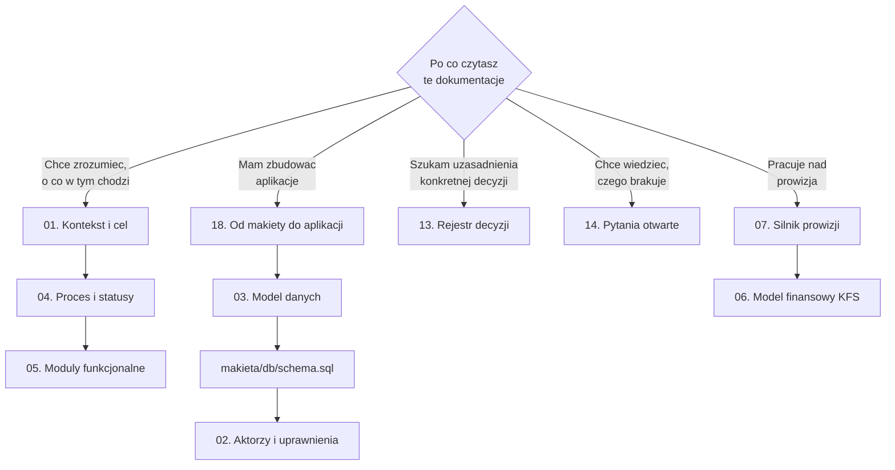
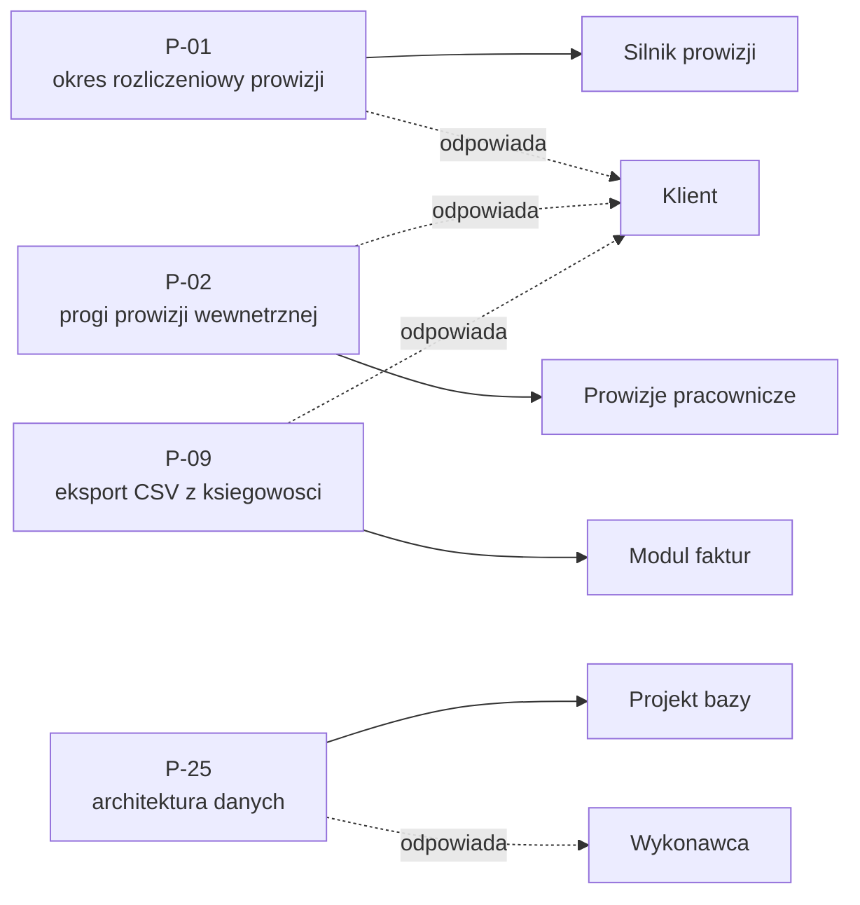

# Dokumentacja projektu: System zarządzania dofinansowaniami KFS

Platforma łącząca firmę pozyskującą dofinansowania (LDIT), współpracujące instytucje szkoleniowe i klientów końcowych. Zastępuje pracę na Excelu, mailach i telefonie.

| | |
|---|---|
| **Klient** | Bartłomiej Olejnik, LDIT |
| **Wykonawca** | Paweł Czapiewski, Odczaruj Low Code |
| **Warsztat wymagań** | 25.08.2026, 3h22m |
| **Warsztat doprecyzowujący** | 04.09.2026, 2h16m |
| **Termin realizacji** | ok. 2 miesiące, gotowe przed styczniem 2027 |
| **Wycena wstępna** | 12-18 tys. PLN (niewiążąca, do potwierdzenia po makiecie) |
| **Status** | makieta v2 działa na bazie SQLite. Runda decyzji 29.09.2026 rozstrzygnęła 38 punktów panelu (D-161 - D-206), 27 z nich czeka na potwierdzenie klienta. Stos docelowy: Open Mercato [D-176]. Przed walidacją konfiguratora prowizji przez klienta |

---

## Od czego zacząć, zależnie od tego, po co tu jesteś

**Jeżeli masz zbudować z tego aplikację, zacznij od [18. Od makiety do aplikacji](18-od-makiety-do-aplikacji.md).** Tam jest napisane, co jest gotowe, co trzeba napisać od nowa i czego w dokumentacji jeszcze brakuje.

---

## Spis sekcji

### Fundament
| Plik | Zawartość |
|---|---|
| [01. Kontekst i cel](01-kontekst-i-cel.md) | Model biznesowy, problemy do rozwiązania, skala, granice systemu |
| [02. Aktorzy i uprawnienia](02-aktorzy-i-uprawnienia.md) | Role, konfigurator ról, macierz widoczności, separacja danych |
| [03. Model danych](03-model-danych.md) | Encje, relacje, pola wyliczane vs ręczne, wersjonowanie |
| [04. Proces i statusy](04-proces-i-statusy.md) | Ścieżka od leada do rozliczenia, statusy, kolory, wyzwalacze |

### Funkcjonalność
| Plik | Zawartość |
|---|---|
| [05. Moduły funkcjonalne](05-moduly-funkcjonalne.md) | Lista modułów z zakresem i priorytetem |
| [06. Model finansowy KFS](06-model-finansowy-kfs.md) | Kwoty, wkład własny, dopłaty, kwalifikacja uczestników |
| [07. Silnik prowizji](07-silnik-prowizji.md) | Najtrudniejszy element projektu. Cztery modele, progi, przypadki testowe |
| [08. Powiadomienia i automatyzacje](08-powiadomienia-i-automatyzacje.md) | Maile, szablony, certyfikaty, dane do faktury, paczka ZIP |

### Realizacja
| Plik | Zawartość |
|---|---|
| [09. Integracje i architektura](09-integracje-i-architektura.md) | Microsoft 365, formularze, import CSV, nabory, stos technologiczny |
| [10. Bezpieczeństwo i RODO](10-bezpieczenstwo-i-rodo.md) | Separacja, audyt, 2FA, retencja, obowiązki prawne |
| [11. UX i nawigacja](11-ux-i-nawigacja.md) | Układ "jak Excel", edycja inline, nazewnictwo, dashboard |
| [12. Zakres i etapowanie](12-zakres-i-etapowanie.md) | Co wchodzi, co wypada, kolejność prac, harmonogram |
| [18. Od makiety do aplikacji](18-od-makiety-do-aplikacji.md) | Co jest gotowe, co trzeba napisać, czego brakuje, w jakiej kolejności |
| [19. Mapa zakładek](19-mapa-zakladek.md) | Inwentaryzacja menu i zakładek makiety, mapa drill through, propozycja mapy docelowej, 38 pytań do klienta (Z-01 - Z-38), plan screenów do Miro |

### Rejestry
| Plik | Zawartość |
|---|---|
| [13. Rejestr decyzji](13-rejestr-decyzji.md) | 206 decyzji (D-01 - D-206) z siłą i uzasadnieniem, w tym 46 z rundy 29.09.2026 |
| [14. Pytania otwarte](14-pytania-otwarte.md) | 20 pytań nadal otwartych, 38 rozstrzygniętych 29.09.2026 (z odnośnikiem do D-xxx), zero blokad |
| [15. Ryzyka](15-ryzyka.md) | Rejestr ryzyk z oceną i mitygacją |
| [16. Słownik](16-slownik.md) | Pojęcia domenowe KFS i terminologia projektu |

### Warsztaty
| Plik | Zawartość |
|---|---|
| [17. Warsztat doprecyzowujący (2026-09-04)](17-warsztat-2026-09-04.md) | Drugi warsztat na makiecie v2: konflikty, decyzje D-125 - D-147, proces Działu Dotacji, powrót modułu zadań |

---

## Cztery blokady

Stan po rundzie 29.09.2026: wszystkie cztery są rozstrzygnięte. P-25 przez D-177, a P-01, P-02 i P-09 (D-164, D-162, D-163) tylko **wstępnie, wyborem wykonawcy, do potwierdzenia przez klienta**. Do tego czasu odpowiednie moduły nie są w pełni odblokowane.

Szczegóły i pełna lista kto komu co jest winien: [14. Pytania otwarte](14-pytania-otwarte.md).

---

## Co poza dokumentacją

| Co | Gdzie | Po co |
|---|---|---|
| Makieta klikalna v2 | [`makieta/`](../makieta/README.md) | Osiemnaście ekranów na prawdziwej bazie SQLite, z logowaniem i uprawnieniami |
| Warstwa danych makiety | [`makieta/DANE.md`](../makieta/DANE.md) | Jak działa baza, jak ją przebudować, jak czytać i zapisywać |
| Schemat bazy | [`makieta/db/schema.sql`](../makieta/db/schema.sql) | **Źródło prawdy o strukturze danych** [D-151] |
| Reguły wyliczeń | [`makieta/db/views.sql`](../makieta/db/views.sql) | Pola wyliczane zapisane jako widoki SQL |
| Dokumentacja jako strona | [`dokumentacja/index.html`](../dokumentacja/index.html) | Ta sama treść w formie klikalnej, do pokazania klientowi |
| **Panel decyzyjny** | [`dokumentacja/sekcje/17-panel-decyzji.html`](../dokumentacja/sekcje/17-panel-decyzji.html) | Po rundzie 29.09.2026 zawiera 38 pytań o mapę zakładek (Z-01 - Z-38, [19](19-mapa-zakladek.md)). Warianty i konsekwencje 38 rozstrzygniętych wcześniej punktów zostały w `decyzje.js` jako archiwum, a wyniki są w rejestrze decyzji D-161 - D-206 |

---

## Źródła

Dokumentacja powstała z połączenia sześciu źródeł:

1. **Transkrypcja warsztatu** z 25.08.2026 (3h22m52s, ok. 206 tys. znaków). Podstawowe źródło decyzji.
2. **Transkrypcja warsztatu doprecyzowującego** z 04.09.2026 (2h16m), prowadzonego na żywo na makiecie v2.
3. **Dokumentacja wymagań przedwarsztatowa** (`00. Poczatkowe założenia/System_LDIT_dokumentacja_wymagan.pdf`, 15 stron, 20.08.2026). Hipotezy wykonawcy przed warsztatem.
4. **Spis funkcji od klienta** (`Warsztat LDIT - 20260825/Od Bartka - spis funkcji .docx`). Wymagania spisane przez Bartka własnymi słowami.
5. **Arkusz logiki prowizji** (`Prowizja liczenie.xlsx`). Realne warianty naliczania z umów.
6. **Diagram procesu Działu Dotacji** (`Warsztaty LDIT - 20260904/Etapy_procesu.png`). Dziesięć etapów obsługi klienta [D-146].

Cytaty pochodzą z automatycznej transkrypcji Teams i bywają zniekształcone. Zachowano je dosłownie, interpretację oznaczono nawiasami kwadratowymi. Znaczniki czasu odnoszą się do nagrania warsztatu.

---

## Konwencje

**Siła decyzji:**
- **TWARDA** jednoznaczne ustalenie, można na nim budować
- **WSTĘPNA** zgoda kierunkowa bez domknięcia szczegółów
- **ODRZUCONA** świadomie wykluczone z zakresu
- **OTWARTA** wymaga rozstrzygnięcia, patrz [pytania otwarte](14-pytania-otwarte.md)

**Kto zdecydował:**
- **[K]** klient (Bartek), potrzeba biznesowa
- **[W]** wykonawca (Paweł), propozycja rozwiązania

**Priorytet wymagań:** MUST / SHOULD / COULD / WON'T (etap I)

**Przy rozjeździe dokumentacji ze schematem bazy wygrywa schemat** [D-151]. Dokumentacja opisuje, `schema.sql` definiuje.
